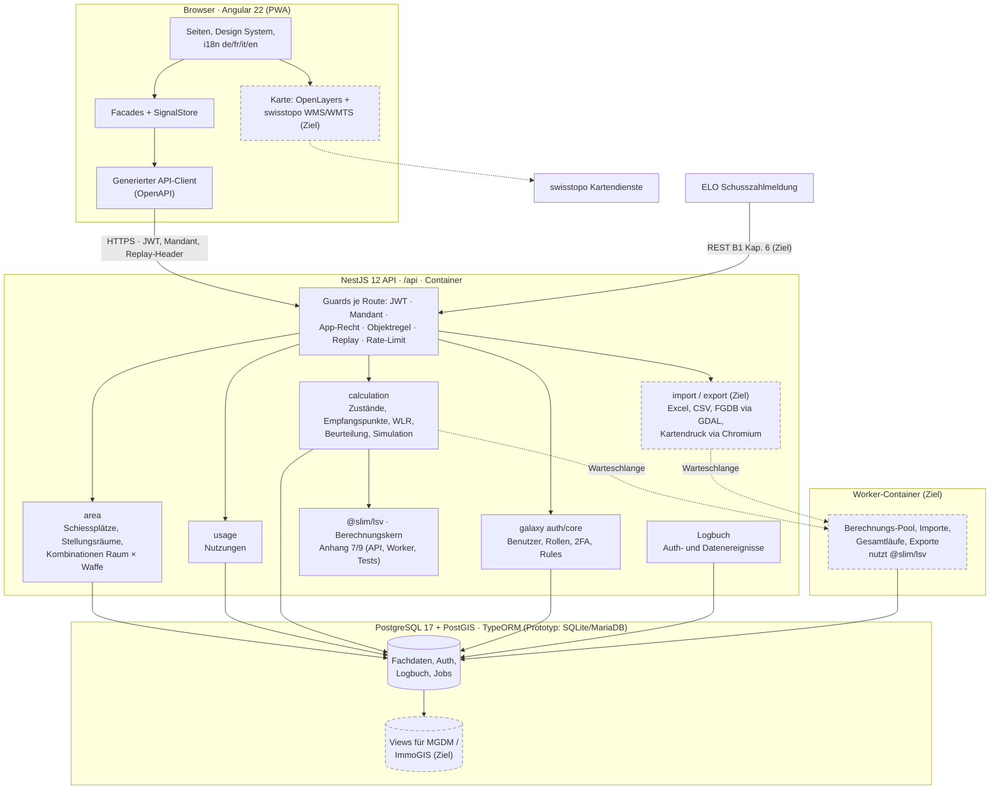
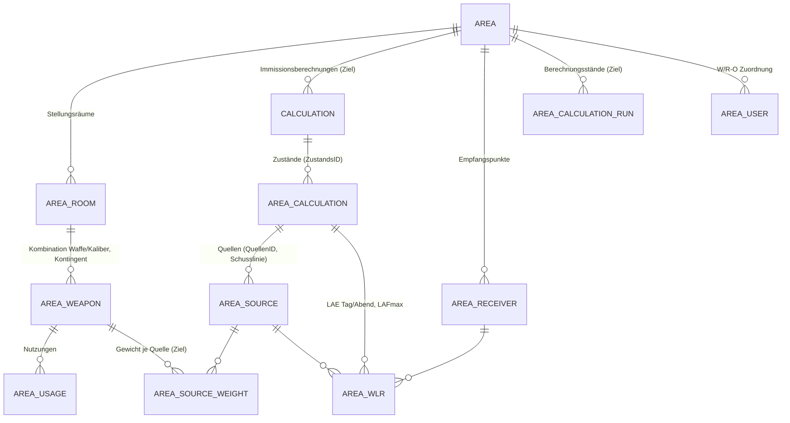
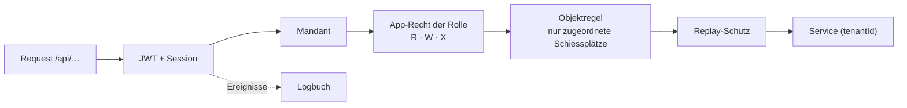
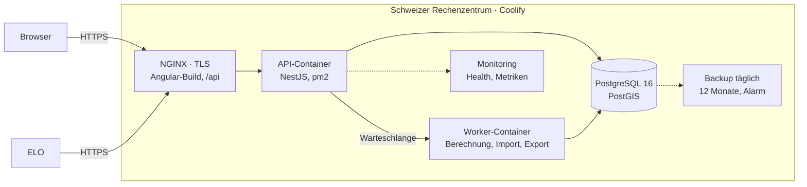
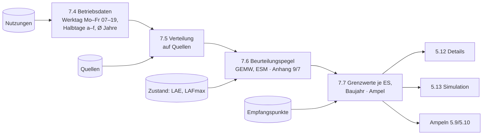
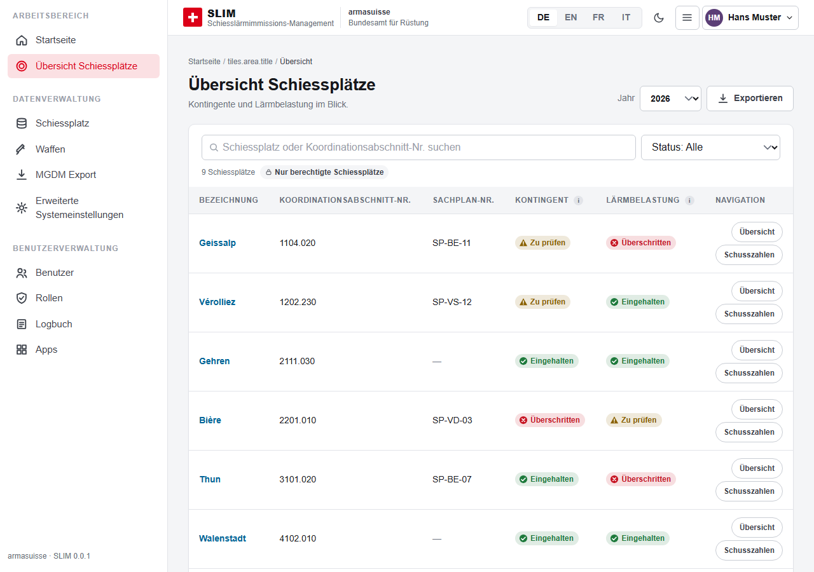
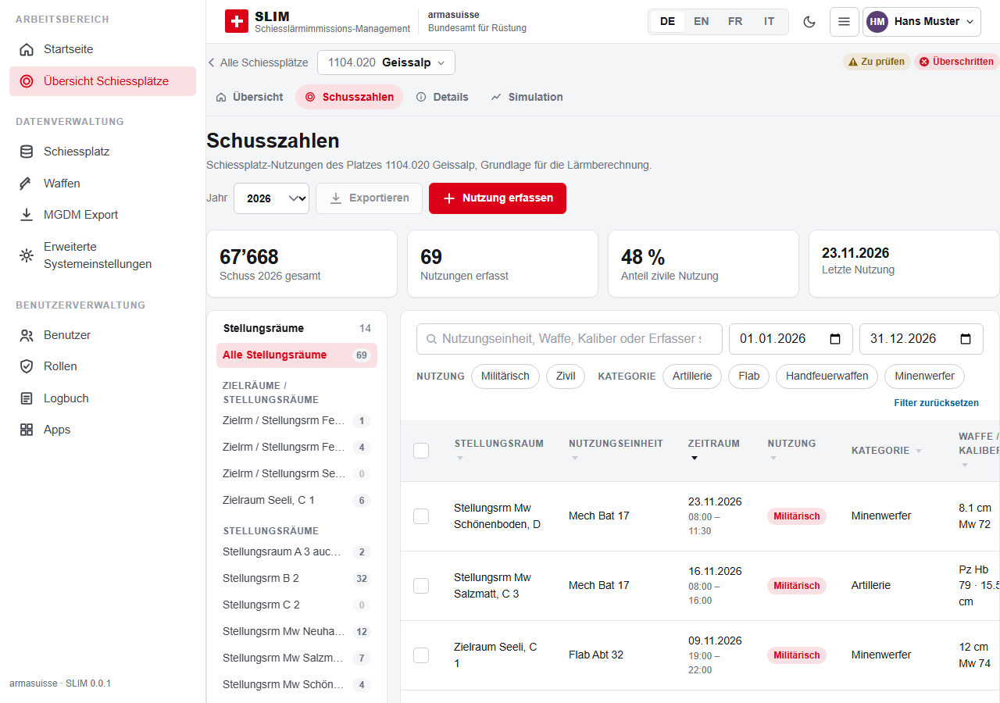
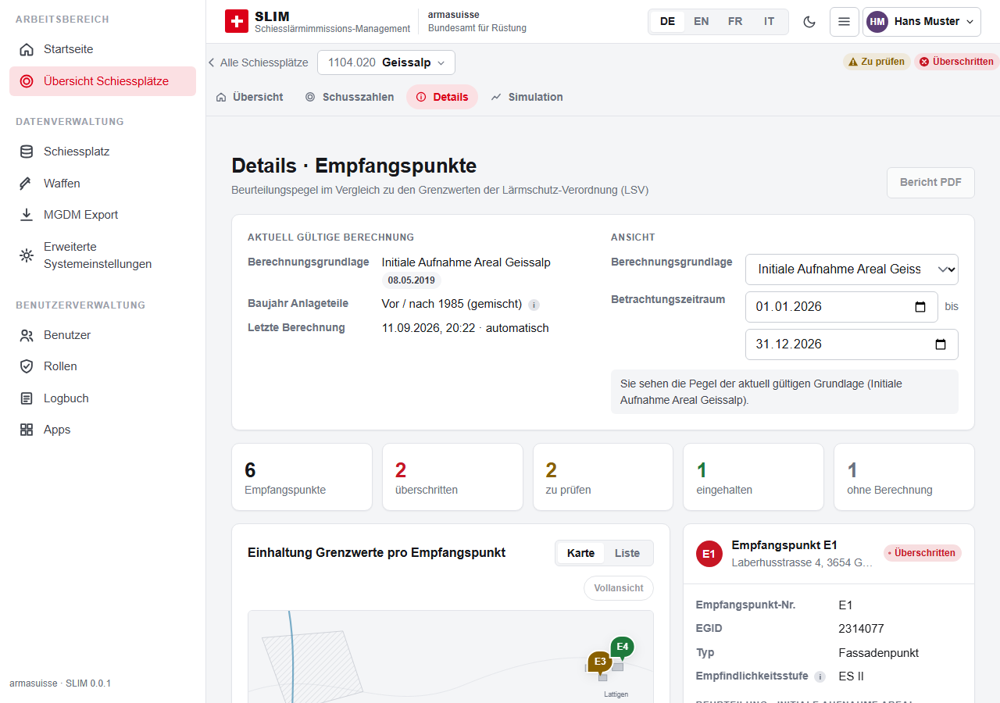
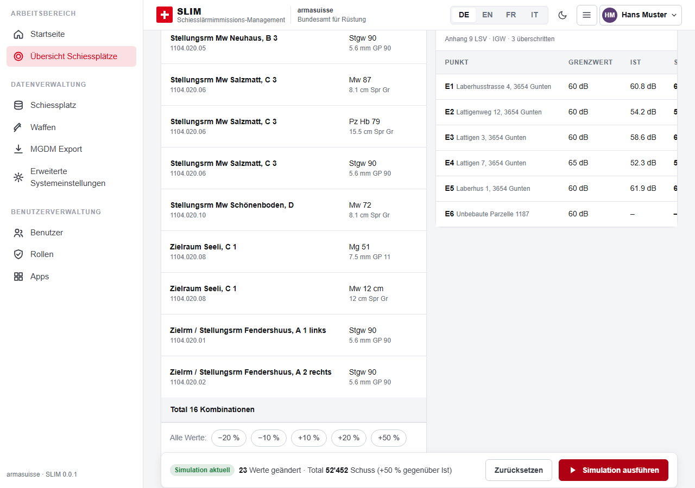
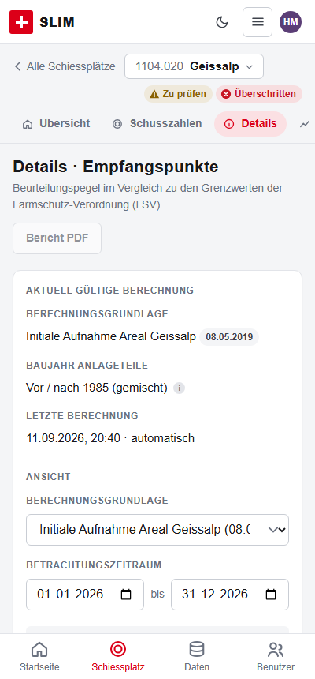

# Lösungskonzept SLIM

<!-- Deckblatt-Angaben (nicht bewertungsrelevant): Schiesslärmimmissions-Management · Ausschreibung armasuisse · simap 41345 · Zuschlagskriterium Z2 · Anbieterin: [Firmenname] · Verantwortlich: [Name, Funktion] · Version 0.2 vom 11. September 2026 (ersetzt v0.1). Grundlagen: Beilage A2, Teil A/B, Beilage B1 mit B1.1–B1.7, FAQ-Export 11.09.2026, Prototyp im Repository (docs/architecture, docs/anforderungskatalog/umsetzungsstand.md). Mit [OFFEN] markierte Stellen sind vor Abgabe zu konkretisieren. -->

## 1 Management Summary

Die Auftraggeberin braucht ein Werkzeug, das die Schiessplatznutzung des VBS erfasst, daraus die Beurteilungspegel nach Anhang 7 und 9 LSV ableitet, die Einhaltung von Grenzwerten und Kontingenten je Schiessplatz und Empfangspunkt sichtbar macht und Massnahmen simulierbar hält – nachvollziehbar für Fachspezialisten, einfach für Schiessplatz-Verantwortliche und Interessenten, auf jedem Gerät, in Deutsch, Französisch und Italienisch (Englisch zusätzlich).

SLIM ist eine Webapplikation aus Standardkomponenten (Angular, NestJS, PostgreSQL/PostGIS, OpenLayers mit swisstopo-Karten, NGINX), die auf einer Schweizer Betriebsplattform in Containern läuft. Sie übernimmt Schusszahlen manuell, per Excel und über die REST-Schnittstelle von ELO, hält die akustischen Grundlagen aus sonARMS als versionierte Zustände und rechnet die Beurteilung bei jeder Anfrage aus Nutzungen und Zustand neu – reproduzierbar und ohne Nachbau der Ausbreitungssoftware. Berechtigungen, Mandanten, Zwei-Faktor-Anmeldung und Logbuch kommen aus vorbestehenden, in einem produktiven Bundessystem erprobten Komponenten; SLIM läuft als eigene Instanz mit eigener Datenbank, eigenen Geheimnissen und eigenen Fachberechtigungen.

Wesentliche Vorteile: Der Berechnungskern ist gegen die Empa-Referenzdaten der Beilage B1.4 geprüft; Ergebnisse und ein dokumentierter Sonderfall stehen in Kapitel 4.3. Die zentralen Masken (Schusszahlen, Details, Simulation) laufen als Prototyp, abgesichert durch 275 automatisierte Tests (Stand 11.09.2026, Testbericht im Repository); das Projektteam kennt ELO und die gemeinsame Plattform aus der Entwicklung [OFFEN: Verhältnis der einreichenden Firma zu ELO vor Abgabe prüfen und Formulierung anpassen] – die Schnittstelle wird dennoch mit der Auftraggeberin abgestimmt und mit Integrationstests über beide Systeme abgenommen.

## 2 Architektur und Technologie

### 2.1 Komponenten, Schichten und Schnittstellen

Die Skizze zeigt die Zielarchitektur; gestrichelte Elemente fehlen im Prototyp noch (Kartenviewer, Import/Export, Worker-Container, Views), die Datenbank läuft im Prototyp auf SQLite/MariaDB statt PostgreSQL/PostGIS. Drei Schichten mit klaren Verträgen: Die **Oberfläche** enthält keine autoritative Fach- oder Berechtigungslogik; sie ruft die aus der OpenAPI-Spezifikation generierten Services auf. Die **API** prüft auf jeder Route Authentifizierung, Mandant, App-Recht der Rolle, Objektregel und Replay-Schutz, validiert die Eingaben und delegiert an Fachmodule (`area`, `usage`, `calculation`, `import/export`). Der **Berechnungskern** ist eine abhängigkeitsfreie Bibliothek, die API und Tests identisch verwenden. Externe Schnittstellen: ELO (REST, Kapitel 3.1), swisstopo-Kartendienste (WMS/WMTS, Kapitel 5.2), nachgelagerte Systeme über Datenbank-Views (Kapitel 3.4).

### 2.2 Technologieentscheidungen

| Entscheid | Begründung |
| --- | --- |
| Angular 22, Standalone-Komponenten, Signals, PWA | Wahl der Anbieterin: ein Code für Desktop und Mobile (PWA, offline-fähige Entwürfe), langfristig gepflegtes Framework mit Enterprise-Verbreitung, ausgereifte Barrierefreiheits- und i18n-Werkzeuge; Team- und Plattformerfahrung aus ELO |
| NestJS 12, TypeORM, OpenAPI-Generierung | Wahl der Anbieterin: eine Sprache (TypeScript) für Oberfläche, API und Berechnungskern – Fachtypen und Berechnungsregeln werden geteilt statt doppelt gepflegt; typisierte DTOs sind der einzige API-Vertrag, der Frontend-Client wird daraus generiert |
| galaxy auth/core (vorbestehende Komponenten, produktiv erprobt) | Benutzer, Rollen, Mandanten, 2FA, Sessions, Replay-Schutz und Objektregeln (Rules) sind erprobt (Nachweis je Komponente: produktiv erprobt / in SLIM integriert / in SLIM getestet); SLIM ergänzt die Fachrollen und betreibt eine eigene Instanz |
| PostgreSQL 17 + PostGIS 3 | Standard mit räumlichen Typen für Empfangspunkte, Anlagenteile und Perimeter, räumliche Indizes, lesende Views für MGDM/ImmoGIS, FGDB-Austausch über GDAL. PostGIS (GPL) wird ausschliesslich als unveränderter Datenbankdienst genutzt – keine Verlinkung mit SLIM-Code, keine Copyleft-Wirkung. Der Prototyp läuft über TypeORM heute auf SQLite/MariaDB; der Treiber ist Konfiguration (`pg` installiert), die Umstellung auf PostgreSQL/PostGIS ist der nächste Schritt vor Abgabe |
| OpenLayers + swisstopo WMS/WMTS (geo.admin.ch) | Offener Standard-Viewer mit LV95, WMS-Hintergründen und Bundeslayern, Massstab, Layer-Konfiguration; keine Lizenzkosten |
| GDAL/OGR ≥ 3.8 (OpenFileGDB-Treiber mit Schreibunterstützung inkl. Domänen und Beziehungsklassen), ExcelJS | Lesen und Schreiben von File-Geodatabases nach dem Schema B1.2 sowie Excel mit Standardbibliotheken; Lese-/Schreibprobe mit dem B1.2-Schema vor Abgabe |
| NGINX, Docker, Coolify | Reverse-Proxy mit TLS liefert den Angular-Build und leitet `/api`; Container-Images versioniert; Coolify für Bereitstellung und Rückfall |

**Vorbestehende Bestandteile und Nutzungsrechte.** SLIM baut auf drei Schichten von Fremd- und Eigenanteilen auf: (1) Open-Source-Komponenten unter permissiven Lizenzen (Angular, NestJS, TypeORM – MIT; OpenLayers – BSD; GDAL – MIT; PostgreSQL/PostGIS – PostgreSQL-/GPL-Lizenz nur serverseitig genutzt; ExcelJS – MIT), ohne Copyleft-Wirkung auf SLIM; (2) die vorbestehende Plattform `@app-galaxy/*` (Authentifizierung, Mandanten, Rollen, Rule-Engine, Übersetzung, Setup) – vorbestehende Software im Sinne von Art. 6.2.4 der Vertragsbedingungen: Sie wird in der SBOM deklariert, die Auftraggeberin erhält daran ein zeitlich unbefristetes, übertragbares Nutzungsrecht für Betrieb, Wartung und Weiterentwicklung sowie den Quellcode als Teil der Lieferung (Art. 6.1.7); eine Freigabe unter einer Open-Source-Lizenz (MIT/Apache) wird geprüft [OFFEN: Rechteinhaberin, Lizenztext und OSS-Entscheid vor Abgabe festlegen]; (3) der SLIM-Anwendungscode, an dem die Auftraggeberin die vertraglich vereinbarten Rechte erhält. Wartbarkeit durch Dritte: Standard-Stack, öffentliche Paketquellen, generierter API-Vertrag, dokumentiertes Datenmodell, automatisierte Tests und der Setup-Wizard erlauben einer anderen Firma die Übernahme; die galaxy-Bibliotheken sind mit Quellcode, Tests und Dokumentation Teil der Lieferung.

### 2.3 Datenhaltung

Das Modell folgt B1 7.4.1 und 10. Schiessplätze und Stellungsräume sind zeitlich unabhängige Referenzobjekte. Die zulässige Kombination Stellungsraum × Waffe/Kaliber trägt das Kontingent und ist der Schlüssel der Erfassung; die **Quellen** des Lärmmodells (sonARMS-QuellenID = Stellungsraum + Schusslinie + Waffe) gehören zum jeweiligen **Zustand**. Eine Kombination ist mit einer oder mehreren Quellen verknüpft; das Gewicht je Quelle stammt aus den Betriebsdaten der Grundlage (Verhältnis der Schusszahlen je Schusslinie, Anhang 9 nach Tag/Abend, Anhang 7 je Waffenkategorie) und wird beim Import des Zustands gesetzt und ist in der Datenverwaltung einsehbar. Hierarchie nach B1 5.18 und Kapitel 10: Schiessplatz → **Immissionsberechnung** (Bezeichnung, Lieferantin, Lieferdatum) → ein oder mehrere **Zustände** (ZustandsID, Referenzjahr, Baujahr-Klasse); genau ein Zustand je Schiessplatz ist «aktuell gültig» und genau einer «Stand MGDM» (Datenbank-Constraint); die Zustände tragen Quellen, Empfangspunkte und WLR-Werte je Empfangspunkt × Quelle. Davon getrennt sind die veränderlichen Auswahlzeiger (gültig/MGDM) und die unveränderlichen Berechnungsstände (Ergebnisläufe). Nutzungen sind davon entkoppelt (Herkunft manuell/ELO/Import, Soft-Delete, Änderungshistorie im Logbuch); Mengen sind Dezimalzahlen mit Einheit (Stück oder kg Sprengstoff, B1 6.2/11.2.3) und werden ohne Rundungsverlust durch Erfassung, Schnittstelle, Import, Verteilung und Export geführt. Externe Identifikatoren (Koordinationsabschnitt-Nr. wie 1104.020, ZustandsID, QuellenID, sonARMS_ID) bleiben als eigene Attribute erhalten; interne Schlüssel sind UUIDs. Physische Datenbankobjekte werden deutsch benannt (B1 12.2, slm 51: `schiessplatz`, `stellungsraum`, `nutzung`, …) – die englischen Klassennamen des Codes und der Skizze sind logische Namen, die Abbildung erfolgt in der Entity-Definition und wird per Migration getestet.

**Reproduzierbarkeit:** Abfragen in den Masken rechnen live aus Nutzungen und Zustand. Zusätzlich sichert ein **Berechnungsstand** (Masken 5.18–5.21 «Berechnungen») jedes fachlich relevante Ergebnis unveränderbar: Zeitraum, Zustand, Parameter (Feiertagskalender, Grenzwerte, Ampelschwellen, Jahre der Mittelung), die verwendeten Nutzungen als vollständige Kopie (ID, Datum, Beginn, Ende, Nutzungsart, Stellungsraum, Waffe/Kaliber, Kategorie, Schusszahl, Herkunft), die Quellen mit ihren Gewichten, die WLR-Werte und Empfangspunkte (ES, Baujahr) des Zustands, Softwareversion des Berechnungskerns, Ergebnisse je Empfangspunkt, Ersteller und Zeitpunkt. Berechnungsstände sind unveränderbar (kein Update/Delete auf Datenbankebene, nur Archivieren); Zustände, Quellengewichte und WLR-Werte werden nach der Freigabe nicht mehr geändert, sondern als neuer Zustand importiert. Ein Berechnungsstand lässt sich später mit derselben Kernversion aus der eigenen Kopie nachrechnen (Prüfsumme über alle Eingaben) und mit dem aktuellen Stand vergleichen; er ist die Grundlage für MGDM-Stände und Exporte. Stellungsräume lassen sich zu Anlagen gruppieren; die Beurteilung erfolgt wahlweise je Anlage oder platzweit (B1 7.3, Abgrenzung im Refinement zu entscheiden). Jede Tabelle trägt `tenantId` – der Mandant trennt Umgebungen innerhalb von SLIM (Demo, Akzeptanz, Produktion); SLIM hat eine eigene Instanz und Datenbank ohne gemeinsame Laufzeit mit ELO –, Zeitstempel und Löschmarke; das Schema wird per Migration versioniert und als ERD automatisch dokumentiert. *Prototyp:* Kernmodell (Schiessplatz, Stellungsraum, Kombination, Zustand, Empfangspunkt, WLR, Nutzung) umgesetzt mit genau einer Quelle je Kombination, ganzzahligen Schusszahlen, englischen Tabellennamen und Live-Berechnung; Berechnungshierarchie, Quellengewichte, Dezimalmengen, deutsche Tabellennamen und Berechnungsstand sind Zielzustand. Der Demo-Datensatz «SLIM Demo» mit neun Schiessplätzen wird aus diesem Modell erzeugt.

### 2.4 Sicherheit

**Rollen und Rechte (B1 8.1):** Die vier Rollen sind mit der Rechtematrix 8.1.2 als App-Rechte (R/W/X je Applikationsbereich) hinterlegt; «W/R-O – nur zugeordnete Schiessplätze» erzwingt eine Objektregel der Rule-Engine (Zuordnung Benutzer ↔ Schiessplatz, 403 ausserhalb, gefilterte Listen). Jede Route und jeder Deep Link wird serverseitig geprüft; die Oberfläche blendet Menüs und Aktionen nach denselben Rollen-Schlüsseln aus (CASL). **Anmeldung:** Passwortregeln, Sperre nach Fehlversuchen, Zwei-Faktor-Anmeldung – im Zielzustand mit TOTP-App (RFC 6238; Enrollment per QR-Code bei der ersten Anmeldung, Seeds verschlüsselt gespeichert, Wiederherstellung über einmalige Backup-Codes oder Rücksetzung durch den Applikationsadministrator im Vier-Augen-Prinzip, kein E-Mail-Umweg um den zweiten Faktor); der E-Mail-Code des Prototyps wird damit abgelöst –, damit ist «MFA oder AGOV» erfüllt. Entscheid der Anbieterin gemäss FAQ 27: MFA in SLIM, weil alle Nutzer über die VBS-Benutzerverwaltung geführt werden und keine Anschlussvereinbarung mit der Bundeskanzlei nötig ist; AGOV (OIDC) ist als vorbereitete Option für externe Nutzer beschrieben und kann ohne Änderung des Fachmodells ergänzt werden. **Nachvollziehbarkeit (slm 56):** Logbuch mit Login (Methode), Fehlversuch mit Grund, Sperre, Logout, Token-Wiederverwendung, Passwort-Reset und -Änderung, E-Mail-Verifikation, Änderungen an Benutzern, Rollen, Stammdaten und Exporten; Maske mit Filtern und Excel-Export; Notfallzugang (Break-Glass) als dokumentierter Prozess mit Vier-Augen-Freigabe, versiegeltem Passwort und Pflichtprotokoll. **Härtung:** Security-Header (HSTS, CSP), CORS, Rate-Limiting, Eingabevalidierung (DTOs, UUID-Parameter, Fachregeln), Geheimnisse ausserhalb des Images, Abhängigkeits-Scan im Build. *Prototyp:* Rollen, Matrix, Objektregel, 2FA per E-Mail-Code, Logbuch inkl. aller Auth-Ereignisse umgesetzt und getestet; TOTP und CASL-Ableitung folgen.

### 2.5 Bereitstellung und Betrieb

SLIM wird in einem Schweizer Rechenzentrum (ISO 27001, Daten und Sicherungen bleiben in der Schweiz, Support aus der Schweiz) betrieben [OFFEN: Provider und Vertragspartner vor Abgabe benennen; Anforderungen sind festgelegt]. Drei getrennte Umgebungen (Entwicklung, Akzeptanz, Produktion) mit identischen Container-Images; NGINX terminiert TLS (≥ 1.2), liefert den Angular-Build und leitet `/api` an den API-Container; Berechnungen, Importe und Exporte laufen in einem eigenen Worker-Container (Kapitel 4.4); PostgreSQL läuft als eigener Container mit persistentem Volume; Coolify verwaltet Bereitstellung, Umgebungsvariablen und Rollback, getrennt vom öffentlichen SLIM-Zugang (Zugang nur mit MFA und aus zugelassenen Netzen, Si001 Fernzugriff). Releases sind versionierte Artefakte mit Datenbankmigration und Smoke-Test über Health-Endpunkte. Rückfall: Migrationen werden rückwärtskompatibel geschrieben (erweitern statt umbenennen/löschen; Aufräumen erst im übernächsten Release), sodass das vorherige Image auf dem migrierten Schema lauffähig bleibt; jede Migration hat einen getesteten Down-Schritt; vor jedem Produktionsrelease wird eine Sicherung gezogen, und für nicht rückwärtskompatible Änderungen gilt ein abgestimmter Wiederherstellungsweg: Release im Wartungsfenster mit Schreibpause, PostgreSQL-Sicherung mit archivierten WAL-Segmenten (Point-in-Time-Recovery), Rückfall = Wiederherstellung auf den Zeitpunkt vor dem Release; die Rückfallgrenze (bis wann ein Rückfall ohne Datenverlust möglich ist) wird je Release festgelegt und kommuniziert. Der Rückfall wird auf dem Akzeptanzsystem geprobt. Sicherung (B1 12.8, FAQ 14): automatisch täglich und manuell vor Releases/Importen, Mehrgenerationen über zwölf Monate, RPO ein Tag, RTO zwei Tage, Integritätsprüfung jeder Sicherung (Prüfsumme und Probe-Restore), Alarm bei fehlender oder fehlerhafter Sicherung (slm 57), jährlicher Restore-Test, Kopie am Betriebsstandort und in einem zweiten Schweizer Standort, lesbarer Datendump (SQL/CSV) auf Verlangen. Monitoring: Health-Endpunkte, Metriken (Antwortzeiten, Fehlerraten, Jobs) und Alarmierung für den SLA-Nachweis (99 % Mo–Fr 07–19 Uhr). *Prototyp:* Docker-Image (Node 24, pm2), Compose mit MariaDB, Health-Endpunkte, reproduzierbarer Setup-Wizard.

## 3 Schnittstellen, Import und Export

### 3.1 ELO-Anbindung

SLIM stellt die REST-Schnittstelle nach B1 Kapitel 6 bereit: `GET` Anlageninformationen (Schiessplätze → Stellungsräume → zulässige Waffen/Kaliber – genau das Modell `area`/`area_room`/`area_weapon`) und `POST` genau eine Schiessplatznutzung. Authentifizierung über ein technisches Konto mit eigener Rolle (nur diese zwei Endpunkte) – OAuth2 Client Credentials oder mTLS, Entscheid mit der Auftraggeberin, mit Schlüsselrotation und IP-Allowlist –, JSON UTF-8, HTTPS mit TLS ≥ 1.2. Jede Meldung trägt einen Idempotenz-Schlüssel: eine Wiederholung liefert dieselbe Antwort und erzeugt keine Doppelnutzung. Validierung vor dem Speichern: Schema, Pflichtfelder, existierende IDs, Viertelstundenraster, Ende > Start, Feldlängen, zulässige Kombination Stellungsraum × Waffe, Sperrdatum; Fehler kommen synchron mit HTTP-Status, Fehlercode und verständlicher Meldung zurück, gültige Nutzungen erhalten die Herkunft «ELO» und sind sofort in Maske 5.11 und in der Beurteilung sichtbar. Vorgehen: Die Schnittstellenspezifikation (Felder, Codes, Fehlerfälle, Konten) wird zu Beginn mit der Auftraggeberin und der ELO-Seite abgestimmt und als OpenAPI-Dokument festgeschrieben (die ELO-seitige Spezifikation verantwortet gemäss FAQ 17 die Auftraggeberin); SLIM stellt früh eine Testumgebung mit Demo-Daten bereit; Integrationstests über beide Systeme (Anlagenabruf, Meldung, alle Fehlerfälle) gehören zur Abnahme. Die Erfahrung des Projektteams mit ELO und der gemeinsamen Plattform verkürzt Abstimmung und Fehlersuche, ersetzt diese Schritte aber nicht [OFFEN: Formulierung an die einreichende Firma anpassen]. *Prototyp:* Datenmodell, Herkunft «ELO» mit Kennzeichen in der Maske und die Validierungsregeln des Nutzungs-Service sind umgesetzt; die beiden Endpunkte folgen als dünne Controller darauf.

### 3.2 Übernahme von Stamm-, Schusszahlen- und Berechnungsdaten

- **Stammdaten (slm 36):** Initialimport aus B1.6 «Areal_Grundlagen» und B1.7 Waffenliste per CSV/Excel in einen Prüfbereich (Staging-Tabellen); Abgleich über Koordinationsabschnitt-Nr., Stellungsraum-Name und Waffe/Kaliber; Prüfbericht mit Zeilenbezug; Übernahme erst nach fehlerfreiem Lauf. Vorgehen der Migration (B1 9.2, FAQ 28): Die Auftraggeberin bereitet die Daten in rund drei Monaten per ETL auf und verantwortet ihre Qualität; SLIM liefert das Zielformat und den Prüfbericht; Probemigration auf dem Akzeptanzsystem mit Mengenabgleich (Schiessplätze, Stellungsräume, Zuordnungen, Nutzungen je Jahr) und fachlicher Stichprobe, Freigabe durch die Auftraggeberin, dann Produktivmigration im Wartungsfenster mit Sicherung davor (Testdaten gemäss Mitwirkungspflichten A1.1, Ziffer 6).
- **Schusszahlen (slm 37):** Excel-Import nach der Vorlage B1.6 (B1 Kapitel 9.3) mit denselben Regeln wie die Maske 5.11 und wie ELO; Zeilen mit unbekanntem Stellungsraum oder unzulässiger Kombination werden abgewiesen und im Bericht ausgewiesen (slm 45).
- **Berechnungsdaten (slm 19, 21):** FGDB aus sonARMS (Anlagenteile, Empfangspunkte, WLR-DAY/WLR-NIGHT, Betriebsdaten A9/A7) wird mit GDAL/OGR gelesen, in Staging geladen und geprüft: Quellen-IDs müssen auf bekannte Stellungsräume/Waffen abbilden, Empfangspunkte brauchen ES und EGID und werden über die sonARMS_ID (B1.2 V5) abgeglichen, WLR-Werte müssen vollständig sein. Erst dann entsteht ein neuer **Zustand** mit Referenzjahr, Baujahr-Klasse und Kennzeichen «gültig»/«MGDM»; frühere Zustände bleiben erhalten. *Prototyp:* Zielstrukturen (Zustand, Empfangspunkte, WLR je Empfangspunkt × Quelle) und die Formate aus B1.4 werden bereits vom Demo-Datensatz-Generator bedient; der Importdialog (5.19) mit Prüfbericht folgt.

### 3.3 Dateiformate, Validierung und Fehler

Excel (`.xlsx`) und CSV (UTF-8, Semikolon) über ExcelJS; FGDB über GDAL. Grosse Dateien werden per Drag-and-Drop abgelegt und zeilenweise gestreamt (kein Laden ganzer Dateien in den Speicher), Geometrien in räumliche Indizes übernommen, Ausschnittabfragen der Karte lesen nur den sichtbaren Bereich. Jeder Import läuft als Job (Kapitel 6.2): Datei ablegen → Struktur prüfen → fachlich validieren → Bericht → Übernahme in einer Transaktion. Fehler werden nie verschluckt: Der Bericht nennt Zeile, Feld, Regel und Behebung; ein Import mit Fehlern übernimmt nichts. Alle Prüfregeln sind dieselben wie in Maske und Schnittstelle (ein Service).

### 3.4 Exporte und nachgelagerte Systeme

Jede Tabelle exportiert ihre aktuelle Sicht (Filter, Spalten) als Excel und CSV (slm 39); davon getrennt der vollständige Nutzungsexport mit allen Attributen im Format B1.6 (slm 40) und die Gesamtstatistik MPV mit einer Zeile je Schiessplatz – Kontingent- und Grenzwertstatus je Anhang, Stand SPM/MPV/Projekt, Berechnungsgrundlage (slm 41). Berechnungsstände werden als GeoDB (GDAL) und CSV exportiert (slm 20). Für MGDM und ImmoGIS (slm 38) stellt PostgreSQL lesende Views mit eigenen technischen Konten bereit (nur SELECT auf die fachlichen Views, kein Zugriff auf Auth- und Mandantentabellen, protokolliert); der Zugriffsweg ist ein dedizierter, TLS-verschlüsselter Datenbankendpunkt im Netzsegment der Auftraggeberin oder über VPN, mit IP-Allowlist – die Datenbank ist nie öffentlich erreichbar; Details werden mit Provider und Auftraggeberin festgelegt; bundesinterne Empfänger gemäss FAQ 15. *Prototyp:* Excel-Export des Logbuchs, Exportknöpfe der Fachmasken vorbereitet.

## 4 Lärmberechnung

### 4.1 Berechnungsablauf

Eingaben: Nutzungen des Zeitraums (je Kombination Stellungsraum × Waffe/Kaliber), die Quellen des Zustands (Stellungsraum + Schusslinie + Waffe, Kapitel 2.3) mit Gewicht und Kategorie, der gewählte Zustand mit den Pegeln je Empfangspunkt × Quelle – für Anhang 9 der LAE aus WLR_Day (Tag) und WLR_Eve (Abend), für Anhang 7 der LAFmax aus WLR_Day (B1 7.6.1/7.6.2; die Zuordnung der Dateien erfolgt über ihr Format, nicht über den Dateinamen) –, Empfangspunkte mit Empfindlichkeitsstufe, Baujahr der zugehörigen Stellungsräume. Ergebnisse: Beurteilungspegel je Empfangspunkt (Anhang 9: LAE1/LAE2/Lr; Anhang 7: Li/Lri/Lr), Grenzwert, Reserve und Ampel je Zeile, aggregiert je Schiessplatz. Die akustischen Grundlagen stammen aus sonARMS; SLIM baut die Schallausbreitung nicht nach.

### 4.2 Umsetzung der fachlichen Regeln

1. Nutzungen nach Zeitraum und Nutzungskategorie wählen (B1 Tabelle 2): **Anhang 9** berücksichtigt alle Kategorien – Militär, Zivil, Blaulicht und SAT; **Anhang 7** normalerweise Zivil und SAT, alle Kategorien bei gesetztem Flag «Gesamtbeurteilung nach Anhang 7» des Schiessplatzes; nur Nutzungen mit gültiger Zuordnung Stellungsraum × Waffe.
2. Betriebsdaten: Schuss anteilig innerhalb/ausserhalb Werktag Mo–Fr 07–19 Uhr (Sa/So und Feiertage ganz ausserhalb, Zeit vor 07 und nach 19 Uhr sowie halbe Feiertage anteilig). Feiertage gelten **lokal am Standort** (B1 S. 71): je Schiessplatz ein Kalender aus nationalen, kantonalen und Gemeinde-Feiertagen inklusive halber Feiertage (Vor-/Nachmittag), in der erweiterten Konfiguration pflegbar und aus Vorlagen übernehmbar; Schiesshalbtage je Waffenkategorie a–f (Werktag Mo–Sa / Sonn- und Feiertag; ein Halbtag zählt 1 bei mehr als zwei Stunden Schiesszeit, sonst ½, LSV Anhang 7 Ziffer 32). Betrachtungszeitraum: Der Benutzer wählt je Berechnung die repräsentativen Jahre – Standard drei, auch nicht aufeinanderfolgende (z. B. 2020, 2023, 2025) – oder einen beliebigen Zeitraum (B1 7.4.5); die Betriebsdaten werden als Jahresmittel über diese Auswahl gebildet.
3. Verteilung auf Quellen: jede Kombination Stellungsraum × Waffe kennt ihre Quellen des Zustands mit Gewicht (Kapitel 2.3); die Schusszahlen aus Schritt 2 werden im Verhältnis dieser Gewichte auf die Quellen (Schusslinien) verteilt – eine Kombination mit genau einer Quelle erhält alles. Sind alle Gewichte einer Kombination null (keine Betriebsdaten in der Grundlage), wird gleichverteilt und der Fall im Prüfbericht des Zustands gemeldet.
4. Beurteilungspegel je Empfangspunkt (LSV): Anhang 9 mit LAE1 = energetisches Mittel der Tag-Quellen + 10·log(Schuss Tag), LAE2 analog für den Abend, Lr = 10·log(10^(0.1·LAE1) + 10^(0.1·(LAE2 + K2))) − 10·log(T) mit K1 = 5, K2 = 15, T = Bezugszeit; Anhang 7 mit Li je Waffenkategorie als energetischem Mittel, Ki = 10·log(Dw + 3·Ds) + 3·log(M) − 44, Lri = Li + Ki und Lr als energetischer Summe über die Kategorien. Leere Quellen und Nullfälle werden explizit behandelt (Marker «keine Energie» statt −∞).
5. Grenzwerte nach ES und Baujahr der Stellungsräume (Stichtag 1. Januar 1985): Anlagen mit Stellungsräumen nur vor dem Stichtag werden am IGW gemessen, nur nach dem Stichtag am PW; bei gemischten Anlagen werden **zwei Datenmengen** gerechnet und ausgewiesen – der Gesamtpegel aller Stellungsräume gegen den IGW und ein zweiter Pegel ausschliesslich aus den Quellen der Stellungsräume nach dem Stichtag gegen den PW (B1 7.4.5); die Zuordnung Quelle → Stellungsraum liegt im eingefrorenen Zustand. Der Vergleich erfolgt mit dem auf ganze dB gerundeten Beurteilungspegel (Projekthandbuch B1.2 Kapitel 10.4: 60.4 → 60 eingehalten, 60.5 → 61 überschritten), die Anzeige mit einer Dezimale; der Rundungsmodus ist Konfiguration. Ampel rot > Grenzwert, orange > Grenzwert − 5 dB, sonst grün. Kontingent (B1 5.10): Soll aus der Plangenehmigung je Waffe/Kaliber gegen Ist des laufenden Jahres und gegen den Durchschnitt der drei letzten Jahre (gewähltes Jahr + zwei Vorjahre); eine Waffe ohne Kontingent hat Soll 0 und ist bei Nutzung rot; Ampel-Schwellen 100 %/125 %. Grenzwerttabellen, Rundung und Schwellen liegen in der erweiterten Konfiguration.

### 4.3 Nachweis der Korrektheit

Der Berechnungskern wird gegen die Empa-Demorechnung B1.4 getestet (95 der 180 API-Tests, Stand 11.09.2026). Referenzwerte je Anhang und Ergebnisgrösse (Sollwerte aus B1.4, Toleranz: gerundet auf 0.1 dB identisch, ungerundet < 10⁻⁶ dB gegen die gespeicherten Excel-Werte):

| Empfangspunkt | Anhang 9 Lr (Soll / Kern) | Anhang 7 Lr (Soll / Kern) |
| --- | --- | --- |
| E1 | 60.7 / 60.7 (ungerundet 60.7332) | 73.8 / 73.8 (73.7506) |
| E4a | 41.8 / 41.8 | 53.1 / 53.1 |
| E8 | 14.5 / 14.5 | 28.08 / 28.05 (Sonderfall, unten) |

**Anhang 9:** LAE1, LAE2 und Lr stimmen für alle zwölf Empfangspunkte überein. **Anhang 7:** Li, Lri und Lr stimmen für elf Empfangspunkte überein; bei E8 liefert der Kern ungerundet 28.046 dB, die Excel-Vorlage 28.080 dB (Differenz 0.034 dB; angezeigt 28.0 gegenüber 28.1). Ursache, numerisch nachvollzogen: Die Excel-Vorlage schreibt für die fünf Waffenkategorien ohne Schüsse (b–f) 0 dB in die Lri-Zellen und summiert diese energetisch mit; 28.046 dB entsprechen 637.7 Energieeinheiten, plus fünfmal 10^0 = 642.7 Einheiten = 28.080 dB – exakt der Excel-Wert. Der Kern lässt Kategorien ohne Schüsse aus der energetischen Summe weg (Marker «keine Energie»); bei lauten Empfangspunkten ist der Effekt unsichtbar. Verbindlich ist die von der Fachstelle im Refinement bestätigte Lesart – bis dahin gilt die Excel-Vorlage als Referenz, und der Kern hält beide Varianten als getesteten Parameter bereit, damit die Entscheidung ohne Codeänderung umgesetzt wird. Die Abnahmetoleranz (absolute Abweichung je Wert) wird mit der Fachstelle festgelegt und in den Tests hinterlegt. Weitere Tests decken Werktag-/Feiertagsregeln, Halbtagzählung (auch mehrere Nutzungen im selben Halbtag), gemischte Baujahre (PW nur aus den Stellungsräumen nach 1985), fehlende Quellen, Kategorien ohne Anhang-7-Zuordnung, Schusszahl null, metamorphe Prüfungen je Anhang (Anhang 9: zehnfache Schusszahl = +10 dB bei LAE1, LAE2 und Lr, Abendzuschlag +5 dB; Anhang 7: zehnfache Schusszahl bei gleichen Halbtagen = +3 dB über 3·log M) und die Ampelschwellen inklusive der Rundungsgrenze 60.4/60.5 ab. Jeder weitere Referenzfall der Auftraggeberin wird als Test aufgenommen; die Fachverantwortlichen bestätigen die Resultate vor der Abnahme. *Prototyp:* Kontrollwerte wie beschrieben belegt; die Kategorienregel (Anhang 9 alle, Anhang 7 Zivil + SAT) und halbe Feiertage sind im Kern umgesetzt und getestet, der Demo-Datensatz enthält Blaulicht- und SAT-Nutzungen.

### 4.4 Performance, Skalierung und grosse Datenmengen

Auslegung (FAQ 18/28): rund 270 Schiessplätze (120 aktive, 150 historische), bis 10'000 Stellungsräume, 50'000 Zuordnungen Waffe/Kaliber, zehn gleichzeitige Nutzer; Antwortzeiten nach B1 12.5: Suche Ø 2 s / max. 5 s, Filter 0.5 / 1 s, Registerwechsel 0.5 / 1 s, Anzeige Details Ø 2 s / max. 5 s, Berechnung Ø 5 s / max. 10 s; Vorgänge über 10 s zeigen Fortschritt und lassen sich abbrechen. Messung des Berechnungskerns mit einem synthetischen Zielmengengerüst (50 Quellen, 300 Empfangspunkte, drei Jahre mit 18'000 Nutzungen, Stand 11.09.2026): Betriebsdaten 79 ms, Pegel Anhang 9 und 7 für alle Empfangspunkte 13 ms, zusammen unter 0.1 s; dazu kommt das indizierte Lesen der Nutzungen je Schiessplatz und Zeitraum in einer Abfrage. Die Beurteilung eines Schiessplatzes bleibt damit weit unter dem Zielwert; der Nachweis unter Last folgt im Lasttest. **Ressourcenisolation:** Im Zielzustand rechnet nicht der API-Prozess, sondern ein getrennter Worker-Container (Isolation gegenüber der API), darin Worker-Threads für Parallelität, mit Warteschlange, begrenzter Parallelität (Anzahl CPU-Kerne) und Zeitlimit je Auftrag. Einzelberechnungen der Masken 5.12/5.13 haben Priorität vor Gesamtläufen (Ampeln der Übersicht, Jahresstatistik, Exporte), die im Hintergrund mit tagesaktuellem Ergebnis laufen (NFA erlaubt das). Eine aufwendige Berechnung blockiert so nie die API. Damit sie auch andere Berechnungen nicht verdrängt, gelten Ressourcenlimits und faire Verteilung: CPU- und Speicherlimits je Worker-Container, ein Zeitlimit je Auftrag (Abbruch mit Meldung statt Endlosbelegung), höchstens ein laufender Auftrag je Nutzer und Round-Robin über wartende Nutzer, reservierte Kapazität für Einzelberechnungen gegenüber Gesamtläufen. Die Wartezeit in der Warteschlange zählt zur gemessenen Antwortzeit (B1 12.5); überschreitet sie den Zielwert, alarmiert das Monitoring, und die API meldet dem Nutzer die voraussichtliche Wartezeit statt eines Timeouts. Weitere API- oder Worker-Container ermöglichen horizontale Skalierung; der erreichbare Durchsatz und die Antwortzeiten nach B1 12.5 werden im Lasttest (k6, Akzeptanzsystem, Datenbestand in Zielgrösse) nachgewiesen, die Kriterien-Tests messen sie laufend. *Prototyp:* synchrone Berechnung im API-Prozess.

## 5 Benutzeroberfläche und Bedienung

### 5.1 Navigation und Benutzerführung

Startseite mit Kacheln und Kennzahlen; Übersicht Schiessplätze mit Kontingent- und Lärm-Ampel, Suche, Statusfilter «Handlungsbedarf» und Aktionen zu Übersicht, Schusszahlen, Details, Simulation; Schiessplatz-Kontext (Zurück, Wechsler, Ampeln, Reiter) bleibt auf allen Seiten eines Platzes sichtbar. Deep Links öffnen berechtigte Seiten direkt, ohne Session über die Anmeldung und zurück. Fehlende Berechnungsgrundlagen werden erklärt («Keine Berechnung»), Erfassung und Ansichten bleiben nutzbar (slm 4). Destruktive Aktionen werden bestätigt oder sind rückgängig machbar; Fehlermeldungen nennen Ursache und Behebung. *Prototyp:* Startseite, Übersicht, Kontext und die drei Fachmasken 5.11–5.13 umgesetzt (Bilder); Datenverwaltungsmasken 5.15–5.28 folgen nach demselben Muster mit ihrer jeweiligen Fachlogik: Schiessplatz allgemein und Stammdaten (5.15/5.16: Koordinationsabschnitt-Nr., Sachplan-Nr., Aktiv = Freigabe für die Erfassung, Flag «Gesamtbeurteilung Anhang 7», Stand SPM/MPV/Projekt, Kontingente je Waffe/Kaliber, Stellungsräume mit Koordinationsnummer und Aktivstatus), Zuordnung Waffen (5.17: Stellungsraum ↔ zulässige Kombinationen, primär per Import), Berechnungen (5.18–5.21: Immissionsberechnungen und Zustände mit genau einem gültigen und einem MGDM-Stand, Import mit Prüfbericht, Export, Ansicht der WLR- und Betriebsdaten je Stellungsraum), Waffen (5.22–5.25: Waffe/Kaliber mit Bezeichnung DE/FR/IT und sonARMS-Zuordnung, Kaliber mit ALN- und SAP-Nr., Waffe mit Kategorie und Anhang-7-Kategorie a–f, Waffenkategorie, jeweils Aktivstatus), Auswahllisten (slm 1: Werte durch den Applikationsadministrator anlegen, ändern, inaktivieren – nie löschen, solange referenziert) und erweiterte Konfiguration (5.28: globales Sperrdatum der Erfassung, Handbuch-Upload, Ampel-Schwellen und -Farben, Grenzwerte, Feiertage).

{width=72%}

{width=72%}

### 5.2 GIS-Kartenviewer

OpenLayers in CH1903+/LV95 mit swisstopo-Hintergründen als **WMS** (wms.geo.admin.ch: Light Base Map, Imagery Base Map, weitere Bundeslayer) und ergänzend WMTS für schnelle Kacheln; Massstab, Zoom (10–12 Stufen, konfigurierbar), Koordinatenanzeige, Vollansicht. Layer: **Anlagenteile und Immissionspunkte zwingend** (Ampel-Symbol, Popover mit Beurteilung, Verknüpfung zur Detailzeile), Gebäude, Isophonen und Untersuchungsperimeter optional aus dem Zustand; Layer, Symbole, Reihenfolge und Sichtbarkeit sind eine JSON-Konfiguration, kein Code. Bezug der Kartendienste gemäss den OGD-Nutzungsbedingungen von swisstopo, für den produktiven Betrieb bei Bedarf über eine Vereinbarung der Auftraggeberin (Forum 120); WMS wird live bezogen (B1 5.4.2, keine Zwischenspeicherung in SLIM), WMTS-Kacheln sind bei swisstopo vorgerendert, zusätzliche WMS-/WFS-Dienste sind konfigurierbar (URL, Layer, Stil, Sichtbarkeit). Kartenexport (slm 2) über einen serverseitigen Druckdienst: die gleiche Kartenkomponente wird in Chromium mit fester Druckauflösung und aus dem Massstab berechnetem Kartenausschnitt gerendert (massstabstreu) und mit Titel, Copyright, Datum, Massstab, Legende und Metadaten als PDF/PNG ausgegeben. Fällt der Kartendienst aus, zeigt SLIM Empfangspunkte als Liste und schematisch. Gebäude, Isophonen und Untersuchungsperimeter gemäss FAQ 13 als Erweiterung LP5 [OFFEN: Aufwandsschätzung LP5 gemäss FAQ 13 ergänzen]. *Prototyp:* schematische Karte mit Ampel-Pins, Popover, Listenumschaltung, LV95-Koordinaten gespeichert.

{width=72%}

### 5.3 Tabellen und Filter

Alle Tabellen kommen aus einer Komponente: Sortierung, Suche, Spaltenfilter, Spaltenauswahl, Mehrfachselektion, persistente Filter und Excel-Export der aktuellen Sicht (slm 3). Darstellungsregeln nach B1 12.3: Zahlen rechtsbündig mit Einheit hinter dem Wert und vom Fachbereich definierten Nachkommastellen, Pflichtfelder gekennzeichnet, schreibgeschützte Felder sichtbar abgesetzt, Duplikatkontrolle bei Eingaben (Stellungsraum, Waffe/Kaliber, Nutzung am selben Tag), Dateiablage per Drag-and-Drop statt Upload-Formular, konfigurierbare Schnellzugriffsleiste (Favoriten), Betrieb in mehreren Browser-Tabs (Vollansicht der Karte in neuem Tab, Sitzung geteilt), Optimierung für 1'600 × 1'200 bei Desktop. *Prototyp:* Sortierung, Suche, Statusfilter, Mehrfachselektion, kompakte Ansicht mit Aktions-Icons; Spaltenauswahl und -filter folgen in der gemeinsamen Komponente.

{width=72%}

### 5.4 Mobile Nutzung, Mehrsprachigkeit, Barrierefreiheit

Mobile first: Tabbar und Seitenpanels auf dem Telefon, Sidebar ab Desktop, Tabellen als gestapelte Karten, Light/Dark persistent. DE/FR/IT (EN zusätzlich) über Übersetzungsressourcen je Fachbereich; Startsprache aus der Browser-Standardsprache, Wahl persistent, Berichte und Exporte in der gewählten Sprache, Formate lokalisiert (de-CH). Die französischen Übersetzungen liefert die Auftraggeberin (B1 12.2); die Anbieterin stellt dafür die Übersetzungsdateien (JSON je Fachbereich) und ein Übersetzungswerkzeug für externe Fachleute bereit, das Schlüssel, Ausgangstext und Kontext zeigt und fehlende oder veraltete Texte meldet; für IT beauftragt die Anbieterin eine Fachübersetzung mit Erfahrung in Bundesterminologie (im Angebot enthalten) [OFFEN: Büro vor Abgabe benennen]. Barrierefreiheit nach eCH-0059 / WCAG 2.1 AA: Tastaturbedienung, sichtbarer Fokus, beschriftete Steuerelemente, Ampeln zusätzlich mit Symbol und Text, Karteninhalte als Tabelle; automatisierte axe-Prüfung im Build; Prüfstandard gemäss FAQ 9 (Anlehnung an ar.admin.ch), Forum 128 offen. Optionale QR-Erfassung (slm 46–49): Der QR-Code je Stellungsraum enthält einen Deep Link mit signiertem Token (Schiessplatz, Stellungsraum, Ausgabedatum, Gültigkeit; HMAC mit mandantenspezifischem Schlüssel, Schlüsselwechsel macht alte Codes ungültig). Die API prüft Signatur, Gültigkeit und Zuordnung, bevor die Erfassungsmaske vorbelegt wird; ein ungültiger, abgelaufener oder manipulierter Code führt zu einer klaren Fehlermeldung ohne Erfassungsmöglichkeit, der Versuch wird protokolliert. Die Erfassungsmaske (slm 47/48, B1 11.2) zeigt Schiessplatz und Stellungsraum gesperrt vorbelegt, Tagesdatum editierbar, Beginn/Ende im Viertelstundenraster, Einheit mit Autovervollständigung, Nutzungskategorie mit ziviler Nutzungsart als bedingtem Pflichtfeld, Anzahl Personen, mehrere Zeilen Waffe/Kaliber mit Menge in Stück oder kg; Prüfung wie in 5.11, Erfolgs- und Fehleranzeige, Entwurf lokal in der PWA gehalten und bei Verbindungsabbruch beim nächsten Kontakt gesendet – mit Idempotenz-Schlüssel, damit Wiederholungen keine Doppelmeldung erzeugen; die Meldung selbst erfolgt mit angemeldetem Konto. *Prototyp:* mobile Layouts, DE/FR/IT/EN, Themes und Fokusführung umgesetzt.

{width=20%}

## 6 Weitere nichtfunktionale Anforderungen

### 6.1 Wartbarkeit und Erweiterbarkeit (slm 55)

Monorepo mit getrennten Modulen (Stammdaten, Nutzungen, Berechnung, Import/Export, Benutzer/Rollen, Logbuch), generiertem API-Vertrag und automatisch dokumentiertem Datenmodell; Fachparameter (Rollen, Rechte, Grenzwerte, Ampelschwellen, Feiertage, Kartenlayer) sind Konfiguration; neue Masken entstehen aus Design System, Facade und generiertem Client. Qualitätssicherung: Lint, Unit- und Service-Tests (API 180, Frontend 63), End-to-End-Tests (32) und Kriterien-Tests je B1-Anforderung in jedem Build; reproduzierbares Setup per Wizard. Erweiterungen (weitere Anhänge der LSV, zusätzliche Layer, AGOV) betreffen je ein Modul.

### 6.2 Skalierbarkeit und Effizienz

Zustandslose API-Container hinter NGINX (horizontal skalierbar, Sessions und Replay-Store in der Datenbank bzw. Redis bei mehr als einem Container), getrennte Worker-Container für Berechnungen, Importe, Gesamtläufe und Exporte (Warteschlange, Priorität, begrenzte Parallelität, Fortschritt, Wiederanlauf; Kapitel 4.4), PostgreSQL mit Indizes je Mandant/Schiessplatz/Datum. Antwortzeiten aus B1 12.5 werden gemessen und im Monitoring alarmiert.

### 6.3 Ergonomie, Betrieb, Support und Informationsschutz

Ergonomie: einheitliche Masken (Design System), Fehlermeldungen mit Behebung, Tastaturbedienung (Kapitel 5). Betrieb: 99 % Mo–Fr 07–19 Uhr, genehmigte Wartungsfenster, Sicherung und Monitoring nach 2.5. Support: 1st Level durch die Trainer der Auftraggeberin (2–15 Personen, FAQ 20), 2nd/3rd Level durch die Anbieterin Mo–Fr 08–17 Uhr [OFFEN: Standort 3rd Level (E-Kriterium) benennen], Reaktion innerhalb vier Stunden, Behebungsbeginn innerhalb 24 Stunden, Behebung bei erheblichen Störungen in der Regel innerhalb 48 Stunden; Schweregrade (FAQ 4): kritisch = Produktion nicht nutzbar, hoch = Kernfunktion gestört ohne Umgehung, mittel = Umgehung vorhanden, niedrig = kosmetisch – mit abgestuften Reaktions- und Behebungszeiten; Meldeweg über Ticketsystem und Hotline, Stellvertretung im Support, Incident-/Problem-/Change-Prozess, Vor-Ort-Einsatz in Bern innerhalb eines Arbeitstags (Teil B 2.6.2/2.8); die Verfügbarkeit von 99 % wird monatlich gemessen und berichtet. Informationsschutz: Si001 wird in einer Kontrollübersicht auf die Massnahmen aus 2.4/2.5 abgebildet (Zugriffsrechte-Prozess, Anmeldemittel, Protokollierung, Break-Glass – Vorlagen aus einem bestehenden Bundesprojekt, für SLIM angepasst); Schweiz-Nachweis (E1/E5, FAQ 39–41/49): Das separate Datenhaltungskonzept inventarisiert alle Dienste mit Projekt- oder Fachdaten – Repository, CI/CD, Container-Registry, Logs und Monitoring, E-Mail-Versand, Fehlertracking, Druckdienst, Demo, allfällige KI-Werkzeuge – mit Standort und Datenkategorie; Fach- und Betriebsdaten bleiben in der Schweiz, Werkzeuge ausserhalb nur ohne Fach- und Personendaten und gemäss diesem Konzept.

### 6.4 Dokumentation, Onlinehilfe und Schulung (slm 53)

Benutzerhandbuch deutsch online und als PDF (Upload in der erweiterten Konfiguration); kontextsensitive Hilfe über Info-Elemente an jeder Maske aus den Übersetzungsressourcen, Anzeige unter zwei Sekunden; technische Dokumentation (Architektur, Datenmodell, Berechnung, Berechtigungen, Betrieb) im Repository, mit jedem Release nachgeführt; rollenbezogene Trainerschulung (Umfang gemäss FAQ 36/38). **Abnahme (Beilage A1.2):** Die Entwicklung läuft in Sprints von zwei bis drei Wochen mit formeller Iterationsabnahme: Vor dem Sprint Review liefert die Anbieterin die Zusammenfassung der umgesetzten Anforderungen, die Testfälle (aus den im Refinement vereinbarten Akzeptanzkriterien) und die Testprotokolle und stellt den Stand auf dem Akzeptanzsystem mit produktionsnahen Daten bereit; die Auftraggeberin protokolliert je Testobjekt abgenommen / bedingt / nicht abgenommen, Nachbesserungen erfolgen in der vereinbarten Frist. Jede B1-Anforderung ist heute schon als Testfall mit Prüfschritten hinterlegt (automatisierte End-to-End-Fälle je `slm`-Nummer, die Kontrollwerte der Berechnung als Tests erbracht); die Schlussabnahme stützt sich auf das vollständige, aus diesen Fällen erzeugte Abnahmetestprotokoll. Abweichungen von B1 laufen ausschliesslich über den Change-Request-Prozess der Beilage (Auswirkungsanalyse Aufwand, Kosten, Termine, Risiken; Entscheid der Auftraggeberin); ein Q-Ansprechpartner der Anbieterin steht dem Qualitätsmanager der Auftraggeberin gegenüber. **Mitwirkung (Beilage A1.1):** Das Konzept setzt die dort zugesagten Beiträge voraus – SPOC, Testdaten und Referenzfälle, Fachbestätigungen (Kapitel 4.3), Mitarbeit an Handbuch, Schulung, Migrations- und Testkonzept, Sprint Planning und Reviews.

### 6.5 Machbarkeit: Prototyp und Demonstration

Der Machbarkeitsnachweis stützt sich nicht auf Absichtserklärungen, sondern auf den lauffähigen Prototyp, der aus denselben Bausteinen besteht wie die angebotene Lösung (Angular, NestJS, TypeORM, galaxy-Plattform, Berechnungskern): Stand 11.09.2026 sind Anmeldung mit 2FA, Rollen und Objektregeln, Übersicht Schiessplätze mit Ampeln, die Masken 5.11 Schusszahlen, 5.12 Details und 5.13 Simulation, die Datenverwaltungs-Übersicht 5.14, Benutzerverwaltung und Logbuch umgesetzt; der Berechnungskern reproduziert die Kontrollwerte der Beilage B1.4 (Kapitel 4.3); 275 automatisierte Tests (API, Oberfläche, End-to-End) und ein reproduzierbarer Setup-Wizard laufen bei jedem Build. Nicht umgesetzte Masken sind in der Oberfläche als «In Vorbereitung» gekennzeichnet; der Umsetzungsstand je Anforderung steht in der Matrix (Kapitel 7, Status P). Die Risiken der verbleibenden Arbeit sind dadurch eingegrenzt:

| Risiko | Massnahme |
| --- | --- |
| FGDB-Schema B1.2 lässt sich mit GDAL nicht vollständig lesen/schreiben (Domänen, Beziehungen) | Lese-/Schreibprobe mit dem B1.2-Schema vor Abgabe; Rückfall: Export über PostGIS-Views + GeoPackage, FGDB-Konvertierung durch FME der Auftraggeberin |
| Performance mit realem Mengengerüst (bis 10'000 Stellungsräume) | Kern gemessen (< 0.1 s), Worker-Isolation, Lasttest auf dem Akzeptanzsystem vor der ersten Iterationsabnahme; Rückfall: tagesaktuelle Vorberechnung der Ampeln |
| Abstimmung der ELO-Schnittstelle | OpenAPI-Vertrag im ersten Sprint, Testumgebung, Integrationstests über beide Systeme |
| Fachliche Regeln (E8, Anlagenabgrenzung 7.3, Quellengewichte) | Bestätigung durch die Fachstelle im Refinement, als Parameter/Test hinterlegt |
| Kartendienste swisstopo (Nutzungsbedingungen, Verfügbarkeit) | Vereinbarung über die Auftraggeberin, Listen-/Schemafallback in der Oberfläche |
| Nutzungsrechte an vorbestehender Software | Deklaration nach Art. 6.2.4, Quellcode-Lieferung, OSS-Entscheid vor Abgabe |

**Interaktive Demonstration des Prototyps.** URL: https://[PLACEHOLDER] – Demo-Zugang mit eingeschränkter Rolle (nur Lesen und Simulation) und einem Konto je Rolle für den Vergleich der Berechtigungen; Zugangsdaten in der Begleitnotiz zum Angebot. Die Demo veranschaulicht den aktuellen Entwicklungsstand (Demostand «SLIM Demo», Datensatz Version 4, Software-Stand 11.09.2026 [OFFEN: Freeze-Datum und Version bei Abgabe eintragen]) anhand synthetischer Beispieldaten: neun fiktive Schiessplätze, Empfangspunkte, Zustände und Nutzungen sind generiert und enthalten keine echten Kunden-, Schiessplatz- oder Personendaten; die Kontrollwerte des Berechnungskerns stammen aus der öffentlichen Beilage B1.4. Noch nicht umgesetzte Funktionen sind gekennzeichnet. Die Demo wird während der Evaluation eingefroren (kein Deployment, tägliche Rücksetzung der Daten), ist auf Schweizer Infrastruktur erreichbar und wird mit Verfügbarkeits-Monitoring überwacht. Die vollständige Beschreibung der angebotenen Lösung ist in diesem Dokument enthalten; das Konzept ist ohne Aufruf der Demo vollständig bewertbar.

<!-- pagebreak -->

## Beilage – Anforderungsübersicht (Anforderungsmatrix)

Zuordnung jeder B1-Anforderung zum Kapitel, das ihre Erfüllung beschreibt (gemäss FAQ 8 ausserhalb des Seitenbudgets, max. zwei Seiten). Status: **P** = erfüllt, im Prototyp nachgewiesen (Klammer nennt Teile, die noch Zielzustand sind) · **Z** = erfüllt, Umsetzung im genannten Kapitel verbindlich beschrieben · **O** = Option (KANN-Anforderung, angeboten, Umsetzung in 5.4 beschrieben) · **K** = Klärung mit der Auftraggeberin offen.

| ID | Anforderung | Kapitel | Status |
| --- | --- | --- | --- |
| slm 1 | Auswahllisten durch Admin pflegbar | 5.3, 6.1 | Z |
| slm 2 | Kartenviewer swisstopo, LV95, Layer, PDF-Export | 5.2 | Z (schematische Karte P; Gebäude/Isophonen LP5 gemäss FAQ 13) |
| slm 3 | Tabellenfunktionen (Suche, Sortierung, Filter, Selektion, Export) | 5.3 | Z (Suche, Sortierung, Selektion P) |
| slm 4 | Nutzbar ohne Berechnungsgrundlage | 5.1 | P |
| slm 5 | Deep Links auf jede Entität | 5.1 | P |
| slm 6 | Berechtigungsprüfung bei Deep Links | 2.4 | P |
| slm 7 | Startseite 5.8 | 5.1 | P |
| slm 8 | Übersicht Schiessplätze 5.9 mit Ampeln | 5.1 | P |
| slm 9 | Schiessplatz-Übersicht 5.10 (Ampeln, Stand SPM/MPV/Projekt, Kontingente, Karte) | 4.2, 5.1, 5.2 | Z (Ampeln, Kontext P) |
| slm 10 | Nutzungen und Schusszahlen 5.11 | 5.1 | P (Spaltenfilter, Export Z) |
| slm 11 | Empfangspunkte / Details 5.12 | 4, 5.2 | P (Kartenviewer, Berechnungsstand Z) |
| slm 12 | Simulation 5.13 | 4, 5.1 | P (Quellengewichte Z; Zuordnung LP1a/LP1b K) |
| slm 13 | Datenverwaltung Schiessplatz – Übersicht 5.14 | 5.1 | P |
| slm 14 | Allgemein – Übersicht 5.15 (Formular, Stellungsräume) | 2.3, 5.1 | Z (Datenmodell P) |
| slm 15 | Stellungsräume pflegen | 2.3, 5.1 | Z (Datenmodell P) |
| slm 16 | Stammdaten 5.16 inkl. Kontingente, Flag Anhang 7 | 2.3, 4.2 | Z (Datenmodell, Flag P) |
| slm 17 | Zuordnung Waffen 5.17 | 2.3, 5.1 | Z (Datenmodell P) |
| slm 18 | Berechnungen – Übersicht 5.18 (Zustände, gültig/MGDM) | 2.3 | Z (Datenmodell P) |
| slm 19 | Berechnungen – Import 5.19 (FGDB, WLR, Betriebsdaten) | 3.2, 3.3 | Z |
| slm 20 | Berechnungen – Export 5.20 (GeoDB, alle Schusszahlen CSV) | 3.4 | Z |
| slm 21 | Berechnungen – Details 5.21 (WLR, Betriebsdaten je Stellungsraum) | 3.2, 4.1 | Z (Formate P) |
| slm 22 | Waffe/Kaliber 5.22 inkl. sonARMS-Zuordnung | 5.1 | Z |
| slm 23 | Kaliber 5.23 | 5.1 | Z |
| slm 24 | Waffe 5.24 inkl. Kategorie Anhang 7 | 5.1, 4.2 | Z |
| slm 25 | Waffenkategorie 5.25 | 5.1 | Z |
| slm 26 | Benutzerverwaltung 5.26 | 2.4 | P (Schiessplatz-Zuordnung im Formular, CASL Z) |
| slm 27 | Erweiterte Konfiguration 5.28 (Sperrdatum, Handbuch, Ampel-Schwellen) | 4.2, 6.1 | Z |
| slm 28 | ELO-Schnittstelle: Anlageninformationen (GET) | 3.1 | Z (Modell P) |
| slm 29 | ELO-Schnittstelle: Nutzung melden (POST) mit Validierung | 3.1 | Z (Validierungsregeln P) |
| slm 30 | ELO-Schnittstelle: Sicherheit, Fehlerbehandlung | 3.1 | Z |
| slm 31 | LSV-Betriebsdaten aus Nutzungen (7.4) | 4.2, 4.3 | P |
| slm 32 | Verteilung auf Quellen (7.5) | 2.3, 4.2 | P (eine Quelle je Kombination; Gewichte Z) |
| slm 33 | Beurteilungspegel Anhang 9 und 7 (7.6) | 4.2, 4.3 | P |
| slm 34 | Grenzwertvergleich und Ampeln (7.7) | 4.2, 4.3 | P (Rundung ganze dB Z) |
| slm 35 | Rollen, Rechte, Anmeldung mit MFA | 2.4 | P (TOTP Z; AGOV Option, 2.4) |
| slm 36 | Initialer Stammdatenimport | 3.2 | Z |
| slm 37 | Excel-Import Schusszahlen | 3.2, 3.3 | Z |
| slm 38 | Geodatenbank mit Views für MGDM/ImmoGIS | 2.3, 3.4 | Z |
| slm 39 | Alle Exporte mindestens CSV | 3.4 | Z (Logbuch-Export P) |
| slm 40 | Export Nutzungen gemäss B1.6 | 3.4 | Z |
| slm 41 | Export Gesamtstatistik MPV | 3.4 | Z |
| slm 42 | Übergeordnete Struktur zeitlich unabhängig | 2.3 | P |
| slm 43 | Berechnungsstruktur je Zustand (ZustandsID) | 2.3 | P (Quellengewichte Z) |
| slm 44 | Nutzungsperiode × Berechnungsstand frei kombinierbar | 2.3, 4.1 | P (Berechnungsstand Z) |
| slm 45 | Stellungsraum-Abgleich beim Import, Abbruch mit Warnung | 3.2 | Z (Regel P) |
| slm 46 | QR-Einstieg je Stellungsraum (Option Kap. 11) | 5.4 | O |
| slm 47 | Erfassungsmaske über QR (Option) | 5.4 | O |
| slm 48 | Offline-Entwürfe (Option) | 5.4 | O |
| slm 49 | Signierte QR-Codes (Option) | 5.4 | O |
| slm 50 | Persistente Einstellungen, Favoriten, Ausblenden nicht autorisierter Funktionen | 5.1, 5.3 | P (Favoriten, CASL Z) |
| slm 51 | Deutsche Bezeichnungen der DB-Objekte | 2.3 | Z (Modell P, Umbenennung mit Migration) |
| slm 52 | Ergonomie, Barrierefreiheit | 5.4, 6.3 | Z (Grundlagen P; Standard FAQ 9) |
| slm 53 | Handbuch und kontextsensitive Hilfe | 6.4 | Z |
| slm 54 | Performance, Ressourcenisolation, 10 Nutzer | 4.4, 6.2 | Z (Kernmessung P) |
| slm 55 | Wartbarkeit, Konfiguration ohne Rekompilierung | 6.1 | P |
| slm 56 | Authentifizierung, Break-Glass, Login-Logging | 2.4 | P (Break-Glass-Prozess Z) |
| slm 57 | Backupüberwachung mit Alarm | 2.5 | Z |
