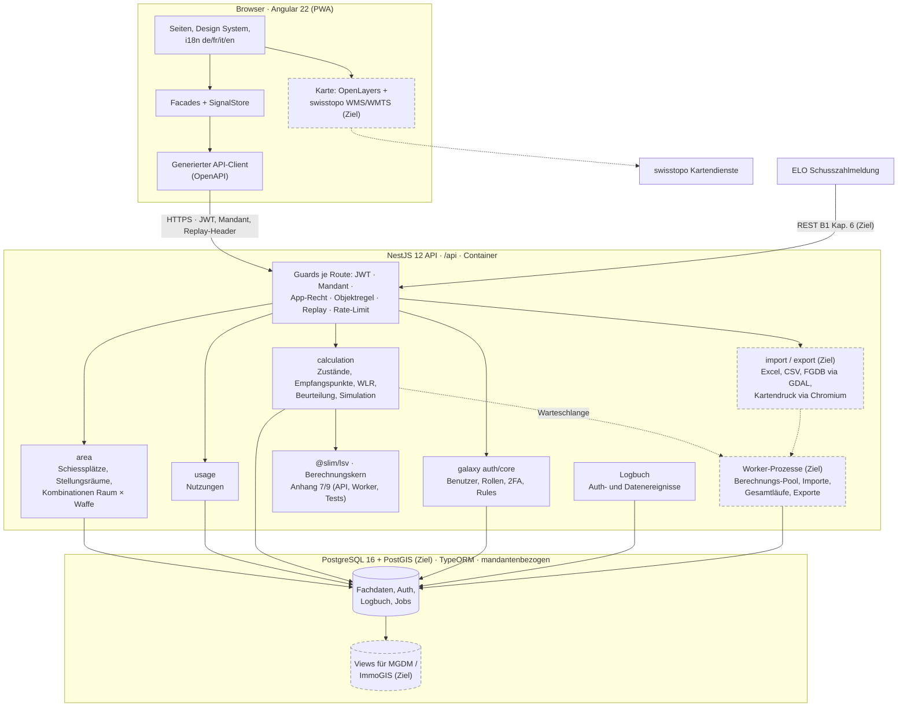
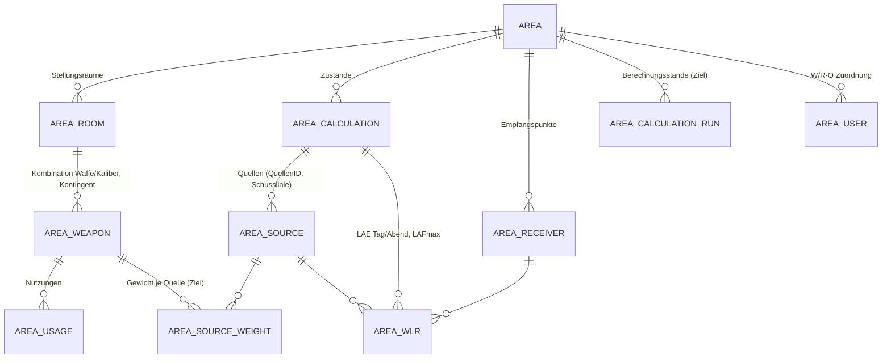
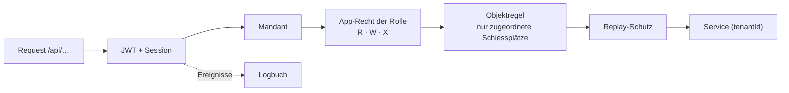
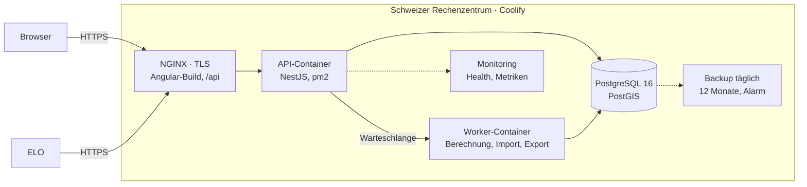
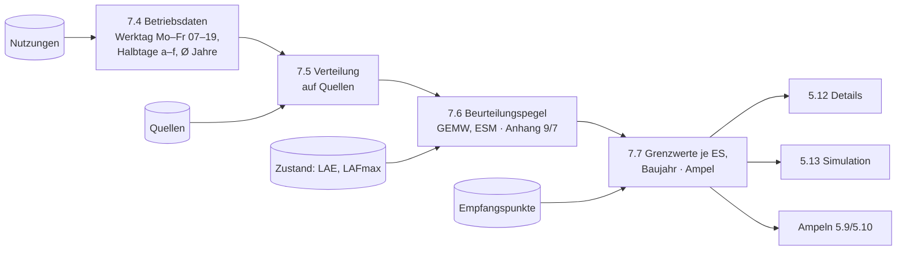

# Lösungskonzept SLIM

<!-- Deckblatt-Angaben (nicht bewertungsrelevant): Schiesslärmimmissions-Management · Ausschreibung armasuisse · simap 41345 · Zuschlagskriterium Z2 · Anbieterin: [Firmenname] · Verantwortlich: [Name, Funktion] · Version 0.2 vom 11. September 2026 (ersetzt v0.1). Grundlagen: Beilage A2, Teil A/B, Beilage B1 mit B1.1–B1.7, FAQ-Export 11.09.2026, Prototyp im Repository (docs/architecture, docs/anforderungskatalog/umsetzungsstand.md). Mit [OFFEN] markierte Stellen sind vor Abgabe zu konkretisieren. -->

## 1 Management Summary

Die Auftraggeberin braucht ein Werkzeug, das die Schiessplatznutzung des VBS erfasst, daraus die Beurteilungspegel nach Anhang 7 und 9 LSV ableitet, die Einhaltung von Grenzwerten und Kontingenten je Schiessplatz und Empfangspunkt sichtbar macht und Massnahmen simulierbar hält – nachvollziehbar für Fachspezialisten, einfach für Schiessplatz-Verantwortliche und Interessenten, auf jedem Gerät, in vier Sprachen.

SLIM ist eine Webapplikation aus Standardkomponenten (Angular, NestJS, PostgreSQL/PostGIS, OpenLayers mit swisstopo-Karten, NGINX), die auf einer Schweizer Betriebsplattform in Containern läuft. Sie übernimmt Schusszahlen manuell, per Excel und über die REST-Schnittstelle von ELO, hält die akustischen Grundlagen aus sonARMS als versionierte Zustände und rechnet die Beurteilung bei jeder Anfrage aus Nutzungen und Zustand neu – reproduzierbar und ohne Nachbau der Ausbreitungssoftware. Berechtigungen, Mandanten, Zwei-Faktor-Anmeldung und Logbuch kommen aus einer erprobten Plattform, die bereits ELO trägt.

Wesentliche Vorteile: Der Berechnungskern reproduziert die Kontrollwerte der Beilage B1.4 (Anhang 9 vollständig, Anhang 7 bis auf eine begründete Abweichung, Kapitel 4.3); die zentralen Masken (Schusszahlen, Details, Simulation) laufen als Prototyp, abgesichert durch 275 automatisierte Tests (Stand 11.09.2026, Testbericht im Repository); ELO und SLIM stammen von derselben Anbieterin und teilen Plattform und Datenmodell – die Schnittstelle wird trotzdem mit der Auftraggeberin abgestimmt und mit Integrationstests über beide Systeme abgenommen.

## 2 Architektur und Technologie

### 2.1 Komponenten, Schichten und Schnittstellen

Gestrichelt = Zielzustand, noch nicht im Prototyp; alles andere läuft heute. Drei Schichten mit klaren Verträgen: Die **Oberfläche** enthält keine autoritative Fach- oder Berechtigungslogik; sie ruft die aus der OpenAPI-Spezifikation generierten Services auf. Die **API** prüft auf jeder Route Authentifizierung, Mandant, App-Recht der Rolle, Objektregel und Replay-Schutz, validiert die Eingaben und delegiert an Fachmodule (`area`, `usage`, `calculation`, `import/export`). Der **Berechnungskern** ist eine abhängigkeitsfreie Bibliothek, die API und Tests identisch verwenden. Externe Schnittstellen: ELO (REST, Kapitel 3.1), swisstopo-Kartendienste (WMS/WMTS, Kapitel 5.2), nachgelagerte Systeme über Datenbank-Views (Kapitel 3.4).

### 2.2 Technologieentscheidungen

| Entscheid | Begründung |
| --- | --- |
| Angular 22, Standalone-Komponenten, Signals, PWA | Wahl der Anbieterin: ein Code für Desktop und Mobile (PWA, offline-fähige Entwürfe), langfristig gepflegtes Framework mit Enterprise-Verbreitung, ausgereifte Barrierefreiheits- und i18n-Werkzeuge; Team- und Plattformerfahrung aus ELO |
| NestJS 12, TypeORM, OpenAPI-Generierung | Wahl der Anbieterin: eine Sprache (TypeScript) für Oberfläche, API und Berechnungskern – Fachtypen und Berechnungsregeln werden geteilt statt doppelt gepflegt; typisierte DTOs sind der einzige API-Vertrag, der Frontend-Client wird daraus generiert |
| galaxy auth/core (eigene, in ELO produktive Plattform) | Benutzer, Rollen, Mandanten, 2FA, Sessions, Replay-Schutz und Objektregeln (Rules) sind erprobt; SLIM ergänzt nur die Fachrollen |
| PostgreSQL 16 + PostGIS | Standard mit räumlichen Typen für Empfangspunkte, Anlagenteile und Perimeter, lesende Views für MGDM/ImmoGIS, FGDB-Austausch über GDAL. Der Prototyp läuft über TypeORM auf SQLite/MariaDB; der Treiber ist Konfiguration, Migrationen werden gegen PostgreSQL geführt |
| OpenLayers + swisstopo WMS/WMTS (geo.admin.ch) | Offener Standard-Viewer mit LV95, WMS-Hintergründen und Bundeslayern, Massstab, Layer-Konfiguration; keine Lizenzkosten |
| GDAL/OGR (OpenFileGDB), ExcelJS | Lesen und Schreiben von File-Geodatabases und Excel mit Standardbibliotheken |
| NGINX, Docker, Coolify | Reverse-Proxy mit TLS liefert den Angular-Build und leitet `/api`; Container-Images versioniert; Coolify für Bereitstellung und Rückfall |

### 2.3 Datenhaltung

Das Modell folgt B1 7.4.1 und 10. Schiessplätze und Stellungsräume sind zeitlich unabhängige Referenzobjekte. Die zulässige Kombination Stellungsraum × Waffe/Kaliber trägt das Kontingent und ist der Schlüssel der Erfassung; die **Quellen** des Lärmmodells (sonARMS-QuellenID = Stellungsraum + Schusslinie + Waffe) gehören zum jeweiligen **Zustand**. Eine Kombination ist mit einer oder mehreren Quellen verknüpft; das Gewicht je Quelle stammt aus den Betriebsdaten der Grundlage (Verhältnis der Schusszahlen je Schusslinie, Anhang 9 nach Tag/Abend, Anhang 7 je Waffenkategorie) und wird beim Import des Zustands gesetzt und ist in der Datenverwaltung einsehbar. Zustände sind versioniert (Baujahr-Klasse, «gültig», «Stand MGDM») und tragen die WLR-Werte je Empfangspunkt × Quelle. Nutzungen sind davon entkoppelt (Herkunft manuell/ELO/Import, Soft-Delete, Änderungshistorie im Logbuch).

**Reproduzierbarkeit:** Abfragen in den Masken rechnen live aus Nutzungen und Zustand. Zusätzlich sichert ein **Berechnungsstand** (Maske 5.23 «Berechnungen») jedes fachlich relevante Ergebnis unveränderbar: Zeitraum, Zustand, Parameter (Feiertagskalender, Grenzwerte, Ampelschwellen, Jahre der Mittelung), die verwendeten Nutzungen als Kopie (ID, Datum, Stellungsraum, Waffe, Schusszahl), Softwareversion des Berechnungskerns, Ergebnisse je Empfangspunkt, Ersteller und Zeitpunkt. Ein Berechnungsstand lässt sich später mit derselben Kernversion nachrechnen (Prüfsumme über die Eingaben) und mit dem aktuellen Stand vergleichen; er ist die Grundlage für MGDM-Stände und Exporte. Jede Tabelle trägt `tenantId`, Zeitstempel und Löschmarke; das Schema wird per Migration versioniert und als ERD automatisch dokumentiert. *Prototyp:* Kernmodell (Schiessplatz, Stellungsraum, Kombination, Zustand, Empfangspunkt, WLR, Nutzung) umgesetzt mit genau einer Quelle je Kombination und Live-Berechnung; Quellengewichte und Berechnungsstand sind Zielzustand. Der Demo-Datensatz «SLIM Demo» mit neun Schiessplätzen wird aus diesem Modell erzeugt.

### 2.4 Sicherheit

**Rollen und Rechte (B1 8.1):** Die vier Rollen sind mit der Rechtematrix 8.1.2 als App-Rechte (R/W/X je Applikationsbereich) hinterlegt; «W/R-O – nur zugeordnete Schiessplätze» erzwingt eine Objektregel der Rule-Engine (Zuordnung Benutzer ↔ Schiessplatz, 403 ausserhalb, gefilterte Listen). Jede Route und jeder Deep Link wird serverseitig geprüft; die Oberfläche blendet Menüs und Aktionen nach denselben Rollen-Schlüsseln aus (CASL). **Anmeldung:** Passwortregeln, Sperre nach Fehlversuchen, Zwei-Faktor per E-Mail-Code oder TOTP-App – damit ist «MFA oder AGOV» erfüllt; eine AGOV-Anbindung über OIDC ist als Option vorgesehen [OFFEN: Entscheid Auftraggeberin]. **Nachvollziehbarkeit (slm 56):** Logbuch mit Login (Methode), Fehlversuch mit Grund, Sperre, Logout, Token-Wiederverwendung, Passwort-Reset und -Änderung, E-Mail-Verifikation, Änderungen an Benutzern, Rollen, Stammdaten und Exporten; Maske mit Filtern und Excel-Export; Notfallzugang (Break-Glass) als dokumentierter Prozess mit Vier-Augen-Freigabe, versiegeltem Passwort und Pflichtprotokoll. **Härtung:** Security-Header (HSTS, CSP), CORS, Rate-Limiting, Eingabevalidierung (DTOs, UUID-Parameter, Fachregeln), Geheimnisse ausserhalb des Images, Abhängigkeits-Scan im Build. *Prototyp:* Rollen, Matrix, Objektregel, 2FA, Logbuch inkl. aller Auth-Ereignisse umgesetzt und getestet; CASL-Ableitung folgt.

### 2.5 Bereitstellung und Betrieb

SLIM wird in einem Schweizer Rechenzentrum (ISO 27001, Daten und Sicherungen bleiben in der Schweiz, Support aus der Schweiz) betrieben [OFFEN: Provider und Vertragspartner vor Abgabe benennen; Anforderungen sind festgelegt]. Drei getrennte Umgebungen (Entwicklung, Akzeptanz, Produktion) mit identischen Container-Images; NGINX terminiert TLS (≥ 1.2), liefert den Angular-Build und leitet `/api` an den API-Container; Berechnungen, Importe und Exporte laufen in einem eigenen Worker-Container (Kapitel 4.4); PostgreSQL läuft als eigener Container mit persistentem Volume; Coolify verwaltet Bereitstellung, Umgebungsvariablen und Rollback, getrennt vom öffentlichen SLIM-Zugang. Releases sind versionierte Artefakte mit Datenbankmigration, Smoke-Test über Health-Endpunkte und Rückfall auf das vorherige Image. Sicherung: täglich, Mehrgenerationen über zwölf Monate, RPO ein Tag, RTO zwei Tage, Alarm bei fehlender Sicherung (slm 57), jährlicher Restore-Test. Monitoring: Health-Endpunkte, Metriken (Antwortzeiten, Fehlerraten, Jobs) und Alarmierung für den SLA-Nachweis (99 % Mo–Fr 07–19 Uhr). *Prototyp:* Docker-Image (Node 24, pm2), Compose mit MariaDB, Health-Endpunkte, reproduzierbarer Setup-Wizard.

## 3 Schnittstellen, Import und Export

### 3.1 ELO-Anbindung

SLIM stellt die REST-Schnittstelle nach B1 Kapitel 6 bereit: `GET` Anlageninformationen (Schiessplätze → Stellungsräume → zulässige Waffen/Kaliber – genau das Modell `area`/`area_room`/`area_weapon`) und `POST` genau eine Schiessplatznutzung. Authentifizierung über ein technisches Konto mit eigener Rolle (nur diese zwei Endpunkte), JSON UTF-8, HTTPS mit TLS ≥ 1.2. Validierung vor dem Speichern: Schema, Pflichtfelder, existierende IDs, Viertelstundenraster, Ende > Start, Feldlängen, zulässige Kombination Stellungsraum × Waffe, Sperrdatum; Fehler kommen synchron mit HTTP-Status, Fehlercode und verständlicher Meldung zurück, gültige Nutzungen erhalten die Herkunft «ELO» und sind sofort in Maske 5.11 und in der Beurteilung sichtbar. Vorgehen: Die Schnittstellenspezifikation (Felder, Codes, Fehlerfälle, Konten) wird zu Beginn mit der Auftraggeberin und der ELO-Seite abgestimmt und als OpenAPI-Dokument festgeschrieben (die ELO-seitige Spezifikation verantwortet gemäss FAQ 17 die Auftraggeberin); SLIM stellt früh eine Testumgebung mit Demo-Daten bereit; Integrationstests über beide Systeme (Anlagenabruf, Meldung, alle Fehlerfälle) gehören zur Abnahme. Dass ELO von derselben Anbieterin auf derselben Plattform stammt, verkürzt Abstimmung und Fehlersuche, ersetzt diese Schritte aber nicht. *Prototyp:* Datenmodell, Herkunft «ELO» mit Kennzeichen in der Maske und die Validierungsregeln des Nutzungs-Service sind umgesetzt; die beiden Endpunkte folgen als dünne Controller darauf.

### 3.2 Übernahme von Stamm-, Schusszahlen- und Berechnungsdaten

- **Stammdaten (slm 36):** Initialimport aus B1.6 «Areal_Grundlagen» und B1.7 Waffenliste per CSV/Excel in einen Prüfbereich (Staging-Tabellen); Abgleich über Koordinationsabschnitt-Nr., Stellungsraum-Name und Waffe/Kaliber; Prüfbericht mit Zeilenbezug; Übernahme erst nach fehlerfreiem Lauf. Datenqualität und Volumen werden mit der Auftraggeberin an den Originaldaten vorab geprüft [OFFEN: Testdaten].
- **Schusszahlen (slm 37):** Excel-Import nach Vorlage (5.20) mit denselben Regeln wie die Maske 5.11 und wie ELO; Zeilen mit unbekanntem Stellungsraum oder unzulässiger Kombination werden abgewiesen und im Bericht ausgewiesen (slm 45).
- **Berechnungsdaten (slm 19, 21):** FGDB aus sonARMS (Anlagenteile, Empfangspunkte, WLR-DAY/WLR-NIGHT, Betriebsdaten A9/A7) wird mit GDAL/OGR gelesen, in Staging geladen und geprüft: Quellen-IDs müssen auf bekannte Stellungsräume/Waffen abbilden, Empfangspunkte brauchen ES und EGID, WLR-Werte müssen vollständig sein. Erst dann entsteht ein neuer **Zustand** mit Referenzjahr, Baujahr-Klasse und Kennzeichen «gültig»/«MGDM»; frühere Zustände bleiben erhalten. *Prototyp:* Zielstrukturen (Zustand, Empfangspunkte, WLR je Empfangspunkt × Quelle) und die Formate aus B1.4 werden bereits vom Demo-Datensatz-Generator bedient; der Importdialog (5.18–5.21) mit Prüfbericht folgt.

### 3.3 Dateiformate, Validierung und Fehler

Excel (`.xlsx`) und CSV (UTF-8, Semikolon) über ExcelJS; FGDB über GDAL. Jeder Import läuft als Job (Kapitel 6.2): Datei ablegen → Struktur prüfen → fachlich validieren → Bericht → Übernahme in einer Transaktion. Fehler werden nie verschluckt: Der Bericht nennt Zeile, Feld, Regel und Behebung; ein Import mit Fehlern übernimmt nichts. Alle Prüfregeln sind dieselben wie in Maske und Schnittstelle (ein Service).

### 3.4 Exporte und nachgelagerte Systeme

Jede Tabelle exportiert ihre aktuelle Sicht (Filter, Spalten) als Excel; Schusszahlen und Gesamtstatistik (slm 39–41) nach den Vorlagen aus B1. Berechnungsstände werden als GeoDB (GDAL) und CSV exportiert (slm 20). Für MGDM und ImmoGIS (slm 38) stellt PostgreSQL lesende Views mit eigenen technischen Konten bereit (nur SELECT, mandantengebunden, protokolliert); bundesinterne Empfänger gemäss FAQ 15. *Prototyp:* Excel-Export des Logbuchs, Exportknöpfe der Fachmasken vorbereitet.

## 4 Lärmberechnung

### 4.1 Berechnungsablauf

Eingaben: Nutzungen des Zeitraums, Quellen (Stellungsraum × Waffe) mit Kategorie, der gewählte Zustand mit LAE Tag/Abend und LAFmax je Empfangspunkt × Quelle, Empfangspunkte mit Empfindlichkeitsstufe und Baujahr. Ergebnisse: Beurteilungspegel je Empfangspunkt (Anhang 9: LAE1/LAE2/Lr; Anhang 7: Li/Lri/Lr), Grenzwert, Reserve und Ampel je Zeile, aggregiert je Schiessplatz. Die akustischen Grundlagen stammen aus sonARMS; SLIM baut die Schallausbreitung nicht nach.

### 4.2 Umsetzung der fachlichen Regeln

1. Nutzungen nach Zeitraum und Nutzungsart wählen (militärisch → Anhang 9, zivil → Anhang 7, alle bei «Gesamtbeurteilung Anhang 7»); nur Nutzungen mit gültiger Zuordnung Stellungsraum × Waffe.
2. Betriebsdaten: Schuss anteilig innerhalb/ausserhalb Werktag (Sa/So/Feiertag ganz ausserhalb; Feiertagskalender national + Kanton des Schiessplatzes, pflegbar in der Konfiguration), Schiesshalbtage je Waffenkategorie, Mittelung über die konfigurierten Jahre.
3. Verteilung auf Quellen: jede Kombination Stellungsraum × Waffe kennt ihre Quellen des Zustands mit Gewicht (Kapitel 2.3); die Schusszahlen aus Schritt 2 werden im Verhältnis dieser Gewichte auf die Quellen (Schusslinien) verteilt – eine Kombination mit genau einer Quelle erhält alles.
4. Energetische Aggregation je Empfangspunkt; leere Quellen und Nullfälle explizit.
5. Grenzwerte nach ES und Baujahr (vor 1985 IGW, danach PW, gemischt beides); Ampel rot > Grenzwert, orange > Grenzwert − 5 dB, sonst grün; Kontingent-Ampel 100 %/125 %. Grenzwerttabellen und Schwellen liegen in der erweiterten Konfiguration.

### 4.3 Nachweis der Korrektheit

Der Berechnungskern wird gegen die Empa-Demorechnung B1.4 getestet (95 automatisierte Tests, Stand 11.09.2026). **Anhang 9:** LAE1, LAE2 und Lr stimmen für alle zwölf Empfangspunkte auf 0.1 dB mit den Kontrollwerten überein (z. B. E1 60.7/73.8, E4a 41.8/53.1). **Anhang 7:** Li, Lri und Lr stimmen für elf Empfangspunkte überein; bei E8 liefert der Kern 28.0 dB statt 28.08 dB. Ursache: Die Excel-Vorlage schreibt für Waffenkategorien ohne Schüsse 0 dB in die Lri-Zellen und summiert diese mit, was einen sehr leisen Empfangspunkt um wenige Hundertstel anhebt; der Kern lässt Kategorien ohne Schüsse aus der energetischen Summe weg, wie es die Formel in B1 7.6 vorsieht. Diese Abweichung ist im Test ausdrücklich dokumentiert; die fachlich verbindliche Variante lässt die Anbieterin von der Fachstelle bestätigen und setzt sie als Parameter um, sodass beide Lesarten nachrechenbar bleiben. Weitere Tests decken Werktag-/Feiertagsregeln, Halbtagzählung, gemischte Baujahre, fehlende Quellen, Schusszahl null, Skalierung (×10 = +10 dB, Abend +5 dB) und die Ampelschwellen ab. Jeder weitere Referenzfall der Auftraggeberin wird als Test aufgenommen; die Fachverantwortlichen bestätigen die Resultate vor der Abnahme. *Prototyp:* erbracht.

### 4.4 Performance, Skalierung und grosse Datenmengen

Auslegung: 126 Schiessplätze, 766 Stellungsräume, zehn gleichzeitige Nutzer, Antwortzeiten nach B1 12.5 (Suche Ø 2 s, Berechnung Ø 5 s/max. 10 s). Eine Beurteilung braucht im Prototyp mit 16 Quellen, 6 Empfangspunkten und einem Jahr Nutzungen rund 100 ms; Nutzungen werden je Schiessplatz und Zeitraum über Indizes gelesen und in einer Abfrage summiert. **Ressourcenisolation:** Im Zielzustand rechnet nicht der API-Prozess, sondern ein Pool von Worker-Prozessen (eigener Container, Node-Worker-Threads) mit Warteschlange, begrenzter Parallelität (Anzahl CPU-Kerne) und Zeitlimit je Auftrag. Einzelberechnungen der Masken 5.12/5.13 haben Priorität vor Gesamtläufen (Ampeln der Übersicht, Jahresstatistik, Exporte), die im Hintergrund mit tagesaktuellem Ergebnis laufen (NFA erlaubt das). Eine aufwendige Berechnung eines Nutzers blockiert so weder die API noch die Berechnungen anderer; die API antwortet bei Überlast mit Wartehinweis statt Timeout. Weitere API- oder Worker-Container ermöglichen horizontale Skalierung; der erreichbare Durchsatz und die Antwortzeiten nach B1 12.5 werden im Lasttest (k6, Akzeptanzsystem, Datenbestand in Zielgrösse) nachgewiesen, die Kriterien-Tests messen sie laufend. *Prototyp:* synchrone Berechnung im API-Prozess.

## 5 Benutzeroberfläche und Bedienung

### 5.1 Navigation und Benutzerführung

Startseite mit Kacheln und Kennzahlen; Übersicht Schiessplätze mit Kontingent- und Lärm-Ampel, Suche, Statusfilter «Handlungsbedarf» und Aktionen zu Übersicht, Schusszahlen, Details, Simulation; Schiessplatz-Kontext (Zurück, Wechsler, Ampeln, Reiter) bleibt auf allen Seiten eines Platzes sichtbar. Deep Links öffnen berechtigte Seiten direkt, ohne Session über die Anmeldung und zurück. Fehlende Berechnungsgrundlagen werden erklärt («Keine Berechnung»), Erfassung und Ansichten bleiben nutzbar (slm 4). Destruktive Aktionen werden bestätigt oder sind rückgängig machbar; Fehlermeldungen nennen Ursache und Behebung. *Prototyp:* Startseite, Übersicht, Kontext und die drei Fachmasken 5.11–5.13 umgesetzt (Bilder); Datenverwaltungsmasken 5.14–5.28 folgen nach demselben Muster.

{width=72%}

{width=72%}

### 5.2 GIS-Kartenviewer

OpenLayers in CH1903+/LV95 mit swisstopo-Hintergründen als **WMS** (wms.geo.admin.ch: Light Base Map, Imagery Base Map, weitere Bundeslayer) und ergänzend WMTS für schnelle Kacheln; Massstab, Zoom (10–12 Stufen, konfigurierbar), Koordinatenanzeige, Vollansicht. Layer: **Anlagenteile und Immissionspunkte zwingend** (Ampel-Symbol, Popover mit Beurteilung, Verknüpfung zur Detailzeile), Gebäude, Isophonen und Untersuchungsperimeter optional aus dem Zustand; Layer, Symbole, Reihenfolge und Sichtbarkeit sind eine JSON-Konfiguration, kein Code. Kartenexport (slm 2) über einen serverseitigen Druckdienst: die gleiche Kartenkomponente wird in Chromium gerendert und mit Titel, Copyright, Datum, Massstab und Legende als PDF/PNG ausgegeben. Fällt der Kartendienst aus, zeigt SLIM Empfangspunkte als Liste und schematisch. Gebäude und Isophonen gemäss FAQ 13 als Erweiterung über LP5. *Prototyp:* schematische Karte mit Ampel-Pins, Popover, Listenumschaltung, LV95-Koordinaten gespeichert.

{width=72%}

### 5.3 Tabellen und Filter

Alle Tabellen kommen aus einer Komponente: Sortierung, Suche, Spaltenfilter, Spaltenauswahl, Mehrfachselektion, persistente Filter und Excel-Export der aktuellen Sicht (slm 3). *Prototyp:* Sortierung, Suche, Statusfilter, Mehrfachselektion, kompakte Ansicht mit Aktions-Icons; Spaltenauswahl und -filter folgen in der gemeinsamen Komponente.

{width=72%}

### 5.4 Mobile Nutzung, Mehrsprachigkeit, Barrierefreiheit

Mobile first: Tabbar und Seitenpanels auf dem Telefon, Sidebar ab Desktop, Tabellen als gestapelte Karten, Light/Dark persistent. DE/FR/IT/EN über Übersetzungsressourcen je Fachbereich, Sprachwahl persistent, Formate lokalisiert (de-CH). Fachübersetzungen werden maschinell vorbereitet und von Fachpersonen der Anbieterin für FR und EN geprüft; für IT wird eine Fachübersetzung eingeplant [OFFEN: Umfang und Kostenträger für IT vor Abgabe festlegen]. Barrierefreiheit nach eCH-0059 / WCAG 2.1 AA: Tastaturbedienung, sichtbarer Fokus, beschriftete Steuerelemente, Ampeln zusätzlich mit Symbol und Text, Karteninhalte als Tabelle; automatisierte axe-Prüfung im Build, Prüfstandard gemäss FAQ 9/128 bestätigt. Optionale QR-Erfassung (slm 46–49): Der QR-Code je Stellungsraum enthält einen Deep Link mit signiertem Token (Schiessplatz, Stellungsraum, Ausgabedatum, Gültigkeit; HMAC mit mandantenspezifischem Schlüssel, Schlüsselwechsel macht alte Codes ungültig). Die API prüft Signatur, Gültigkeit und Zuordnung, bevor die Erfassungsmaske vorbelegt wird; ein ungültiger, abgelaufener oder manipulierter Code führt zu einer klaren Fehlermeldung ohne Erfassungsmöglichkeit, der Versuch wird protokolliert. Entwürfe werden offline in der PWA gehalten und beim nächsten Kontakt gesendet; die Meldung selbst erfolgt mit angemeldetem Konto. *Prototyp:* mobile Layouts, vier Sprachen, Themes und Fokusführung umgesetzt.

{width=20%}

## 6 Weitere nichtfunktionale Anforderungen

### 6.1 Wartbarkeit und Erweiterbarkeit (slm 55)

Monorepo mit getrennten Modulen (Stammdaten, Nutzungen, Berechnung, Import/Export, Benutzer/Rollen, Logbuch), generiertem API-Vertrag und automatisch dokumentiertem Datenmodell; Fachparameter (Rollen, Rechte, Grenzwerte, Ampelschwellen, Feiertage, Kartenlayer) sind Konfiguration; neue Masken entstehen aus Design System, Facade und generiertem Client. Qualitätssicherung: Lint, Unit- und Service-Tests (API 180, Frontend 63), End-to-End-Tests (32) und Kriterien-Tests je B1-Anforderung in jedem Build; reproduzierbares Setup per Wizard. Erweiterungen (weitere Anhänge der LSV, zusätzliche Layer, AGOV) betreffen je ein Modul.

### 6.2 Skalierbarkeit und Effizienz

Zustandslose API-Container hinter NGINX (horizontal skalierbar, Sessions und Replay-Store in der Datenbank bzw. Redis bei mehr als einem Container), getrennte Worker-Container für Berechnungen, Importe, Gesamtläufe und Exporte (Warteschlange, Priorität, begrenzte Parallelität, Fortschritt, Wiederanlauf; Kapitel 4.4), PostgreSQL mit Indizes je Mandant/Schiessplatz/Datum. Antwortzeiten aus B1 12.5 werden gemessen und im Monitoring alarmiert.

### 6.3 Ergonomie, Betrieb, Support und Informationsschutz

Ergonomie: einheitliche Masken (Design System), Fehlermeldungen mit Behebung, Tastaturbedienung (Kapitel 5). Betrieb: 99 % Mo–Fr 07–19 Uhr, genehmigte Wartungsfenster, Sicherung und Monitoring nach 2.5. Support: 1st Level durch die Auftraggeberin, 2nd/3rd Level Mo–Fr 08–17 Uhr, Reaktion innerhalb vier Stunden, Behebungsbeginn innerhalb 24 Stunden, Behebung bei erheblichen Störungen in der Regel innerhalb 48 Stunden. Informationsschutz: Si001 wird in einer Kontrollübersicht auf die Massnahmen aus 2.4/2.5 abgebildet (Zugriffsrechte-Prozess, Anmeldemittel, Protokollierung, Break-Glass – aus ELO übernommen); Werkzeuge nur nach Freigabe gemäss FAQ 39–41/49.

### 6.4 Dokumentation, Onlinehilfe und Schulung (slm 53)

Benutzerhandbuch deutsch online und als PDF (Upload in der erweiterten Konfiguration); kontextsensitive Hilfe über Info-Elemente an jeder Maske aus den Übersetzungsressourcen, Anzeige unter zwei Sekunden; technische Dokumentation (Architektur, Datenmodell, Berechnung, Berechtigungen, Betrieb) im Repository, mit jedem Release nachgeführt; rollenbezogene Trainerschulung (Umfang gemäss FAQ 36/38). Abnahme: jede B1-Anforderung ist mit Prüfschritten als Testfall hinterlegt; die Kontrollwerte der Berechnung sind bereits als Tests erbracht.

<!-- pagebreak -->

## 7 Anforderungsmatrix

Zuordnung der B1-Anforderungen zu den Kapiteln. Status: **P** = im Prototyp umgesetzt und getestet, **Z** = Zielzustand, in diesem Konzept verbindlich beschrieben, **O** = Option / Klärung mit der Auftraggeberin.

| ID | Anforderung kurz | Kapitel | Status |
| --- | --- | --- | --- |
| slm 1 | Auswahllisten | 5.3, 6.1 | Z |
| slm 2 | Kartenviewer, Kartenexport | 5.2 | Z (schematische Karte P) |
| slm 3 | Tabellenfunktionen | 5.3 | Z (Suche, Sortierung, Selektion P) |
| slm 4 | Nutzbar ohne Berechnungsgrundlage | 5.1 | P |
| slm 5–6 | Deep Links, Zugriffskontrolle | 2.4, 5.1 | P |
| slm 7–8 | Startseite, Schiessplatzübersicht | 5.1 | P |
| slm 9 | Schiessplatz-Übersicht 5.10 | 5.1 | Z (Ampeln, Kontext P) |
| slm 10 | Nutzungen und Schusszahlen 5.11 | 5.1 | P |
| slm 11 | Empfangspunkte, Details 5.12 | 4, 5.2 | P |
| slm 12 | Simulation 5.13 | 4, 5.1 | P |
| slm 13–18 | Datenverwaltung: Übersicht, Platzdaten, Stellungsräume, Kontingente, Waffen-Zuordnung, Zustände, Berechnungsstände | 2.3, 5.1 | Z (Datenmodell P) |
| slm 19 | GDB-Import | 3.2, 3.3 | Z |
| slm 20 | GeoDB-/CSV-Export | 3.4 | Z |
| slm 21 | WLR und Betriebsdaten | 3.2, 4.1 | Z (Formate P) |
| slm 22–25 | Waffe/Kaliber, Kaliber, Waffe, Kategorie | 5.1 | Z |
| slm 26 | Benutzerverwaltung | 2.4 | P |
| slm 27 | Erweiterte Konfiguration | 4.2, 6.1 | Z |
| slm 28–30 | ELO-Schnittstelle | 3.1 | Z (Modell, Validierung, Kennzeichen P) |
| slm 31 | LSV-Betriebsdaten | 4.2, 4.3 | P |
| slm 32 | Quellenzuordnung | 2.3, 4.2 | P (eine Quelle), Gewichte Z |
| slm 33–34 | Beurteilungspegel, Grenzwertvergleich | 4.2, 4.3 | P |
| slm 35 | Rollen und Anmeldung | 2.4 | P (AGOV O) |
| slm 36–37 | Initialimport, Excel-Schusszahlen | 3.2, 3.3 | Z |
| slm 38 | Geodatenbank und Views | 2.3, 3.4 | Z |
| slm 39–41 | Exporte, Nutzungsexport, Gesamtstatistik | 3.4 | Z (Logbuch-Export P) |
| slm 42–44 | Entkoppeltes Datenmodell, Reproduzierbarkeit | 2.3 | P (Modell), Berechnungsstand Z |
| slm 45 | Stellungsraum-Abgleich beim Import | 3.2 | Z (Regel P) |
| slm 46–49 | QR-Einstieg, Erfassung, Offline, Signatur | 5.4 | O |
| slm 50–51 | Einheitliche Oberfläche, Mehrsprachigkeit | 5.1, 5.4 | P |
| slm 52 | Ergonomie, Barrierefreiheit | 5.4, 6.3 | Z (Grundlagen P) |
| slm 53 | Handbuch und Hilfe | 6.4 | Z |
| slm 54 | Performance, Ressourcenisolation | 4.4, 6.2 | Z (Messung P) |
| slm 55 | Wartbarkeit | 6.1 | P |
| slm 56 | Authentifizierung, Logging | 2.4 | P |
| slm 57 | Backupüberwachung | 2.5 | Z |
