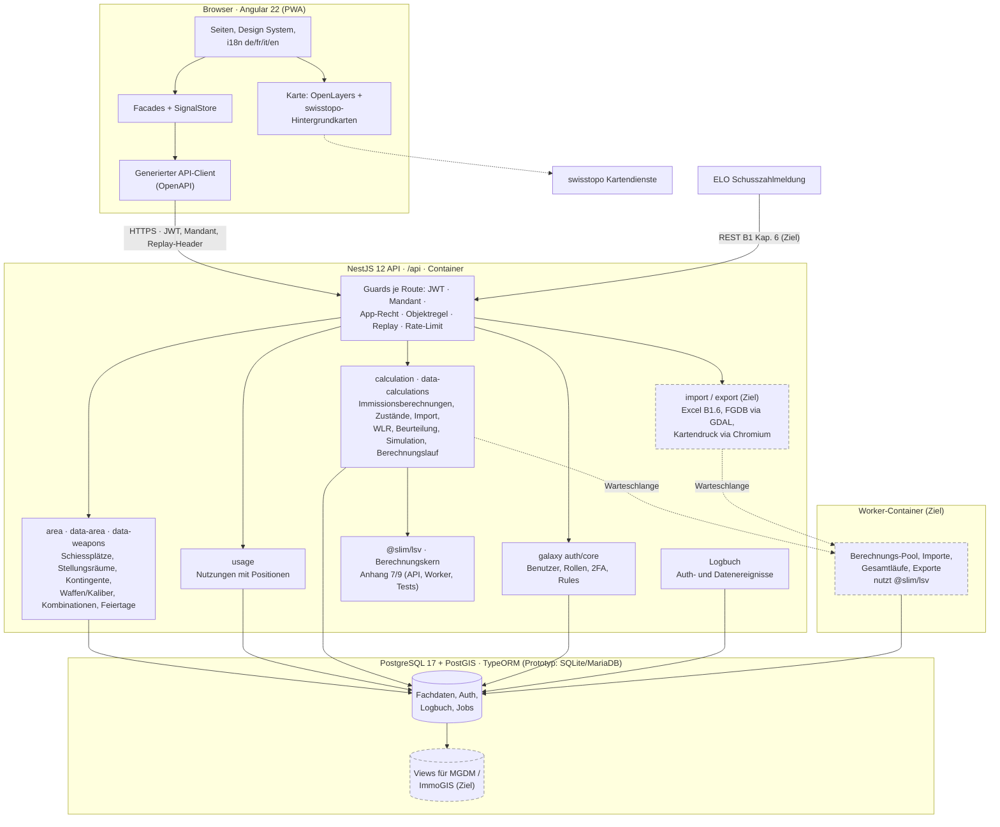
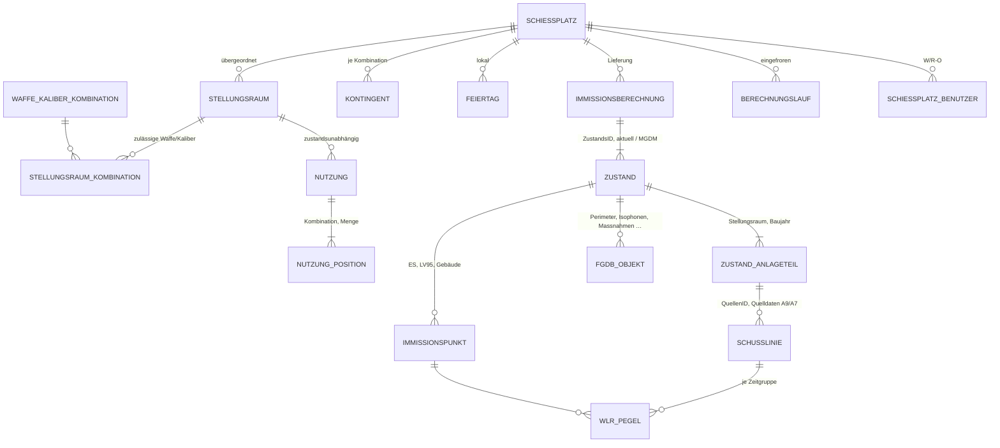
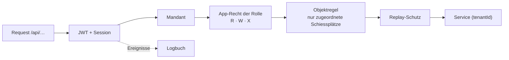
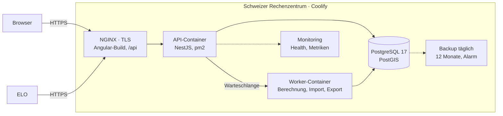
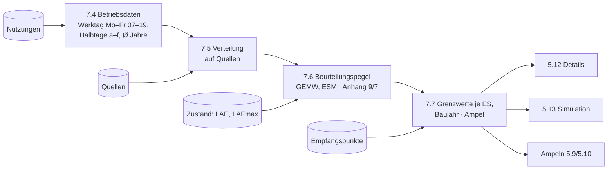
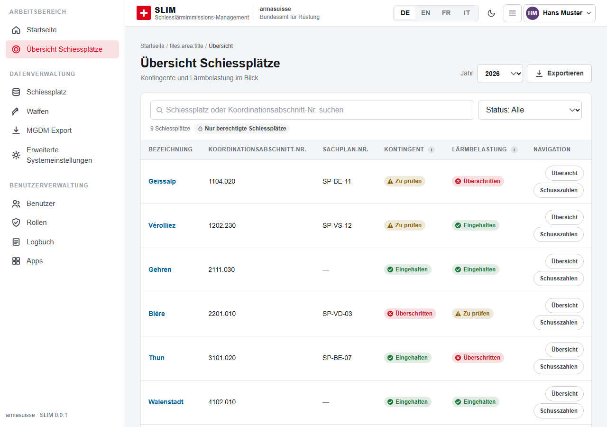
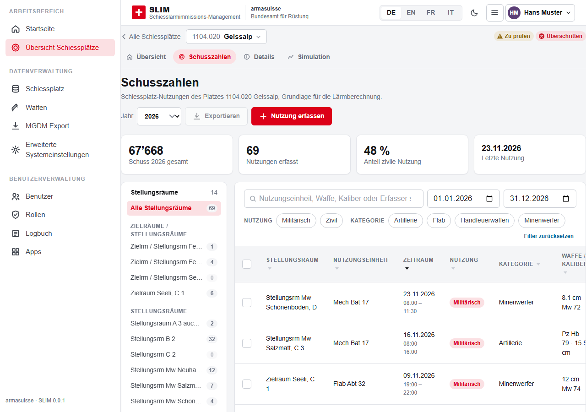
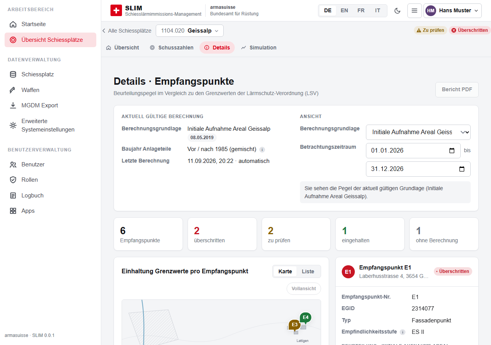
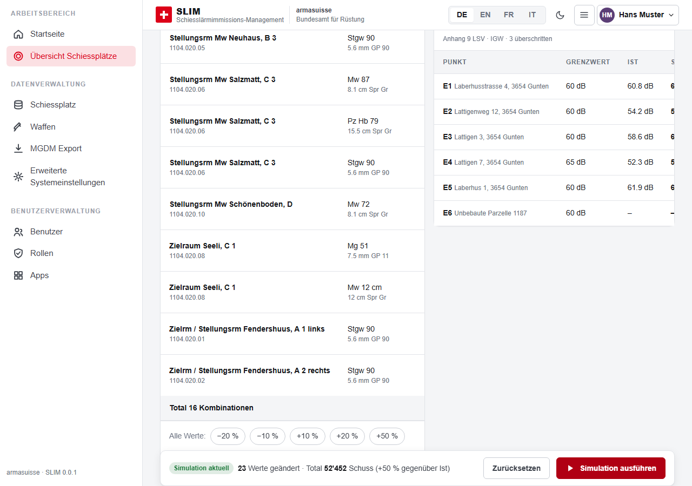
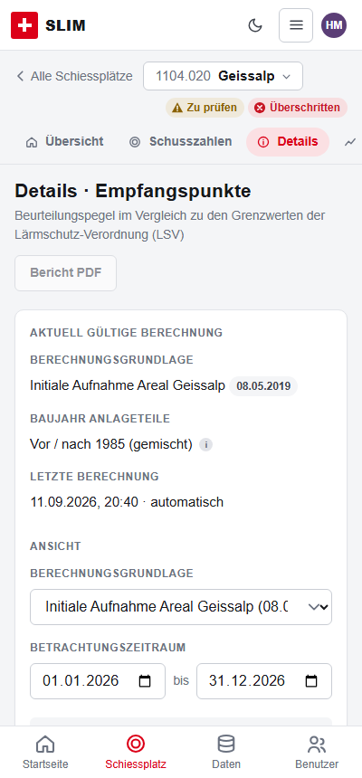

# Lösungskonzept SLIM

<!-- Deckblatt-Angaben (nicht bewertungsrelevant): Schiesslärmimmissions-Management · Ausschreibung armasuisse · simap 41345 · Zuschlagskriterium Z2 · Anbieterin (Generalunternehmerin): ongoing · Subunternehmerin Entwicklung: siehe Kapitel 1 · Version 1.0 vom 2. Oktober 2026 (ersetzt v0.3 vom 21. September 2026). Grundlagen: Beilage A2, Teil A/B, Beilage B1 mit B1.1–B1.7, Frageforum Stand 01.10.2026 (182 Fragen, 167 beantwortet), Prototyp Stand 02.10.2026. Die mit [OFFEN: …] markierten Angaben sind in C2-offene-angaben.md gesammelt und vor der Abgabe einzusetzen. -->

## 1 Management Summary

Die Auftraggeberin braucht ein Werkzeug, das die Schiessplatznutzung des VBS erfasst, daraus die Beurteilungspegel nach Anhang 7 und 9 LSV ableitet, die Einhaltung von Grenzwerten und Kontingenten je Schiessplatz und Empfangspunkt zeigt und Massnahmen simulierbar hält – nachvollziehbar für Fachspezialisten, einfach für Schiessplatz-Verantwortliche und Interessenten, in Deutsch, Französisch und Italienisch.

SLIM ist eine Webapplikation aus Standardkomponenten (Angular, NestJS, PostgreSQL/PostGIS, OpenLayers mit swisstopo-Karten), betrieben in Containern auf Schweizer Infrastruktur. Sie übernimmt Schusszahlen manuell, per Excel und über die REST-Schnittstelle von ELO, hält die akustischen Grundlagen aus sonARMS als versionierte Zustände und rechnet die Beurteilung bei jeder Anfrage aus Nutzungen und Zustand neu – reproduzierbar und ohne Nachbau der Ausbreitungssoftware. Berechtigungen, Mandanten, Zwei-Faktor-Anmeldung und Logbuch stammen aus vorbestehenden, in einem produktiven Bundessystem eingesetzten Komponenten.

**Anbieterorganisation.** Generalunternehmerin und alleinige Vertragspartnerin ist ongoing; sie verantwortet Betrieb, Support und Schulung. [OFFEN: Firmenname Entwicklerin] (nachfolgend «Entwicklerin») ist als spezialisierte Technologiepartnerin und Subunternehmerin verbindlich für die Entwicklung eingebunden (LP1 und LP5).

**Geringeres Umsetzungsrisiko.** Das Konzept stützt sich auf einen lauffähigen Prototyp (MVP): Fachmasken, Datenverwaltung, Kartenviewer, das Datenmodell nach B1 Kapitel 10 und der gegen die Empa-Referenzwerte der Beilage B1.4 geprüfte Berechnungskern sind umgesetzt und automatisiert getestet; der Stand je Anforderung steht in der Matrix. Die Entwicklerin hat zudem ELO entwickelt und kennt die Fachdomäne und beide Seiten der Schnittstelle. Deshalb wird LP1a mit einem Maximalaufwand von 2'800 statt 4'000 Stunden angeboten, und der Projektplan sieht die produktive Einführung im März 2028 vor, drei Monate vor dem vertraglichen Termin; geschult wird durch die Trainer von ongoing.

## 2 Architektur und Technologie

### 2.1 Komponenten, Schichten und Schnittstellen

```mermaid width=85%
flowchart TB
  subgraph Client["Browser · Angular 22 (PWA)"]
    direction TB
    APP["Seiten, Design System,<br/>i18n de/fr/it/en"]
    FACADE["Facades + SignalStore"]
    CLIENT["Generierter API-Client<br/>(OpenAPI)"]
    MAP["Karte: OpenLayers +<br/>swisstopo-Hintergrundkarten"]
    APP --> FACADE --> CLIENT
    APP --> MAP
  end
  subgraph Server["NestJS 12 API · /api · Container"]
    direction TB
    GUARDS["Guards je Route: JWT · Mandant ·<br/>App-Recht · Objektregel · Replay · Rate-Limit"]
    GALAXY["galaxy auth/core<br/>Benutzer, Rollen, 2FA, Rules"]
    AREA["area · data-area · data-weapons<br/>Schiessplätze, Stellungsräume, Kontingente,<br/>Waffen/Kaliber, Kombinationen, Feiertage"]
    USAGE["usage<br/>Nutzungen mit Positionen"]
    CALC["calculation · data-calculations<br/>Immissionsberechnungen, Zustände, Import,<br/>WLR, Beurteilung, Simulation, Berechnungslauf"]
    IO["import / export (Ziel)<br/>Excel B1.6, FGDB via GDAL,<br/>Kartendruck via Chromium"]:::target
    LSV["@slim/lsv · Berechnungskern<br/>Anhang 7/9 (API, Worker, Tests)"]
    LOG["Logbuch<br/>Auth- und Datenereignisse"]
    GUARDS --> GALAXY & AREA & USAGE & CALC & IO
    CALC --> LSV
  end
  subgraph Worker["Worker-Container (Ziel)"]
    JOBS["Berechnungs-Pool, Importe,<br/>Gesamtläufe, Exporte<br/>nutzt @slim/lsv"]:::target
  end
  CALC -. "Warteschlange" .-> JOBS
  IO -. "Warteschlange" .-> JOBS
  subgraph Data["PostgreSQL 17 + PostGIS · TypeORM (Prototyp: SQLite/MariaDB)"]
    direction LR
    DB[("Fachdaten, Auth,<br/>Logbuch, Jobs")]
    VIEWS[("Views für MGDM /<br/>ImmoGIS (Ziel)")]:::target
  end
  ELO["ELO Schusszahlmeldung"]
  GEO["swisstopo Kartendienste"]
  CLIENT -- "HTTPS · JWT, Mandant, Replay-Header" --> GUARDS
  ELO -- "REST B1 Kap. 6 (Ziel)" --> GUARDS
  MAP -.-> GEO
  AREA & USAGE & CALC & GALAXY & LOG & JOBS --> DB
  DB --> VIEWS
  classDef target stroke-dasharray:6 4,stroke:#777;
```

Die Skizze zeigt die Zielarchitektur; gestrichelte Elemente sind im Prototyp noch nicht vorhanden (ELO-Endpunkte, Excel- und FGDB-Verarbeitung über GDAL, Worker-Container, Views), die Datenbank läuft im Prototyp auf SQLite/MariaDB. Drei Schichten mit klaren Verträgen: Die **Oberfläche** enthält keine autoritative Fach- oder Berechtigungslogik; sie ruft die aus der OpenAPI-Spezifikation generierten Services auf. Die **API** prüft auf jeder Route Authentifizierung, Mandant, App-Recht der Rolle, Objektregel und Replay-Schutz, validiert die Eingaben und delegiert an Fachmodule (Stammdaten, Nutzungen, Berechnung, Datenverwaltung, Import/Export). Der **Berechnungskern** ist eine abhängigkeitsfreie Bibliothek, die API und Tests identisch verwenden. Externe Schnittstellen: ELO (REST, Kapitel 3.1), swisstopo-Kartendienste (Kapitel 5.2), nachgelagerte Systeme über Datenbank-Views (Kapitel 3.4).

### 2.2 Technologieentscheidungen

| Entscheid | Begründung |
| --- | --- |
| Angular 22, Standalone-Komponenten, Signals, PWA | Ein Code für Desktop, Tablet und mobile Erfassung (PWA, offline-fähige Entwürfe); langfristig gepflegtes Framework mit ausgereiften Werkzeugen für Barrierefreiheit und Mehrsprachigkeit; gleicher Stack wie ELO |
| NestJS 12, TypeORM, OpenAPI-Generierung | Eine Sprache (TypeScript) für Oberfläche, API und Berechnungskern – Fachtypen und Rechenregeln werden geteilt statt doppelt gepflegt; typisierte DTOs sind der einzige API-Vertrag, der Frontend-Client wird daraus generiert |
| galaxy auth/core (vorbestehend) | Benutzer, Rollen, Mandanten, 2FA, Sessions, Replay-Schutz und Objektregeln (Rules) sind produktiv erprobt; SLIM ergänzt die Fachrollen und läuft als eigene Instanz mit eigener Datenbank und eigenen Geheimnissen |
| PostgreSQL 17 + PostGIS 3 | Standard mit räumlichen Typen und Indizes für Empfangspunkte, Anlagenteile und Perimeter, lesende Views für MGDM/ImmoGIS. PostGIS (GPL) wird nur als unveränderter Datenbankdienst genutzt – keine Verlinkung mit SLIM-Code. Der Prototyp läuft über TypeORM auf SQLite/MariaDB; Container, Konfiguration und treiberneutrale Abfragen für PostgreSQL sind vorbereitet, die Typzuordnung der vorbestehenden Bibliotheken ist die erste Aufgabe in LP1 (Nachweis auf dem Akzeptanzsystem bis Meilenstein M2) |
| OpenLayers + swisstopo (geo.admin.ch) | Offener Standard-Viewer mit LV95, Bundeslayern, Massstab und Layer-Konfiguration; keine Lizenzkosten |
| GDAL/OGR ≥ 3.8 (Treiber OpenFileGDB mit Schreibunterstützung), ExcelJS | File-Geodatabases werden über GDAL gelesen und geschrieben, Excel und CSV über ExcelJS – in einer klar abgegrenzten Verarbeitungsschicht, damit ein Wechsel auf GeoPackage oder INTERLIS mit vertretbarem Aufwand möglich bleibt (FAQ 121, 176; Change LP5) |
| NGINX, Docker, Coolify | Reverse-Proxy mit TLS liefert den Angular-Build und leitet `/api`; versionierte Container-Images; Coolify für Bereitstellung und Rückfall |

**Vorbestehende Rechte und Nutzungsrechte.** (1) Open-Source-Komponenten: Angular 22, NestJS 12, TypeORM 0.3, ExcelJS 4 (MIT), OpenLayers (BSD-2), GDAL ≥ 3.8 (MIT), PostgreSQL 17 (PostgreSQL-Lizenz), PostGIS 3.5 (GPL, nur als Datenbankdienst) – ohne Copyleft-Wirkung auf SLIM; die Lizenzliste mit Versionen ist Teil der SBOM jedes Releases. (2) Vorbestehende Rechte der Entwicklerin: die Plattformbibliotheken `@app-galaxy/*` (Authentifizierung, Mandanten, Rollen, Rule-Engine, Übersetzung, Setup) und der Prototyp (MVP) in seinem Stand vor Inkrafttreten des Rahmenvertrags. Das Eigentum an diesen Basiskomponenten verbleibt bei der Entwicklerin; die Auftraggeberin erhält daran das vertraglich verlangte, vollständige und unentgeltliche Nutzungsrecht gemäss Art. 6.2.4 des Rahmenvertrags, den Quellcode als Teil der Lieferung (Art. 2.9.1) und die Kennzeichnung als vorbestehend in der SBOM (Art. 4.3.1; FAQ 97, 138, 170). (3) Arbeitsergebnisse: Alle im Projekt erstellten Erweiterungen und Anpassungen gehen gemäss Art. 6.1.4 auf die Auftraggeberin über. Wartbarkeit durch Dritte: Standard-Stack, öffentliche Paketquellen, generierter API-Vertrag, dokumentiertes Datenmodell, automatisierte Tests und der Setup-Wizard erlauben einer anderen Firma die Übernahme; die galaxy-Bibliotheken werden mit Quellcode, Tests und Dokumentation geliefert.

### 2.3 Datenhaltung

Das Modell folgt B1 7.4.1 und Kapitel 10. Schiessplätze und Stellungsräume sind zeitlich unabhängige Referenzobjekte. Die zulässige Kombination Stellungsraum × Waffe/Kaliber trägt das Kontingent und ist der Schlüssel der Erfassung; die **Quellen** des Lärmmodells (sonARMS-QuellenID = Stellungsraum + Schusslinie + Waffe) gehören zum jeweiligen **Zustand**. Eine Kombination ist mit einer oder mehreren Quellen verknüpft; das Gewicht je Quelle stammt aus den Betriebsdaten der Grundlage (Verhältnis der Schusszahlen je Schusslinie; Anhang 9 nach Tag/Abend, Anhang 7 je Waffenkategorie) und wird beim Import des Zustands gesetzt. Hierarchie nach B1 5.18: Schiessplatz → **Immissionsberechnung** (Bezeichnung, Lieferantin, Lieferdatum) → ein oder mehrere **Zustände** (ZustandsID, Referenzjahr, Baujahr-Klasse) mit Quellen, Empfangspunkten und WLR-Werten je Empfangspunkt × Quelle; genau ein Zustand je Schiessplatz ist «aktuell gültig» und genau einer «Stand MGDM» (Datenbank-Constraint). Nutzungen sind davon entkoppelt (Herkunft manuell/ELO/Import, Soft-Delete, Änderungshistorie im Logbuch); Mengen sind Dezimalzahlen mit Einheit (Stück oder kg Sprengstoff, B1 6.2/11.2.3) und werden ohne Rundungsverlust durch Erfassung, Schnittstelle, Import, Verteilung und Export geführt. Externe Identifikatoren (Koordinationsabschnitt-Nr., ZustandsID, QuellenID, sonARMS_ID) bleiben als eigene Attribute erhalten; interne Schlüssel sind UUIDs. Physische Datenbankobjekte sind deutsch benannt (B1 12.2, slm 51); die englischen Klassennamen des Codes sind logische Namen.

**Reproduzierbarkeit:** Die Masken rechnen live aus Nutzungen und Zustand. Zusätzlich sichert ein **Berechnungsstand** jedes fachlich relevante Ergebnis unveränderbar: Zeitraum, Zustand, Parameter (Feiertagskalender, Grenzwerte, Ampelschwellen, Jahre der Mittelung), die verwendeten Nutzungen als vollständige Kopie, Quellen mit Gewichten, WLR-Werte und Empfangspunkte (ES, Baujahr), Version des Berechnungskerns, Ergebnisse je Empfangspunkt, Ersteller und Zeitpunkt. Berechnungsstände kennen kein Update und kein Delete (nur Archivieren); Zustände, Gewichte und WLR-Werte werden nach der Freigabe nicht geändert, sondern als neuer Zustand importiert. Ein Berechnungsstand lässt sich mit derselben Kernversion aus der eigenen Kopie nachrechnen (Prüfsumme über alle Eingaben) und mit dem aktuellen Stand vergleichen; er ist die Grundlage für MGDM-Stände und Exporte. **Anlagenabgrenzung (B1 7.3, FAQ 93):** Angebotsbasis ist die platzweite Berechnung aller Nutzungen und Anlagenteile eines Schiessplatzes; getrennte Berechnungen einzelner Anlagen werden als Erweiterung unter LP5 behandelt. Jede Tabelle trägt `tenantId` (fachliche Mandantentrennung, z. B. Demo- neben Produktivmandant; Entwicklung, Akzeptanz und Produktion sind getrennte Instanzen mit eigener Datenbank; SLIM teilt keine Laufzeit mit ELO), Zeitstempel und Löschmarke; das Schema wird per Migration versioniert und als ERD automatisch dokumentiert. *Prototyp:* Das Modell nach B1 Kapitel 10 (Abbildung 43) ist umgesetzt: Referenzstruktur, zustandsunabhängige Nutzungen mit n Positionen, Zustandsebene (Immissionsberechnung → Zustand → Anlageteile, Schusslinien mit Quelldaten Anhang 9/7, Immissionspunkte, Gebäude, WLR je Zeitgruppe, weitere FGDB-Objekte); zusammengesetzte Fremdschlüssel verhindern Verknüpfungen über Zustände hinweg, Unique-Indizes erzwingen genau einen aktuellen und einen MGDM-Zustand; der Berechnungsstand (Kopie der Nutzungen, Referenz-Snapshot, Kernversion, Prüfsumme) ist umgesetzt. Tabellen sind deutsch benannt, Spalten deutsch in Zustandsebene und Berechnungslauf; die Spalten der Referenzstruktur und der Nutzungen werden in LP1 umbenannt. Geometrien liegen im Prototyp als Text (WKT) vor, im Zielsystem als PostGIS-Geometrien.

```mermaid width=82%
%% physische Tabellen (slm 51); drei Ebenen wie B1 Abbildung 43
erDiagram
  SCHIESSPLATZ ||--o{ STELLUNGSRAUM : "übergeordnet"
  STELLUNGSRAUM ||--o{ STELLUNGSRAUM_KOMBINATION : "zulässige Waffe/Kaliber"
  WAFFE_KALIBER_KOMBINATION ||--o{ STELLUNGSRAUM_KOMBINATION : ""
  SCHIESSPLATZ ||--o{ KONTINGENT : "je Kombination"
  SCHIESSPLATZ ||--o{ FEIERTAG : "lokal"
  STELLUNGSRAUM ||--o{ NUTZUNG : "zustandsunabhängig"
  NUTZUNG ||--|{ NUTZUNG_POSITION : "Kombination, Menge"
  SCHIESSPLATZ ||--o{ IMMISSIONSBERECHNUNG : "Lieferung"
  IMMISSIONSBERECHNUNG ||--|{ ZUSTAND : "ZustandsID, aktuell / MGDM"
  ZUSTAND ||--|{ ZUSTAND_ANLAGETEIL : "Stellungsraum, Baujahr"
  ZUSTAND_ANLAGETEIL ||--o{ SCHUSSLINIE : "QuellenID, Quelldaten A9/A7"
  ZUSTAND ||--o{ IMMISSIONSPUNKT : "ES, LV95, Gebäude"
  SCHUSSLINIE ||--o{ WLR_PEGEL : "je Zeitgruppe"
  IMMISSIONSPUNKT ||--o{ WLR_PEGEL : ""
  ZUSTAND ||--o{ FGDB_OBJEKT : "Perimeter, Isophonen, Massnahmen …"
  SCHIESSPLATZ ||--o{ BERECHNUNGSLAUF : "eingefroren"
  SCHIESSPLATZ ||--o{ SCHIESSPLATZ_BENUTZER : "W/R-O"
```

### 2.4 Sicherheit

**Rollen und Rechte (B1 8.1):** Die vier Rollen sind mit der Rechtematrix 8.1.2 als App-Rechte (R/W/X je Applikationsbereich) hinterlegt; «W/R-O – nur zugeordnete Schiessplätze» erzwingt eine Objektregel der Rule-Engine (Zuordnung Benutzer ↔ Schiessplatz, 403 ausserhalb, gefilterte Listen). Jede Route und jeder Deep Link wird serverseitig geprüft; die Oberfläche blendet Menüs und Aktionen nach denselben Rollen-Schlüsseln aus. **Anmeldung:** «MFA oder AGOV» (slm 35) erfüllt SLIM mit einer Zwei-Faktor-Anmeldung in SLIM selbst: Passwort plus zweiter Faktor über TOTP-App (RFC 6238; Enrollment per QR-Code bei der ersten Anmeldung, Seeds verschlüsselt gespeichert, Wiederherstellung über einmalige Backup-Codes oder Rücksetzung durch den Applikationsadministrator im Vier-Augen-Prinzip), für jedes Konto erzwungen; dazu Passwortregeln und Sperre nach Fehlversuchen. Entscheid der Anbieterin gemäss FAQ 27: MFA in SLIM, weil alle Nutzer über die VBS-Benutzerverwaltung geführt werden und keine Anschlussvereinbarung mit der Bundeskanzlei nötig ist; AGOV (OIDC) kann als Option für externe Nutzer ohne Änderung des Fachmodells ergänzt werden. **Nachvollziehbarkeit (slm 56):** Logbuch mit Login (Methode), Fehlversuch mit Grund, Sperre, Logout, Token-Wiederverwendung, Passwort-Reset und -Änderung, E-Mail-Verifikation, Änderungen an Benutzern, Rollen und Stammdaten sowie Exporten; Maske mit Filtern und Excel-Export; Notfallzugang (Break-Glass) als dokumentierter Prozess mit Vier-Augen-Freigabe, versiegeltem Passwort und Pflichtprotokoll. **Härtung:** Security-Header (HSTS, CSP), CORS, Rate-Limiting, Eingabevalidierung (DTOs, UUID-Parameter, Fachregeln), Geheimnisse ausserhalb des Images, Abhängigkeits-Scan im Build. *Prototyp:* Rollen, Matrix, Objektregel, Logbuch mit allen Auth-Ereignissen und die Security-Header (CSP beschränkt den Browser auf die eigene Herkunft und geo.admin.ch) sind umgesetzt und getestet; Menü und Lesemodus der Datenverwaltung folgen den App-Rechten der Sitzung. Der zweite Faktor ist als E-Mail-Code vorhanden (in der Demo nicht aktiviert); TOTP ersetzt ihn im ersten Sprint, die Ableitung der einzelnen Schaltflächen aus den Rechten folgt in LP1.

```mermaid
flowchart LR
  REQ["Request /api/…"] --> JWT["JWT + Session"] --> TENANT["Mandant"] --> APPS["App-Recht der Rolle<br/>R · W · X"] --> SCOPE["Objektregel<br/>nur zugeordnete Schiessplätze"] --> REPLAY["Replay-Schutz"] --> SVC["Service (tenantId)"]
  JWT -. "Ereignisse" .-> LOGB["Logbuch"]
```

### 2.5 Bereitstellung und Betrieb

ongoing betreibt SLIM auf der Infrastruktur von [OFFEN: Hosting-Anbieter] in Schweizer Rechenzentren (reiner Infrastrukturanbieter gemäss FAQ 132, 140 und 180; Anforderungen: ISO 27001, IT-Grundschutz Si001). Sämtliche Applikations- und Projektdaten – alle Umgebungen, Sicherungen, Protokolle, Quellcode und Entwicklungsdaten – werden zu 100 % in der Schweiz gespeichert und bearbeitet; keine Kopie verlässt die Schweiz, auch nicht zu Sicherungszwecken (E1; Nachweis je System im Datenhaltungskonzept). Ein Wechsel des Hosting-Anbieters wird der Auftraggeberin zur Genehmigung vorgelegt. Drei getrennte Umgebungen (Entwicklung, Akzeptanz, Produktion) mit identischen Container-Images; NGINX terminiert TLS (≥ 1.2), liefert den Angular-Build und leitet `/api` an den API-Container; Berechnungen, Importe und Exporte laufen in einem eigenen Worker-Container (Kapitel 4.4); PostgreSQL läuft als eigener Container mit persistentem Volume; Coolify verwaltet Bereitstellung, Umgebungsvariablen und Rollback (Zugang nur mit MFA und aus zugelassenen Netzen, Si001). Releases sind versionierte Artefakte mit Datenbankmigration und Smoke-Test über Health-Endpunkte. Rückfall: Migrationen sind rückwärtskompatibel (erweitern statt umbenennen oder löschen; Aufräumen erst im übernächsten Release), sodass das vorherige Image auf dem migrierten Schema lauffähig bleibt; jede Migration hat einen getesteten Down-Schritt. Für nicht rückwärtskompatible Änderungen gilt: Release im Wartungsfenster mit Schreibpause, Sicherung mit archivierten WAL-Segmenten (Point-in-Time-Recovery), Rückfall durch Wiederherstellung auf den Zeitpunkt vor dem Release; der Rückfall wird auf dem Akzeptanzsystem geprobt. Sicherung (B1 12.8, FAQ 14/116): automatisch täglich und manuell vor Releases und Importen, Mehrgenerationen über zwölf Monate, RPO ein Tag, RTO zwei Tage, Integritätsprüfung jeder Sicherung (Prüfsumme und Probe-Restore), Alarm bei fehlender oder fehlerhafter Sicherung (slm 57), jährlicher Restore-Test, Kopie am Betriebsstandort und an einem zweiten Schweizer Standort, lesbarer Datendump (SQL/CSV) auf Verlangen. Jede Sicherung umfasst gemäss FAQ 116 den über alle Komponenten konsistenten Systemstand: Datenbank mit Transaktionsprotokollen, importierte Dateien, Anwendungsversion und Container-Images, Schema und Migrationen sowie Infrastruktur- und Laufzeitkonfiguration; Schlüssel, Zertifikate und Secrets werden getrennt und geschützt gesichert. Ein Sicherungsmanifest ordnet Versionen, Zeitpunkt und Prüfsummen zu; der Restore-Test stellt das Gesamtsystem wieder her und prüft Datenkonsistenz und Funktion. Monitoring: Health-Endpunkte, Metriken (Antwortzeiten, Fehlerraten, Jobs) und Alarmierung für den SLA-Nachweis (99 % Mo–Fr 07–19 Uhr). *Prototyp:* Docker-Image (Node 24, pm2), Compose mit MariaDB und PostGIS-Container, Health-Endpunkte, CI mit Lint, Unit-, HTTP- und End-to-End-Tests je Commit, reproduzierbarer Setup-Wizard; Sicherung, Monitoring und Worker werden mit der Betriebsplattform aufgebaut.

```mermaid width=80%
flowchart LR
  U["Browser"] -- "HTTPS" --> P
  E["ELO"] -- "HTTPS" --> P
  subgraph CH["Schweizer Rechenzentrum · Coolify"]
    direction LR
    P["NGINX · TLS<br/>Angular-Build, /api"] --> A["API-Container<br/>NestJS, pm2"] --> D[("PostgreSQL 17<br/>PostGIS")]
    A -- "Warteschlange" --> W["Worker-Container<br/>Berechnung, Import, Export"] --> D
    D -.-> B["Backup täglich<br/>12 Monate, Alarm"]
    A -.-> M["Monitoring<br/>Health, Metriken"]
  end
```

## 3 Schnittstellen, Import und Export

### 3.1 ELO-Anbindung

SLIM stellt die REST-Schnittstelle nach B1 Kapitel 6 bereit: `GET` Anlageninformationen (Schiessplätze → Stellungsräume → zulässige Waffen/Kaliber) und `POST` genau eine Schiessplatznutzung. Authentifizierung über ein technisches Konto mit eigener Rolle (nur diese zwei Endpunkte): Vorschlag der Anbieterin ist OAuth2 Client Credentials (kurzlebige Zugriffstoken, Geheimnis-Rotation ohne Unterbruch) mit IP-Allowlist, mTLS als Alternative – der Entscheid fällt bei der Schnittstellenabstimmung. JSON UTF-8, HTTPS mit TLS ≥ 1.2. Jede Meldung trägt einen Idempotenz-Schlüssel: Eine Wiederholung liefert dieselbe Antwort und erzeugt keine Doppelnutzung. Validierung vor dem Speichern: Schema, Pflichtfelder, existierende IDs, Viertelstundenraster, Ende > Start, Feldlängen, zulässige Kombination Stellungsraum × Waffe, Sperrdatum; Fehler kommen synchron mit HTTP-Status, Fehlercode und verständlicher Meldung zurück, gültige Nutzungen erhalten die Herkunft «ELO» und sind sofort in Maske 5.11 und in der Beurteilung sichtbar. **Beide Seiten in einer Hand:** Die Entwicklerin hat ELO auf demselben Technologie-Stack entwickelt und kennt Datenmodell und Fachbegriffe beider Systeme. Das senkt das Integrationsrisiko, ersetzt die Abstimmung aber nicht: Die Schnittstellenspezifikation (Felder, Codes, Fehlerfälle, Konten) wird zu Beginn mit der Auftraggeberin festgelegt und als OpenAPI-Dokument festgeschrieben (die ELO-seitige Spezifikation verantwortet gemäss FAQ 17 die Auftraggeberin unter Zuzug der ELO-Entwicklerfirma, Anpassungen an ELO trägt die Auftraggeberin); SLIM stellt früh eine Testumgebung mit Demo-Daten bereit; Integrationstests über beide Systeme (Anlagenabruf, Meldung, alle Fehlerfälle) gehören zur Abnahme. *Prototyp:* Die beiden Endpunkte sind noch nicht umgesetzt; sie werden in LP1 gebaut. Vorhanden und getestet sind das Datenmodell (Nutzung mit n Positionen, Herkunft «ELO» mit Kennzeichen in der Maske, Idempotenz über die externe ID) und die Validierungsregeln des Nutzungs-Service (Viertelstundenraster, Ende > Start, Anzahl Personen, zivile Nutzungsart als bedingtes Pflichtfeld, nur zulässige Kombinationen, Dezimalmengen mit Einheit, Sperrdatum), auf denen die Endpunkte als dünne Controller aufsetzen.

### 3.2 Übernahme von Stamm-, Schusszahlen- und Berechnungsdaten

- **Stammdaten (slm 36):** Initialimport aus B1.6 «Areal_Grundlagen» und B1.7 Waffenliste per CSV/Excel in einen Prüfbereich (Staging-Tabellen); Abgleich über Koordinationsabschnitt-Nr., Stellungsraum-Name und Waffe/Kaliber; Prüfbericht mit Zeilenbezug; Übernahme erst nach fehlerfreiem Lauf. Vorgehen (B1 9.2, FAQ 28): Die Auftraggeberin bereitet die Daten in rund drei Monaten per ETL auf und verantwortet ihre Qualität; SLIM liefert das Zielformat und den Prüfbericht; Probemigration auf dem Akzeptanzsystem mit Mengenabgleich und fachlicher Stichprobe, Freigabe durch die Auftraggeberin, dann Produktivmigration im Wartungsfenster mit Sicherung davor. Historische Nutzungen und frühere Berechnungen sind gemäss B1 9.2 nicht Teil des Initialimports; ein späterer Nachimport ist ein Change.
- **Schusszahlen (slm 37):** Excel-Import nach der Vorlage B1.6 (B1 9.3) mit denselben Regeln wie Maske 5.11 und ELO; Zeilen mit unbekanntem Stellungsraum oder unzulässiger Kombination werden abgewiesen und im Bericht ausgewiesen.
- **Berechnungsdaten (slm 19–21):** Ablauf nach B1 9.1: SLIM exportiert die Grundlage (Zustand, Nutzungen), das Ingenieurbüro rechnet in sonARMS, die zurückgelieferte FGDB wird durch KOMZ Lärm mit der FME-Workbench **fachlich** validiert (ausserhalb von SLIM); SLIM prüft beim Import Struktur und Zuordnung. SLIM liest und schreibt die FGDB (Anlagenteile, Empfangspunkte, WLR-DAY/WLR-NIGHT, Betriebsdaten A9/A7) direkt über die GDAL-Bibliotheken (OGR, Treiber OpenFileGDB); die Lese- und Schreibfähigkeit wird zu Projektbeginn mit den Testdaten von KOMZ Lärm validiert, das endgültige Schema gemäss FAQ 99 gemeinsam festgelegt. Die Daten werden in Staging geladen und geprüft: Quellen-IDs müssen auf bekannte Stellungsräume und Waffen abbilden, Empfangspunkte brauchen ES und EGID und werden über die sonARMS_ID abgeglichen, WLR-Werte müssen vollständig sein. Erst dann entsteht ein neuer **Zustand**; frühere Zustände bleiben erhalten. *Prototyp:* Import 5.19 umgesetzt: Staging, Validierung ohne Schreiben (Befunde, Warnungen, Zähler), Abbruch bei unbekanntem Stellungsraum oder doppeltem Anlageteil, ohne einen Datensatz zu schreiben (slm 45), Übernahme in einer Transaktion als neuer Zustand; WLR- und Betriebsdaten-Dateien je Zeitgruppe werden direkt gelesen. Die Berechnungsdatei selbst liest und schreibt der Prototyp als JSON derselben Struktur (FME-Export); die GDAL-Anbindung ersetzt diesen Schritt, die Prüfungen bleiben unverändert.

### 3.3 Dateiformate, Validierung und Fehler

Excel (`.xlsx`) und CSV (UTF-8, Semikolon) über ExcelJS; FGDB über GDAL. Grosse Dateien werden per Drag-and-Drop abgelegt und zeilenweise gestreamt, Geometrien in räumliche Indizes übernommen; Ausschnittabfragen der Karte lesen nur den sichtbaren Bereich. Jeder Import läuft als Job (Kapitel 6.2): Datei ablegen → Struktur prüfen → fachlich validieren → Bericht → Übernahme in einer Transaktion. Fehler werden nie verschluckt: Der Bericht nennt Zeile, Feld, Regel und Behebung; ein Import mit Fehlern übernimmt nichts. Alle Prüfregeln sind dieselben wie in Maske und Schnittstelle (ein Service).

### 3.4 Exporte und nachgelagerte Systeme

Jede Tabelle exportiert ihre aktuelle Sicht (Filter, Spalten) als Excel und CSV (slm 3, 39); davon getrennt der vollständige Nutzungsexport im Format B1.6 (slm 40) und die Gesamtstatistik MPV mit einer Zeile je Schiessplatz – Kontingent- und Grenzwertstatus je Anhang, Stand SPM/MPV/Projekt, Berechnungsgrundlage (slm 41). Berechnungsstände werden als GeoDB (GDAL) und CSV exportiert (slm 20). Für MGDM und ImmoGIS (slm 38) stellt PostgreSQL lesende Views mit eigenen technischen Konten bereit (nur SELECT auf die fachlichen Views, protokolliert); Zugriff über einen dedizierten, TLS-verschlüsselten Datenbankendpunkt mit IP-Allowlist oder VPN – die Datenbank ist nie öffentlich erreichbar; Netze und Quellen werden gemäss FAQ 171 zu Beginn der Realisierung festgelegt. *Prototyp:* Tabellen-Export als Excel (fester Kopfblock mit Titel, Auswahl, Filter, Exportdatum und Benutzer) und als CSV in der Übersicht der Schiessplätze und in den Schusszahlen, Excel-Export des Logbuchs und der Waffen-Stammdaten, Zustände als wieder importierbares Bündel (5.20), Schusszahlen als CSV. In LP1 folgen der Export in den übrigen Tabellen, das Format B1.6, die MPV-Statistik, die GeoDB und die Views.

## 4 Lärmberechnung

### 4.1 Berechnungsablauf

Eingaben: Nutzungen des Zeitraums (je Kombination Stellungsraum × Waffe/Kaliber), die Quellen des Zustands mit Gewicht und Kategorie, die Pegel je Empfangspunkt × Quelle – für Anhang 9 der LAE aus WLR_Day (Tag) und WLR_Eve (Abend), für Anhang 7 der LAFmax aus WLR_Day (B1 7.6.1/7.6.2) –, Empfangspunkte mit Empfindlichkeitsstufe, Baujahr der zugehörigen Stellungsräume. Ergebnisse: Beurteilungspegel je Empfangspunkt (Anhang 9: LAE1/LAE2/Lr; Anhang 7: Li/Lri/Lr), Grenzwert, Reserve und Ampel je Zeile, aggregiert je Schiessplatz. Die akustischen Grundlagen stammen aus sonARMS; SLIM baut die Schallausbreitung nicht nach.

```mermaid width=92%
flowchart LR
  U[("Nutzungen")] --> S1["7.4 Betriebsdaten<br/>Werktag Mo–Fr 07–19,<br/>Halbtage a–f, Ø Jahre"] --> S2["7.5 Verteilung<br/>auf Quellen"] --> S3["7.6 Beurteilungspegel<br/>GEMW, ESM · Anhang 9/7"] --> S4["7.7 Grenzwerte je ES,<br/>Baujahr · Ampel"]
  W[("Quellen")] --> S2
  C[("Zustand: LAE, LAFmax")] --> S3
  R[("Empfangspunkte")] --> S4
  S4 --> D["5.12 Details"] & SIM["5.13 Simulation"] & OV["Ampeln 5.9/5.10"]
```

### 4.2 Umsetzung der fachlichen Regeln

1. Nutzungen nach Zeitraum und Nutzungskategorie wählen (B1 Tabelle 2): **Anhang 9** berücksichtigt alle Kategorien (Militär, Zivil, Blaulicht, SAT); **Anhang 7** Zivil und SAT, alle Kategorien bei gesetztem Flag «Gesamtbeurteilung nach Anhang 7» des Schiessplatzes; nur Nutzungen mit gültiger Zuordnung Stellungsraum × Waffe. Ob zivile Nutzungen in Anhang 9 einfliessen, wird gemäss FAQ 165 zu Beginn der Realisierung mit KOMZ Lärm bestätigt; die Regel liegt an einer Stelle des Berechnungskerns.
2. Betriebsdaten: Schuss anteilig innerhalb/ausserhalb Werktag Mo–Fr 07–19 Uhr (Sa/So und Feiertage ganz ausserhalb, Zeit vor 07 und nach 19 Uhr sowie halbe Feiertage anteilig). Feiertage gelten **lokal am Standort** (B1 S. 71, FAQ 164): je Schiessplatz ein in SLIM gepflegter Kalender aus nationalen, kantonalen und Gemeinde-Feiertagen inklusive halber Feiertage. Schiesshalbtage je Waffenkategorie a–f (Werktag Mo–Sa / Sonn- und Feiertag; Grenze Vormittag/Nachmittag 12:00 Uhr nach B1 7.4.3; ein Halbtag zählt 1 bei mehr als zwei Stunden Schiesszeit, sonst ½, LSV Anhang 7 Ziffer 322; mehrere Nutzungen im selben Halbtag werden zusammengezählt). Betrachtungszeitraum: je Berechnung die repräsentativen Jahre – Standard drei, auch nicht aufeinanderfolgende – oder ein beliebiger Zeitraum (B1 7.4.5); die Betriebsdaten werden als Jahresmittel über diese Auswahl gebildet.
3. Verteilung auf Quellen: Die Schusszahlen aus Schritt 2 werden im Verhältnis der Gewichte auf die Quellen (Schusslinien) der Kombination verteilt – eine Kombination mit genau einer Quelle erhält alles. Bei nicht verteilbaren oder nicht zuordenbaren positiven Schusszahlen wird die betroffene Gesamtbeurteilung als «nicht beurteilbar» gekennzeichnet (ohne Ampelfarbe, mit Prüfhinweis auf die betroffenen Kombinationen und den Zustand); Teilpegel bleiben sichtbar, gelten aber nicht als Gesamtbeurteilung. Eine Gleichverteilung ist nur nach dokumentierter Freigabe durch KOMZ Lärm zulässig (Parameter mit Referenz und Datum des Fachentscheids, im Berechnungsstand mitgeführt, Ergebnis mit Kennzeichen «Ersatzregel angewendet»); die Import-Validierung meldet Kombinationen mit Quellen, aber ohne Betriebsdaten. *Prototyp:* umgesetzt und getestet bis in Detailmaske, Simulation, Übersichts-Ampel und Berechnungslauf.
4. Beurteilungspegel je Empfangspunkt, Anhang 9 gemäss Formelblatt A9X der Beilage B1.4: LAE1 = GEMW(M_Tag, LAE_Day) + 10·log10(Σ M_Tag); LAE2 = GEMW(M_Ausserhalb, LAE_Eve) + 10·log10(Σ M_Ausserhalb) + 5; Lr = 10·log10(10^(0.1·LAE1) + 10^(0.1·LAE2)) − 10·log10(T / 1 s) + 15. GEMW ist das mit den Schusszahlen gewichtete energetische Mittel über die Quellen; M_Tag und M_Ausserhalb sind die auf die Quellen verteilten mittleren jährlichen Schusszahlen innerhalb bzw. ausserhalb Werktag; T = 52 × 5 × 12 × 3600 s = 11’232’000 s. Der Zuschlag für Schüsse ausserhalb Werktag (+5 dB) ist in LAE2 enthalten und wird nicht nochmals addiert. Anhang 7 (Formelblatt A7X) mit Li je Waffenkategorie als energetischem Mittel, Ki = 10·log(Dw + 3·Ds) + 3·log(M) − 44, Lri = Li + Ki und Lr als energetischer Summe über die Kategorien. Leere Quellen und Nullfälle werden explizit behandelt (Marker «keine Energie» statt −∞).
5. Grenzwerte nach ES und Baujahr der Stellungsräume (Stichtag 1. Januar 1985): Anlagen mit Stellungsräumen nur vor dem Stichtag werden am IGW gemessen, nur nach dem Stichtag am PW; bei gemischten Anlagen werden **zwei Datenmengen** gerechnet und ausgewiesen – der Gesamtpegel aller Stellungsräume gegen den IGW und ein zweiter Pegel ausschliesslich aus den Quellen der Stellungsräume nach dem Stichtag gegen den PW (B1 7.4.5). Der Vergleich erfolgt mit dem auf ganze dB gerundeten Beurteilungspegel (Projekthandbuch B1.2 Kapitel 10.4: 60.4 → 60 eingehalten, 60.5 → 61 überschritten), die Anzeige mit einer Dezimale. *Prototyp:* Rundung und PW-Teilbetrachtung umgesetzt und getestet; Grenzwerttabellen und Rundungsmodus sind Konstanten und werden in LP1 in die erweiterte Konfiguration (5.28) überführt.

**Zwei Ampeln, zwei Massstäbe (FAQ 166).** Lärm-Ampel und Kontingent-Ampel vergleichen verschiedene Grössen und haben eigene Schwellen in eigener Einheit:

| Ampel | Vergleich | Einheit | grün | orange | rot |
| --- | --- | --- | --- | --- | --- |
| Lärmbelastung | Beurteilungspegel gegenüber LSV-Grenzwert (je Empfangspunkt; Schiessplatz = schlechtester Punkt) | dB | Reserve ≥ 5 dB | Reserve < 5 dB | > Grenzwert |
| Kontingent | Erfasste Schusszahlen gegenüber bewilligtem Kontingent (Plangenehmigung) | Prozent | ≤ 100 % | > 100 % bis 125 % | > 125 % |

Das Kontingent (B1 5.10) ist das Soll aus der Plangenehmigung je Waffe/Kaliber; verglichen wird das Ist des laufenden Jahres und der Durchschnitt der drei letzten Jahre; eine Waffe ohne Kontingent hat Soll 0 und ist bei Nutzung rot. *Prototyp:* Beide Ampeln der Übersicht werden aus Nutzungen, Kontingenten und der Beurteilung des aktuellen Zustands berechnet und tragen ihren Grund (keine Berechnungsgrundlage, keine Nutzungen, Kombination ohne Kontingent). Die Schwellen beider Gruppen (dB bzw. Prozent) und die Ampelfarben sind in der erweiterten Konfiguration 5.28 einstellbar; eine Änderung berechnet die Ampeln sofort neu, jeder Berechnungsstand schreibt die verwendeten Schwellen mit.

### 4.3 Nachweis der Korrektheit

Verbindliche Umsetzungsvorlage sind gemäss FAQ 19 und 98 die Formelblätter A9X und A7X der Beilage B1.4. Der Berechnungskern (Version 1.4.0) rechnet standardmässig nach diesen Formelblättern; die automatisierten Tests prüfen in jedem Build alle zwölf Empfangspunkte je Anhang gegen die hinterlegten Referenzwerte (Anhang 9: LAE1/LAE2 auf zwei Dezimalen, Lr auf eine; Anhang 7: Lr auf eine Dezimale; dazu einzelne ungerundete Kontrollwerte). Eine Übereinstimmung aller Excel-Zwischenwerte innerhalb 10⁻⁶ dB wird damit nicht behauptet. Auszug:

| Empfangspunkt | Anhang 9 Lr: Soll A9X / SLIM | Anhang 7 Lr: Soll A7X / SLIM |
| --- | --- | --- |
| E1 | 60.7 / 60.7 (60.7332 / 60.7332) | 73.8 / 73.8 (73.7506 / 73.7506) |
| E4a | 41.8 / 41.8 | 53.1 / 53.1 |
| E8 | 14.5 / 14.5 | 28.1 / 28.1 (28.08 / 28.08) |

**Sonderfall E8:** Die Kernel-Ausgabeblätter derselben Beilage zeigen für E8 abweichend 14.3 dB (A9p) und 28.0 dB (A7p), weil der Kernel Quellen unter seiner Relevanzschwelle bzw. Waffenkategorien ohne Schüsse auslässt, während A7X die leeren Kategorien b–f mit je 0 dB energetisch mitsummiert. Massgebend sind die Formelblätter. Die Kernel-Variante bleibt als Parameter erhalten und wird nur nach dokumentiertem Fachentscheid über das Änderungsverfahren verwendet.

Zweite Stufe: 25 Rechenfälle am synthetischen Testplatz S laufen durch die ganze Kette (Datenbank → Betriebsdaten → Verteilung → Pegel → Anzeige und Ampel), jeder Sollwert aus einer Handrechnung mit unabhängiger Gegenrechnung – Trennung 12:00, Halbtage (2 h = ½, 2 h 01 = 1), Feiertage ganz und halb, Mehrfachnutzung im Halbtag, gemischte Baujahre, fehlende Quellen, Schusszahl null, Jahresmittel ohne vorzeitige Rundung, metamorphe Prüfungen (Anhang 9: ×10 Schuss = +10 dB, Abend +5 dB; Anhang 7: ×10 Schuss bei gleichen Halbtagen = +3 dB) und die Rundungsgrenze 60.4/60.5. Weitere Referenzfälle der Auftraggeberin (FAQ 98) werden als Tests aufgenommen; die Fachverantwortlichen bestätigen die Resultate vor der Abnahme.

### 4.4 Performance, Skalierung und grosse Datenmengen

Auslegung (FAQ 18, 28, 32): rund 270 Schiessplätze (120 aktive, 150 historische), bis 10'000 Stellungsräume, 50'000 Zuordnungen Waffe/Kaliber, 10 bis über 1'000 Empfangspunkte je Schiessplatz, rund 20 neue FGDB pro Jahr von wenigen MB, zehn gleichzeitige Nutzer. Antwortzeiten nach B1 12.5: Suche Ø 2 s / max. 5 s, Filter und Registerwechsel 0.5 / 1 s, Details Ø 2 s / max. 5 s, Berechnung Ø 5 s / max. 10 s; Vorgänge über 10 s zeigen Fortschritt und lassen sich abbrechen. Gemessen (Entwicklungsrechner, Service-Ebene ohne HTTP, September 2026): Berechnungskern mit synthetischem Mengengerüst (50 Quellen, 300 Empfangspunkte, drei Jahre mit 18'000 Nutzungen) – Betriebsdaten 79 ms, Pegel Anhang 9 und 7 für alle Empfangspunkte 13 ms; Beurteilung durch den Service mit 4'572 Nutzungen über drei Jahre Ø 146 ms (max. 219 ms), Simulation Ø 57 ms. Nicht gemessen sind HTTP-Overhead, Browser-Rendering, gleichzeitige Nutzer und Plätze mit über 1'000 Empfangspunkten; diesen Nachweis erbringt der Lasttest (k6, Akzeptanzsystem, Datenbestand in Zielgrösse) vor der ersten Iterationsabnahme. **Ressourcenisolation:** Im Zielsystem rechnet nicht der API-Prozess, sondern ein getrennter Worker-Container mit Worker-Threads, Warteschlange, begrenzter Parallelität (Anzahl CPU-Kerne) und Zeitlimit je Auftrag. Einzelberechnungen der Masken 5.12/5.13 haben Priorität vor Gesamtläufen (Ampeln der Übersicht, Jahresstatistik, Exporte), die im Hintergrund mit tagesaktuellem Ergebnis laufen (B1 12.5 erlaubt das). Damit eine aufwendige Berechnung weder die API blockiert noch andere Berechnungen verdrängt, gelten CPU- und Speicherlimits je Worker-Container, höchstens ein laufender Auftrag je Nutzer, Round-Robin über wartende Nutzer und reservierte Kapazität für Einzelberechnungen. Die Wartezeit in der Warteschlange zählt zur gemessenen Antwortzeit; überschreitet sie den Zielwert, alarmiert das Monitoring, und die API meldet die voraussichtliche Wartezeit statt eines Timeouts. Weitere API- oder Worker-Container skalieren horizontal. *Prototyp:* synchrone Berechnung im API-Prozess.

## 5 Benutzeroberfläche und Bedienung

### 5.1 Navigation und Benutzerführung

Startseite mit Kacheln und Kennzahlen; Übersicht Schiessplätze mit Kontingent- und Lärm-Ampel, Suche, Filter «Handlungsbedarf» und Aktionen zu Übersicht, Schusszahlen, Details, Simulation; der Schiessplatz-Kontext (Zurück, Wechsler, Ampeln, Reiter) bleibt auf allen Seiten eines Platzes sichtbar. Deep Links öffnen berechtigte Seiten direkt, ohne Session über die Anmeldung und zurück (slm 5, 6). Fehlende Berechnungsgrundlagen werden erklärt («Keine Berechnungsgrundlage»), Erfassung und Ansichten bleiben nutzbar (slm 4). Destruktive Aktionen werden bestätigt oder sind rückgängig machbar; Fehlermeldungen nennen Ursache und Behebung. *Prototyp:* Umgesetzt sind Startseite, Übersicht mit berechneten Ampeln (Grund je Ampel im Tooltip), Schiessplatz-Wechsler mit Lesezeichen, Kontextleiste, die Fachmasken 5.11–5.13 (Bilder), eine eigene Adresse je Schiessplatz, Zustand und einzelner Nutzung, die Datenverwaltung 5.14–5.16 (Schiessplätze, Allgemein, Stammdaten mit Kontingenten), 5.17 als Anzeige (FAQ 52: Pflege über Import), 5.18–5.21 (Berechnungen: Zeiger aktuell/MGDM, Import mit Prüfbericht, Export, Details je Stellungsraum), 5.22–5.25 (Waffen mit Löschschutz und Export), die Auswahllisten (slm 1: Werte der Stammdaten-Listen und der zivilen Nutzungsart anlegen, ändern, inaktivieren – nie löschen; Listen, die die Berechnung steuern oder die LSV vorgibt, bleiben fest) und die erweiterte Konfiguration 5.28 (Sperrdatum der Erfassung, Handbuch-Upload, Ampel-Schwellen und -farben, Kontaktangaben). In LP1 folgen die Seite 5.10 (Kontingent-Tabelle Soll/Ist/Ø drei Jahre, Karte), die Zuordnung Benutzer ↔ Schiessplatz in 5.26, die Pflege von Feiertagen und Grenzwerten sowie die Auswahl repräsentativer Jahre in der Maske.

{width=46%}

{width=46%}

### 5.2 GIS-Kartenviewer

OpenLayers mit den swisstopo-Hintergrundkarten nach B1 5.4.5 (Light Base Map, Imagery Base Map) sowie konfigurierbaren WMS-/WMTS-/WFS-Diensten des Bundes; Massstab, Zoom (12 Stufen, konfigurierbar), Koordinatenanzeige in CH1903+/LV95, Vollansicht. Layer: **Anlagenteile und Immissionspunkte zwingend** (Ampel-Symbol, Popover mit Beurteilung, Verknüpfung zur Detailzeile); Layer, Symbole, Reihenfolge und Sichtbarkeit sind eine JSON-Konfiguration, kein Code. Die Kartendienste werden live bei swisstopo bezogen (B1 5.4.2, keine Zwischenspeicherung in SLIM), gemäss den OGD-Nutzungsbedingungen bzw. über eine Vereinbarung der Auftraggeberin (FAQ 120). Kartenexport (slm 2) massstabstreu über einen serverseitigen Druckdienst: Die gleiche Kartenkomponente wird in Chromium mit fester Druckauflösung gerendert und mit Titel, Copyright, Datum, Massstab, Legende und Metadaten als PDF/PNG ausgegeben. Fällt der Kartendienst aus, zeigt SLIM die Empfangspunkte als Liste und schematisch. Gebäude, Isophonen und Untersuchungsperimeter werden gemäss FAQ 13 als Erweiterung unter LP5 angeboten; Aufwand: [OFFEN: Aufwandsschätzung LP5 zusätzliche Kartenlayer]. *Prototyp:* Kartenviewer umgesetzt (Light Base Map als Vector Tiles, Imagery Base Map, Landeskarte; Anlagenteile und Empfangspunkte aus LV95, Massstab, 12 Zoomstufen, Koordinatenanzeige LV95, Ebenen, Vollansicht, JSON-Konfiguration; Export als PDF oder Bild im Browser mit Titel, Copyright, Datum, Disclaimer und Massstab). Die Kartenansicht rechnet in Web Mercator, der Projektion der swisstopo-Vector-Tiles; Daten und Anzeige sind LV95. In LP1 folgen der serverseitige Druckdienst und die Karte in den Masken der Datenverwaltung.

{width=46%}

### 5.3 Tabellen und Filter

Alle Tabellen kommen aus einer Komponente: Sortierung, Suche, Spaltenfilter, Spaltenauswahl, Mehrfachselektion, persistente Filter und Excel-/CSV-Export der aktuellen Sicht (slm 3). Darstellungsregeln nach B1 12.3: Zahlen rechtsbündig mit Einheit, Pflichtfelder gekennzeichnet, schreibgeschützte Felder abgesetzt, Duplikatkontrolle bei Eingaben, Dateiablage per Drag-and-Drop, konfigurierbare Schnellzugriffsleiste (Favoriten), Betrieb in mehreren Browser-Tabs, Optimierung für 1'600 × 1'200. *Prototyp:* Sortierung, Suche und Filter in den Tabellen, Mehrfachselektion in den Schusszahlen; Excel-Export mit festem Kopfblock und CSV-Export der angezeigten oder markierten Zeilen in der Übersicht der Schiessplätze und in den Schusszahlen, jeder Export im Logbuch. Export in den übrigen Tabellen, Filter je Spalte mit Operatoren, Spaltenauswahl und persistente Filter folgen in der gemeinsamen Komponente.

{width=46%}

### 5.4 Mobile Nutzung, Mehrsprachigkeit, Barrierefreiheit

Die Basislösung ist gemäss FAQ 142 für Desktop und Tablet optimiert (mindestens 1'600 × 1'200); die Oberfläche ist durchgehend responsiv (Tabbar und Seitenpanels auf schmalen Geräten, Tabellen als gestapelte Karten, Light/Dark persistent), die Smartphone-Optimierung gilt der mobilen Erfassungsmaske (LP1b). DE/FR/IT (EN zusätzlich) über Übersetzungsressourcen je Fachbereich; Startsprache aus der Browser-Standardsprache, Wahl persistent, Berichte und Exporte in der gewählten Sprache, Formate lokalisiert (de-CH). Die französischen Übersetzungen liefert die Auftraggeberin (B1 12.2); die Anbieterin stellt dafür die Übersetzungsdateien und ein Übersetzungswerkzeug bereit, das Schlüssel, Ausgangstext und Kontext zeigt und fehlende oder veraltete Texte meldet; für Italienisch beauftragt die Anbieterin eine Fachübersetzung mit Erfahrung in Bundesterminologie (im Angebot enthalten). **Barrierefreiheit:** SLIM wird verbindlich nach eCH-0059 / WCAG 2.1 Konformitätsstufe AA umgesetzt, in Anlehnung an die Erklärung zur Barrierefreiheit von armasuisse (FAQ 9, 128): Tastaturbedienung, sichtbarer Fokus, beschriftete Steuerelemente, Ampeln zusätzlich mit Symbol und Text, Karteninhalte als Tabelle, PDF-Ausgaben mit Struktur (Tagged PDF). Geprüft wird automatisiert im Build (axe) und manuell an den Kernmasken je Release (Tastatur, Screenreader, Kontrast, Zoom 200 %). Optionale QR-Erfassung (slm 46–49): Der QR-Code je Stellungsraum enthält einen Deep Link mit signiertem Token (Schiessplatz, Stellungsraum, Ausgabedatum, Gültigkeit; HMAC mit mandantenspezifischem Schlüssel, Schlüsselwechsel macht alte Codes ungültig). Die API prüft Signatur, Gültigkeit und Zuordnung, bevor die Erfassungsmaske vorbelegt wird; ein ungültiger oder abgelaufener Code führt zu einer klaren Fehlermeldung ohne Erfassungsmöglichkeit, der Versuch wird protokolliert. Die Erfassungsmaske (B1 11.2) zeigt Schiessplatz und Stellungsraum gesperrt vorbelegt, Tagesdatum editierbar, Beginn/Ende im Viertelstundenraster, Einheit mit Autovervollständigung, Nutzungskategorie, Anzahl Personen, mehrere Zeilen Waffe/Kaliber mit Menge in Stück oder kg; Prüfung wie in 5.11; der Entwurf wird lokal in der PWA gehalten und bei Verbindungsabbruch beim nächsten Kontakt gesendet – mit Idempotenz-Schlüssel, damit Wiederholungen keine Doppelmeldung erzeugen. *Prototyp:* responsive Layouts, DE/FR/IT/EN, Themes und Fokusführung umgesetzt; QR-Erfassung und der Nachweis der Barrierefreiheit folgen.

{width=14%}

## 6 Weitere nichtfunktionale Anforderungen

### 6.1 Wartbarkeit und Erweiterbarkeit (slm 55)

Monorepo mit getrennten Modulen (Stammdaten, Nutzungen, Berechnung, Datenverwaltung, Import/Export, Benutzer/Rollen, Logbuch), generiertem API-Vertrag und automatisch dokumentiertem Datenmodell; Fachparameter (Rollen, Rechte, Auswahllisten, Grenzwerte, Ampelschwellen, Rundung, Sperrdatum, Feiertage, Kartenlayer) sind Konfiguration ohne Rekompilierung; neue Masken entstehen aus Design System, Facade und generiertem Client. Qualitätssicherung in jedem Build (Stand 02.10.2026, alle bestanden): Lint; 426 API-Tests (Berechnungskern gegen B1.4, Rechenfälle, Service- und HTTP-Tests je Controller mit Rechtematrix); 233 Oberflächen-Tests; 27 Tests der Kartenbibliothek; dazu End-to-End-Fälle (Playwright) für Anmeldung, Startseite, Schiessplatz-Masken und Datenverwaltung sowie Kriterien-Fälle je B1-Anforderung als Skelett mit Prüfschritten, die mit der jeweiligen Maske automatisiert werden. *Prototyp:* Rollen, Rechte, Übersetzungen, Auswahllisten, Sperrdatum, Ampelschwellen und -farben sowie Kartenlayer sind konfigurierbar; Grenzwerte, Rundung und Feiertage folgen in LP1. Erweiterungen (weitere Anhänge der LSV, zusätzliche Layer, AGOV) betreffen je ein Modul.

### 6.2 Skalierbarkeit und Effizienz

Zustandslose API-Container hinter NGINX (horizontal skalierbar, Sessions und Replay-Store in der Datenbank bzw. Redis bei mehr als einem Container), getrennte Worker-Container für Berechnungen, Importe, Gesamtläufe und Exporte (Warteschlange, Priorität, begrenzte Parallelität, Fortschritt, Wiederanlauf; Kapitel 4.4), PostgreSQL mit Indizes je Mandant/Schiessplatz/Datum. Antwortzeiten aus B1 12.5 werden gemessen und im Monitoring alarmiert.

### 6.3 Ergonomie, Betrieb, Support und Informationsschutz

Ergonomie: einheitliche Masken (Design System), Fehlermeldungen mit Behebung, Tastaturbedienung (Kapitel 5). **Betrieb (LP4):** ongoing betreibt SLIM als SaaS über die gesamte Betriebsphase von zehn Jahren und trägt die volle Betriebsverantwortung: 99 % Verfügbarkeit Mo–Fr 07–19 Uhr, monatlich gemessen und berichtet, genehmigte Wartungsfenster, Sicherung und Monitoring nach 2.5. **Support:** 1st Level durch die Trainer der Auftraggeberin (2–15 Personen, FAQ 20); 2nd und 3rd Level durch ongoing, Mo–Fr 08–17 Uhr, Standort [OFFEN: Standort 2nd-/3rd-Level-Support]: Reaktion innerhalb vier Stunden, Behebungsbeginn innerhalb 24 Stunden, Behebung erheblicher Störungen in der Regel innerhalb 48 Stunden. Codeänderungen im 3rd Level erstellt die Entwicklerin; sie gelangen ausschliesslich über die CI/CD-Pipeline (Build, automatisierte Tests, Akzeptanzsystem, Freigabe) von der Entwicklung in den Betrieb, die Gesamtverantwortung bleibt bei ongoing. Fristbeginn gemäss FAQ 115: bei Eingang innerhalb der Supportzeit mit der Meldung, sonst mit der nächsten Erreichbarkeit; danach laufen die Fristen kalendarisch, auch an Wochenenden und Feiertagen, gesichert durch einen Bereitschafts- und Eskalationsprozess. Schweregrade (FAQ 4): kritisch = Produktion nicht nutzbar, hoch = Kernfunktion gestört ohne Umgehung, mittel = Umgehung vorhanden, niedrig = kosmetisch; Meldeweg über Ticketsystem und Hotline, Stellvertretung im Support, Incident-/Problem-/Change-Prozess, Vor-Ort-Einsatz in Bern innerhalb eines Arbeitstags (Teil B 2.6.2/2.8). **Informationsschutz:** Si001 wird in einer Kontrollübersicht auf die Massnahmen aus 2.4/2.5 abgebildet (Zugriffsrechte-Prozess, Anmeldemittel, Protokollierung, Break-Glass). **Datenhaltung in der Schweiz (E1, E5):** Das Datenhaltungskonzept inventarisiert alle Dienste mit Applikations- oder Projektdaten – Repository, Dokumentation, CI/CD, Container-Registry, Logs und Monitoring, E-Mail-Versand, Ticketsystem, Druckdienst, Demo, KI-Werkzeuge – mit Datenkategorien, Datenflüssen, Standorten und Unterauftragnehmern; ongoing und die Entwicklerin legen je ein eigenes Konzept vor (FAQ 132). Verbindlich gilt: Applikations- und Projektdaten werden in allen Umgebungen ausschliesslich auf Informatiksystemen in der Schweiz gespeichert und bearbeitet (FAQ 49, 174) – einschliesslich Quellcode (selbst betriebenes GitLab, FAQ 158), Container-Images und Paketen (selbst betriebenes Nexus), Build-Artefakten, Rand- und Metadaten, Protokollen, Telemetrie, Support und Sicherungen; eine Region «Europa/EU» genügt nicht. Reale Fachdaten liegen nur in Produktion und Akzeptanz; Entwicklung, Tests und Demo arbeiten mit synthetischen Daten. Werkzeuge ausserhalb der Schweiz (z. B. KI-Entwicklungswerkzeuge) werden gemäss FAQ 157, 160 und 172 nur eingesetzt, soweit sie nachweislich keine produktiven oder realen Fachdaten und keine schützenswerten Projektinformationen erhalten; ihr Einsatz ist im Datenhaltungskonzept ausgewiesen. Die Entwicklungsleistungen werden in der Schweiz erbracht.

### 6.4 Dokumentation, Onlinehilfe und Schulung (slm 53)

Benutzerhandbuch deutsch online und als PDF (Upload in der erweiterten Konfiguration); kontextsensitive Hilfe je Seite über Hilfe-Schaltfläche und F1 aus den Übersetzungsressourcen, Anzeige unter zwei Sekunden; technische Dokumentation (Architektur, Datenmodell, Berechnung, Berechtigungen, Betrieb) im Repository, mit jedem Release nachgeführt. *Prototyp:* Hilfe mit 16 Themen in vier Sprachen und Online-Hilfe umgesetzt; der Inhalt des PDF-Handbuchs und die Schulungsunterlagen entstehen in LP1. **Schulung (LP3):** Die Trainer von ongoing führen sämtliche Schulungen durch – zehn initiale und zwei wiederkehrende über die Laufzeit, z. B. bei Wechsel der Applikationsverantwortung (FAQ 36/38) – als Train-the-Trainer für die Applikationsverantwortlichen der Auftraggeberin: vor Ort (Bern und weitere Standorte), rund ein halber Tag, zwei bis drei Personen je Schulung, Unterlagen auf Deutsch, Durchführung bei Bedarf auch auf Französisch oder Italienisch (FAQ 37, 70). Annahme für grössere Funktionserweiterungen: eine zusätzliche Trainerschulung je Erweiterungsrelease. **Abnahme (Beilage A1.2):** Die Entwicklung läuft in Sprints von zwei bis drei Wochen mit formeller Iterationsabnahme: Vor dem Sprint Review liefert die Anbieterin die Zusammenfassung der umgesetzten Anforderungen, die Testfälle (aus den im Refinement vereinbarten Akzeptanzkriterien) und die Testprotokolle und stellt den Stand auf dem Akzeptanzsystem mit produktionsnahen Daten bereit; die Auftraggeberin protokolliert je Testobjekt abgenommen / bedingt / nicht abgenommen. Die Schlussabnahme stützt sich auf das vollständige Abnahmetestprotokoll. Abweichungen von B1 laufen ausschliesslich über den Change-Request-Prozess (Auswirkungsanalyse Aufwand, Kosten, Termine, Risiken; Entscheid der Auftraggeberin); ein Q-Ansprechpartner der Anbieterin steht dem Qualitätsmanager der Auftraggeberin gegenüber. **Mitwirkung (Beilage A1.1):** Das Konzept setzt die dort zugesagten Beiträge voraus – SPOC, Testdaten und Referenzfälle, Fachbestätigungen, Mitarbeit an Handbuch, Schulung, Migrations- und Testkonzept, Sprint Planning und Reviews.

### 6.5 Machbarkeit: Prototyp und Demonstration

Der Machbarkeitsnachweis stützt sich auf den lauffähigen Prototyp (MVP), der aus denselben Bausteinen besteht wie die angebotene Lösung (Angular, NestJS, TypeORM, galaxy-Plattform, Berechnungskern). Stand 02.10.2026 sind umgesetzt: Anmeldung, Rollen und Objektregeln, Übersicht Schiessplätze mit berechneten Ampeln, die Masken 5.11 Schusszahlen, 5.12 Details und 5.13 Simulation, der GIS-Kartenviewer, die Datenverwaltung 5.14–5.25 (5.17 als Anzeige), Auswahllisten, erweiterte Konfiguration 5.28, Hilfe, das Datenmodell nach B1 Kapitel 10, der Berechnungslauf, Benutzerverwaltung und Logbuch; der Berechnungskern ist gegen Beilage B1.4 geprüft (Kapitel 4.3). Noch nicht umgesetzt sind insbesondere die Seite 5.10, die ELO-Endpunkte, der FGDB-Zugriff über GDAL, der Excel-Import der Schusszahlen, die Exporte nach B1.6 und MPV, die Views, der Betrieb auf PostgreSQL/PostGIS und die Zuordnung Benutzer ↔ Schiessplatz in der Maske. Nicht umgesetzte Masken sind in der Oberfläche als «In Vorbereitung» gekennzeichnet; der Stand je Anforderung steht in der Matrix. Auf diesem Stand und auf der ELO-Erfahrung der Entwicklerin beruht der angebotene Maximalaufwand von 2'800 Stunden für LP1a. Die Risiken der verbleibenden Arbeit sind eingegrenzt:

| Risiko | Massnahme |
| --- | --- |
| FGDB-Schema lässt sich mit GDAL nicht vollständig lesen oder schreiben (Domänen, Beziehungen) | Validierung zu Projektbeginn mit den Testdaten von KOMZ Lärm einschliesslich Domänen, Beziehungen, Geometrien und Identifikatoren; vollständiger Nachweis gegen das gemäss FAQ 99 festgelegte Schema. Bei Lücken stellt die Anbieterin einen Konvertierungsweg bereit und weist den vollständigen FGDB-Import und -Export nach. Ein anderes Austauschformat ersetzt FGDB nur über den Change-Request-Prozess (FAQ 121) |
| Umstellung des Prototyps auf PostgreSQL/PostGIS | Typzuordnung der vorbestehenden Bibliotheken als erste Aufgabe in LP1; Nachweis auf dem Akzeptanzsystem vor dem fachlichen Durchstich |
| Performance mit realem Mengengerüst | Kern gemessen (4.4), Worker-Isolation, Lasttest auf dem Akzeptanzsystem vor der ersten Iterationsabnahme; Rückfall: tagesaktuelle Vorberechnung der Ampeln |
| Abstimmung der ELO-Schnittstelle | Beide Systeme sind der Entwicklerin bekannt; OpenAPI-Vertrag im ersten Sprint, Testumgebung, Integrationstests über beide Systeme |
| Offene Fachregeln (Ersatzregel der Verteilung, «nicht beurteilbar», zivile Nutzungen in Anhang 9, getrennte Anlagen) | Fachentscheidregister, Bestätigung durch KOMZ Lärm zu Beginn der Realisierung (FAQ 165); platzweite Berechnung als Basis (FAQ 93), Abweichungen über Change Request |
| Kartendienste swisstopo (Nutzungsbedingungen, Verfügbarkeit) | Vereinbarung über die Auftraggeberin (FAQ 120), Listen- und Schemafallback in der Oberfläche |
| Nutzungsrechte an vorbestehender Software | Deklaration nach Art. 6.2.4, Quellcode-Lieferung und SBOM (2.2) |

**Interaktive Demonstration des Prototyps.** URL: [OFFEN: Demo-URL] – Demo-Zugang mit der Rolle Interessent (Lesen und Simulation gemäss Matrix 8.1.2) und einem Konto je Rolle für den Vergleich der Berechtigungen; Zugangsdaten in der Begleitnotiz zum Angebot. Die Demo zeigt den Stand [OFFEN: Freeze-Datum und Version der Demo] anhand synthetischer Beispieldaten (Datensatz «SLIM Demo»): Neun fiktive Schiessplätze, Empfangspunkte, Zustände und Nutzungen sind generiert und enthalten keine echten Kunden-, Schiessplatz- oder Personendaten. Die Demo ist während der Evaluation eingefroren (kein Deployment, tägliche Rücksetzung der Daten) und läuft auf Schweizer Infrastruktur. Das Konzept ist ohne Aufruf der Demo vollständig bewertbar.

<!-- pagebreak -->

## Beilage – Anforderungsübersicht (Anforderungsmatrix)

Zuordnung jeder B1-Anforderung zum Umsetzungskapitel (FAQ 8). Status des Prototyps am 02.10.2026: **P** = umgesetzt · **T** = teilweise umgesetzt · **Z** = verbindlich zugesagt, Umsetzung ausstehend · **O** = angebotene Option. Die Angaben sind keine Abnahmebestätigung; die Klammer nennt vorhandene und ausstehende Teile.

<!-- compact -->
| ID | Anforderung | Kapitel | Status |
| --- | --- | --- | --- |
| slm 1 | Auswahllisten durch Admin pflegbar | 5.1, 6.1 | P (Stammdaten-Listen, zivile Nutzungsart; fachlich fixe Listen fest) |
| slm 2 | Kartenviewer swisstopo, LV95, Layer, Export | 5.2 | P (Viewer, Layer, PDF-/Bild-Export, Vollansicht; Server-Druck ausstehend, weitere Layer LP5) |
| slm 3 | Tabellenfunktionen (Suche, Sortierung, Filter, Selektion, Export) | 5.3 | T (Excel/CSV mit Kopfblock in zwei Tabellen; übrige Tabellen, Spaltenfilter ausstehend) |
| slm 4 | Nutzbar ohne Berechnungsgrundlage | 5.1 | P |
| slm 5 | Deep Links auf jede Entität | 5.1 | P (auch je einzelne Nutzung) |
| slm 6 | Berechtigungsprüfung bei Deep Links | 2.4 | P |
| slm 7 | Startseite 5.8 | 5.1 | P |
| slm 8 | Übersicht Schiessplätze 5.9 mit Ampeln | 4.2, 5.1 | P (Ampeln aus der Berechnung, mit Grund) |
| slm 9 | Schiessplatz-Übersicht 5.10 (Ampeln, Stände, Kontingente, Karte) | 4.2, 5.1 | Z (Ampeln in der Kontextleiste vorhanden) |
| slm 10 | Nutzungen und Schusszahlen 5.11 inkl. Dezimalmengen | 5.1 | T (Erfassung, Summen je Einheit, Export; Spaltenfilter ausstehend) |
| slm 11 | Empfangspunkte / Details 5.12 | 4, 5.2 | T (Details mit Karte; Jahresauswahl in der Maske ausstehend) |
| slm 12 | Simulation 5.13 | 4, 5.1 | P – Option LP1b gemäss FAQ 117 |
| slm 13 | Datenverwaltung Schiessplatz – Übersicht 5.14 | 5.1 | P |
| slm 14 | Allgemein – Übersicht 5.15 (Formular, Stellungsräume) | 2.3, 5.1 | P |
| slm 15 | Stellungsräume pflegen | 2.3, 5.1 | T (Anzeige, Suche; Bearbeiten ausstehend) |
| slm 16 | Stammdaten 5.16 inkl. Kontingente, Flag Anhang 7 | 2.3, 4.2 | P |
| slm 17 | Zuordnung Waffen 5.17 (Anzeige gemäss FAQ 52) | 2.3, 5.1 | P (Pflege über Import, slm 36) |
| slm 18 | Berechnungen – Übersicht 5.18 (Zustände, gültig/MGDM) | 2.3, 5.1 | P |
| slm 19 | Berechnungen – Import 5.19 (FGDB, WLR, Betriebsdaten) | 3.2, 3.3 | T (JSON, WLR, Betriebsdaten; FGDB über GDAL ausstehend) |
| slm 20 | Berechnungen – Export 5.20 (GeoDB, Schusszahlen CSV) | 3.4 | T (Bündel JSON, CSV; GeoDB ausstehend) |
| slm 21 | Berechnungen – Details 5.21 (WLR, Betriebsdaten) | 3.2, 4.1 | T (Maske vorhanden; Grundlage JSON statt FGDB) |
| slm 22 | Waffe/Kaliber 5.22 inkl. sonARMS-Zuordnung | 5.1 | P |
| slm 23 | Kaliber 5.23 | 5.1 | P |
| slm 24 | Waffe 5.24 inkl. Kategorie Anhang 7 | 5.1, 4.2 | P |
| slm 25 | Waffenkategorie 5.25 | 5.1 | P |
| slm 26 | Benutzerverwaltung 5.26 | 2.4 | T (Benutzer, Rollen; Platz-Zuordnung in der Maske ausstehend) |
| slm 27 | Erweiterte Konfiguration 5.28 | 4.2, 6.1 | P (Sperrdatum, Handbuch, Schwellen dB / %, Farben) |
| slm 28 | ELO-Schnittstelle: Anlageninformationen (GET) | 3.1 | Z (Datenmodell vorhanden) |
| slm 29 | ELO-Schnittstelle: Nutzung melden (POST) | 3.1 | Z (Validierungsregeln vorhanden) |
| slm 30 | ELO-Schnittstelle: Sicherheit, Fehlerbehandlung | 3.1 | Z |
| slm 31 | LSV-Betriebsdaten aus Nutzungen (7.4) | 4.2, 4.3 | P |
| slm 32 | Verteilung auf Quellen (7.5) | 2.3, 4.2 | P |
| slm 33 | Beurteilungspegel Anhang 9 und 7 (7.6) | 4.2, 4.3 | P (nach A9X/A7X, Kernversion 1.4.0) |
| slm 34 | Grenzwertvergleich und Ampeln (7.7) | 4.2, 4.3 | P |
| slm 35 | Rollen, Rechte, Anmeldung mit MFA | 2.4 | T (Rollen, Matrix, 2FA per E-Mail-Code; TOTP ausstehend) |
| slm 36 | Initialer Stammdatenimport | 3.2 | Z |
| slm 37 | Excel-Import Schusszahlen | 3.2, 3.3 | Z |
| slm 38 | Geodatenbank mit Views für MGDM/ImmoGIS | 2.3, 3.4 | Z (Geometrien heute als Text) |
| slm 39 | Alle Exporte mindestens CSV | 3.4 | T (einzelne Exporte; übrige ausstehend) |
| slm 40 | Export Nutzungen gemäss B1.6 | 3.4 | Z (CSV in eigener Struktur vorhanden) |
| slm 41 | Export Gesamtstatistik MPV | 3.4 | Z |
| slm 42 | Übergeordnete Struktur zeitlich unabhängig | 2.3 | P |
| slm 43 | Berechnungsstruktur je Immissionsberechnung/Zustand | 2.3 | P |
| slm 44 | Nutzungsperiode × Berechnungsstand frei kombinierbar | 2.3, 4.1 | P |
| slm 45 | Stellungsraum-Abgleich beim Import, Abbruch mit Warnung | 3.2 | P |
| slm 46 | QR-Einstieg je Stellungsraum (Option Kap. 11) | 5.4 | O |
| slm 47 | Erfassungsmaske über QR (Option) | 5.4 | O |
| slm 48 | Offline-Entwürfe (Option) | 5.4 | O |
| slm 49 | Signierte QR-Codes (Option) | 5.4 | O |
| slm 50 | Persistente Einstellungen, Favoriten, Rechte in der Oberfläche | 5.1, 5.3 | T (Lesezeichen, Menü nach Rechten; Persistenz je Benutzer ausstehend) |
| slm 51 | Deutsche Bezeichnungen der DB-Objekte | 2.3 | T (Tabellen, Teil der Spalten; übrige Spalten ausstehend) |
| slm 52 | Ergonomie, Barrierefreiheit | 5.4, 6.3 | T (UI-Grundlagen; Nachweis WCAG 2.1 AA ausstehend) |
| slm 53 | Handbuch und kontextsensitive Hilfe | 6.4 | P (Hilfe je Seite, F1, Online-Hilfe; Handbuch-Inhalt ausstehend) |
| slm 54 | Performance, Ressourcenisolation, 10 Nutzer | 4.4, 6.2 | T (Kernmessung; Lasttest, Worker ausstehend) |
| slm 55 | Wartbarkeit, Konfiguration ohne Rekompilierung | 6.1 | T (Rollen, Listen, Schwellen; Grenzwerte, Feiertage ausstehend) |
| slm 56 | Authentifizierung, Break-Glass, Login-Logging | 2.4 | T (Auth, Logbuch; MFA-Nachweis, Break-Glass-Prozess ausstehend) |
| slm 57 | Backupüberwachung mit Alarm | 2.5 | Z |
