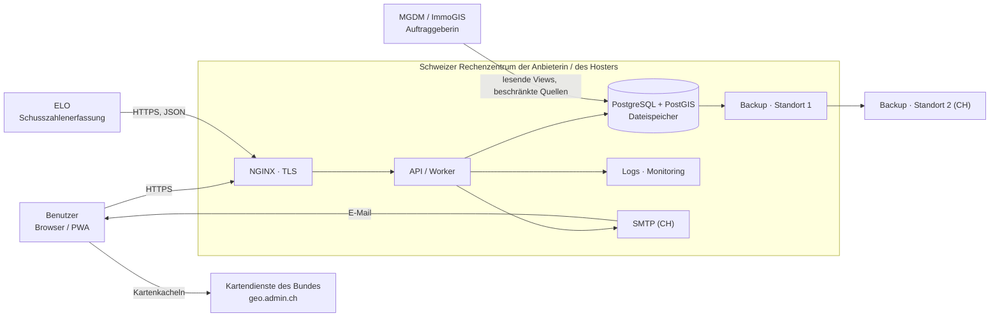

# E1 – Datenhaltungskonzept SLIM (Entwurf)

| | |
| --- | --- |
| Dokument | Umsetzungskonzept zum Eignungskriterium E1 «Datenhaltung in der Schweiz» |
| Version / Stand | 0.1 – Entwurf, 02.10.2026 |
| Einreichende Firma | [OFFEN: Firma, verantwortliche Person, Funktion] |
| Geltung | Projektphase (LP1) und Betriebsphase (LP4/LP5) von SLIM, alle Umgebungen |
| Bezug | Lösungskonzept C2 Kapitel 2.3, 2.5 und 6.3; `C2-offene-angaben.md` Zeile «6.3 Datenhaltung» |

**Lesehilfe.** *Ziel* beschreibt, was mit dem Angebot zugesagt wird. *Ist (Prototyp)* beschreibt, was das Repository am 02.10.2026 tatsächlich tut. `[OFFEN: …]` markiert Angaben, die vor der Abgabe entschieden oder belegt werden müssen; sie sind in Kapitel 12 gesammelt. Der Wortlaut von E1 (Teil A) liegt nicht im Repository – die Vorgaben in Kapitel 2 stammen aus den Antworten des Frageforums (`FAQ-Export.md`) und sind vor Abgabe gegen Teil A und Teil C zu prüfen.

## 1. Zweck und Geltungsbereich

Das Konzept weist nach, dass sämtliche Applikations- und Projektdaten von SLIM ausschliesslich auf Informatiksystemen in der Schweiz gespeichert und bearbeitet werden, und zeigt, mit welchen Massnahmen dies über die ganze Entwicklungs- und Betriebskette sichergestellt wird.

Es gilt für

- alle Umgebungen, in denen Applikations- oder Projektdaten liegen (Entwicklung, Integration, Akzeptanz, Produktion – FAQ 174),
- alle Bearbeitungsschritte im Sinne von E1: Beschaffen, Aufbewahren, Verwenden, Umarbeiten, Bekanntgeben, Archivieren, Vernichten, einschliesslich Zwischenspeicherung und Randdaten (FAQ 49),
- alle beteiligten Parteien: Anbieterin, Hosting-Anbieter und allfällige Subunternehmen. Nimmt die Anbieterin mit Subunternehmen teil, legt jede Partei ein eigenes Datenhaltungskonzept bei (FAQ 132). [OFFEN: Subunternehmen ja/nein]

Nicht Gegenstand: das fachliche Datenmodell im Detail (`docs/architecture/datenstruktur.md`, C2 2.3) und das Betriebs- und Sicherungskonzept, das gemäss FAQ 116 in der Realisierungsphase präzisiert wird.

## 2. Vorgaben

| Quelle | Vorgabe | Umsetzung in Kapitel |
| --- | --- | --- |
| E1, FAQ 14, 94 | Alle Daten einschliesslich Backups ausschliesslich in der Schweiz; keine Kopie ins Ausland, auch nicht zu Backupzwecken. «On-premise» = Infrastruktur des Lieferanten/Hosters in der Schweiz. | 5, 8 |
| FAQ 49 | E1 hat Vorrang vor E5. Erfasst sind auch Zwischenspeicherung, Randdaten, Protokollierung, Telemetrie, Support und Backup, sobald Applikations- oder Projektdaten berührt werden. Eine Region «Europa/EU» genügt nicht. | 3, 6 |
| FAQ 113 | Hyperscaler mit Standort Schweiz nur, wenn nachweislich ausschliesslich in der Schweiz gespeichert und bearbeitet wird und keine indirekte Ausleitung erfolgt. | 7 |
| FAQ 132, 140, 180 | Hosting-Anbieter ist im Angebot zu benennen; E1 ist bei ihm nachzuweisen; Si001 und Stand der Technik; späterer Wechsel genehmigungspflichtig. | 7 |
| FAQ 158 | Auch der entwickelte Code muss in der Schweiz gehostet sein. | 6 |
| FAQ 39–41, 172 | Werkzeuge für Dokumentation, Tickets, Betrieb und Support ausserhalb der Schweiz sind nur zulässig, solange keine sensiblen Applikations- und Projektdaten, insbesondere keine produktiven oder realen Fachdaten, dort gespeichert oder bearbeitet werden; das Konzept zeigt, wie das sichergestellt wird. | 6, 10 |
| FAQ 157, 160, 163 | KI-Werkzeuge ausserhalb der Schweiz sind zulässig, solange sie keine produktiven oder realen Fachdaten und keine schützenswerten Projektinformationen verarbeiten; Einsatz im Konzept nachweisen. FAQ 53 (Bereiche ohne KI) ist noch unbeantwortet. | 6.2 |
| FAQ 155, 44 | Fernzugriff von Support-Personal aus dem Ausland ist zulässig, wenn die Daten in der Schweiz bleiben; Zugriff mit MFA und Protokollierung gemäss Si001. Entwicklung, Test und Dokumentation werden in der Schweiz erbracht (E5, FAQ 168, 179). | 9 |
| FAQ 174 | E1 gilt für alle Umgebungen mit Applikations- oder Projektdaten. | 5.2 |
| FAQ 102, 120, 164, 171 | E1 gilt auch für eingebundene Dienste (Kartendienste, Feiertagsdienst) und für den View-Zugriff von MGDM/ImmoGIS. | 5.3 |
| FAQ 116, B1 12.8, slm 57 | Sicherung als konsistenter Gesamtstand über alle Komponenten, Mehrgenerationen über zwölf Monate, RPO ein Tag, RTO zwei Tage. | 8 |
| FAQ 22, 23 | Klassifizierung der Informationen grundsätzlich «intern»; Protokollierung nach Si001. | 4 |

## 3. Grundsätze

1. **Ein Standort, eine Regel.** Jedes System, das Applikations- oder Projektdaten speichert oder bearbeitet, steht in der Schweiz und wird von einer Organisation nach Schweizer Recht betrieben. Es gibt keine Ausnahme für Backups, Logs, Telemetrie oder Support.
2. **Reale Daten nur in zwei Umgebungen.** Produktive und reale Fachdaten liegen ausschliesslich in Produktion und im Akzeptanzsystem. Entwicklung, Integration, automatisierte Tests und die Demo arbeiten mit dem synthetischen Datensatz «SLIM Demo».
3. **Massgebend ist der Datenbezug, nicht das Werkzeug** (FAQ 160). Ein Werkzeug ausserhalb der Schweiz kommt nur in Frage, wenn technisch und organisatorisch ausgeschlossen ist, dass es reale Fachdaten oder schützenswerte Projektinformationen erhält.
4. **Keine stillen Datenabflüsse.** Die Anwendung ruft im Betrieb keine Dienste Dritter auf, die nicht in Kapitel 5.3 aufgeführt sind; der Browser wird über die Content-Security-Policy darauf beschränkt.
5. **Nachweis statt Zusicherung.** Jeder Standort wird mit einem Beleg des Anbieters hinterlegt (Kapitel 11); das Inventar wird bei jeder Änderung der Werkzeugkette nachgeführt.

## 4. Dateninventar und Klassifizierung

Einstufung grundsätzlich **INTERN** (FAQ 22). Mengengerüst gemäss FAQ 16, 18 und 32: rund 120 aktive und 150 historisch relevante Schiessplätze, unter 10'000 Stellungsräume, rund 250 Waffen/Kaliber, rund 50'000 Zuordnungen, 200–300 Benutzer, FGDB von wenigen MB, rund 20 neue Berechnungen pro Jahr.

| ID | Kategorie | Inhalt (physische Tabellen / Ablage) | Personenbezug | Speicherort |
| --- | --- | --- | --- | --- |
| D1 | Referenzstruktur | `schiessplatz`, `stellungsraum`, `waffe`, `kaliber`, `waffenkategorie`, `waffe_kaliber_kombination`, `stellungsraum_kombination`, `kontingent`, `feiertag` | nein | Datenbank |
| D2 | Nutzungen | `nutzung`, `nutzung_position`: Stellungsraum, Einheit, Datum, Zeit, Nutzungsart, Personenzahl, Erfasser, Herkunft (manuell / ELO / Import) | Erfasser | Datenbank |
| D3 | Berechnungsgrundlagen | `immissionsberechnung`, `zustand`, `zustand_anlageteil`, `schusslinie`, Quelldaten Anhang 9/7, `immissionspunkt` (EGID, EGRID, Adresse, Koordinaten LV95), `wlr_pegel`, Gebäude, Perimeter, Isophonen, Massnahmen | indirekt über Gebäudeadressen | Datenbank (Geometrien) |
| D4 | Berechnungsstände | `berechnungslauf`: Kopie der Nutzungen, Referenz-Snapshot, Parameter, Kernversion, Ergebnis, Prüfsumme, Ersteller | Ersteller | Datenbank |
| D5 | Benutzer und Berechtigungen | Benutzerkonten (Name, E-Mail, Telefon), Passwort-Hashes, zweiter Faktor, Sitzungen, Rollen, `schiessplatz_benutzer` | ja | Datenbank |
| D6 | Protokoll- und Randdaten | `logbuch` (Benutzer, Aktion, Bezug, IP-Adresse, Gerät, Zeitpunkt); Proxy-, Anwendungs- und Datenbank-Logs; Metriken | ja | Datenbank; Log- und Monitoring-System |
| D7 | Dateien | Importierte FGDB-, WLR- und Betriebsdaten-Dateien, Excel-/CSV-Exporte, Benutzerhandbuch (`benutzerhandbuch`, PDF in der Datenbank) | möglich | Datenbank bzw. Dateispeicher |
| D8 | Konfiguration und Geheimnisse | `systemeinstellung`, Umgebungsvariablen, Schlüssel, Zertifikate, Datenbank-Zugangsdaten | nein | Deployment-Verwaltung, geschützt |
| D9 | Sicherungen | Vollständiger Systemstand aus D1–D8 inkl. Images und Migrationen | wie Quelle | Backup-Speicher, zwei Standorte |
| D10 | Projekt- und Entwicklungsdaten | Quellcode, Pipeline-Definitionen, Build-Artefakte, Container-Images, Pipeline-Logs, Dokumentation, Backlog, Protokolle, Abnahmeunterlagen | Projektbeteiligte | Entwicklungsplattform (Kapitel 6) |
| D11 | Migrations- und Testdaten | Von der Auftraggeberin per ETL bereitgestellte Stammdaten (FAQ 28); Referenz-FGDB; synthetischer Datensatz «SLIM Demo» | reale Daten: möglich | reale Daten nur Akzeptanz/Produktion |
| D12 | Support-Daten | Tickets, Anhänge, Bildschirmfotos, Hotline-Notizen | ja | Ticketsystem (Kapitel 6) |
| D13 | Daten auf dem Endgerät | Browser-Speicher: Sitzungs-Token, Sprache, Darstellung, Menü-Favoriten; Cache der PWA; in LP1b Entwürfe der mobilen Erfassung | Sitzung | Gerät des Benutzers |

Zu D13: Die Geräte gehören der Auftraggeberin bzw. den Benutzern; SLIM speichert dort keine Fachdaten dauerhaft. Für die mobile Erfassung (LP1b) wird im Detailkonzept festgelegt, welche Entwürfe offline gehalten und wann sie gelöscht werden.

## 5. Speicher- und Bearbeitungsorte im Betrieb

### 5.1 Systeme

| System | Daten | Ziel | Ist (Prototyp) |
| --- | --- | --- | --- |
| Datenbank | D1–D7 | PostgreSQL 17 + PostGIS, eigener Container mit persistentem Volume im Schweizer Rechenzentrum; je Umgebung eine eigene Instanz | SQLite lokal bzw. MariaDB 11 im Container; kein produktiver Betrieb |
| Dateispeicher für Importe/Exporte | D7 | Originaldateien jeder importierten Berechnung werden unveränderbar abgelegt (Reproduzierbarkeit, FAQ 101) und mitgesichert. [OFFEN: Ablage in der Datenbank oder in einem Objektspeicher am selben Standort] | Importdateien werden nur im Arbeitsspeicher verarbeitet, gespeichert wird der Dateiname; das Benutzerhandbuch liegt in der Datenbank |
| API- und Worker-Container | Verarbeitung D1–D7, keine dauerhafte Ablage | Zustandslos; temporäre Dateien nur im Container und nach dem Auftrag gelöscht | ein API-Prozess (pm2), kein Worker |
| Reverse-Proxy | Zugriffs-Logs (D6) | NGINX im selben Rechenzentrum, TLS ≥ 1.2 | nicht Teil des Repositories |
| Sitzungs-/Replay-Speicher | D5 | Datenbank bzw. Redis im selben Rechenzentrum | In-Memory |
| Logs und Monitoring | D6 | selbst betriebene Instanz im Schweizer Rechenzentrum; kein Versand an Dritte [OFFEN: Produkt] | nur Health-Endpunkte, keine Auswertung |
| E-Mail-Versand | E-Mail-Adresse, Links für Passwort-Reset und Bestätigung, Codes | SMTP-Dienst eines Schweizer Anbieters mit Verarbeitung in der Schweiz [OFFEN: Anbieter] | `MAIL_*` nicht konfiguriert |
| Deployment-Verwaltung | D8 | Coolify, selbst betrieben auf der Schweizer Infrastruktur, Zugang nur mit MFA aus zugelassenen Netzen | – |
| Backup-Speicher | D9 | Betriebsstandort und zweiter Schweizer Standort (Kapitel 8) | nicht vorhanden |

Hosting-Anbieter, Rechenzentrumsstandorte und Vertragspartner: [OFFEN: benennen und belegen, Kapitel 7].

### 5.2 Umgebungen

| Umgebung | Daten | Standort | Bemerkung |
| --- | --- | --- | --- |
| Produktion | reale Daten | Schweizer Rechenzentrum | eigene Datenbank, eigene Geheimnisse |
| Akzeptanz | produktionsnahe Daten, stufenweise Migration (Teil B 2.3.3) | Schweizer Rechenzentrum | gleiche Schutzmassnahmen wie Produktion |
| Integration / Entwicklung (gehostet) | nur synthetisch | Schweizer Rechenzentrum | Demo-Seed aktiv |
| Entwickler-Arbeitsplatz | nur synthetisch | Schweiz (E5) | reale Daten werden nie lokal gehalten |
| Demo-Instanz | nur synthetisch («SLIM Demo») | [OFFEN: Standort und URL] | – |

Produktion und Akzeptanz sind getrennte Instanzen mit eigener Datenbank; der Mandant (`tenantId`) trennt fachlich innerhalb einer Instanz und ersetzt keine Umgebungstrennung.

### 5.3 Datenflüsse nach aussen

| Fluss | Inhalt | Richtung | E1-Beurteilung |
| --- | --- | --- | --- |
| Browser ↔ SLIM | alle Fachdaten der Sitzung | beidseitig, HTTPS | Verarbeitung in der Schweiz; Darstellung auf dem Gerät des Benutzers |
| ELO → SLIM | Nutzungen, Stammdatenabruf (B1 6.1) | eingehend | Daten bleiben bei der Auftraggeberin und in SLIM; Betrieb von ELO liegt bei der Auftraggeberin |
| Browser → geo.admin.ch | Anfragen für Kartenstil und Kacheln (Ausschnitt, IP-Adresse des Benutzers) | ausgehend vom Browser, nicht vom Server | Vom Auftraggeber vorgegebener Bundesdienst (FAQ 102, 120). Es werden keine SLIM-Fachdaten übermittelt; Empfangspunkte und Anlageteile zeichnet der Browser lokal. Die Content-Security-Policy lässt ausser der eigenen Herkunft nur `https://*.geo.admin.ch` zu (umgesetzt). |
| MGDM / ImmoGIS → Datenbank | lesende Views (slm 38, FAQ 100) | Abruf durch die Auftraggeberin | eigener Datenbankbenutzer nur mit Leserecht auf die Views, Zugriff auf definierte Quellen beschränkt; Netz/VPN wird zu Beginn der Realisierung festgelegt (FAQ 171) |
| SLIM → E-Mail | Adresse, Link, Code | ausgehend | Schweizer SMTP-Dienst; keine Fachdaten in E-Mails |
| Exporte (Excel, CSV, FGDB) | Fachdaten | Download durch berechtigte Benutzer | Datei verlässt SLIM auf das Gerät des Benutzers; Export wird im Logbuch protokolliert |
| Feiertage | – | – | werden als Stammdaten in SLIM gepflegt; kein externer Dienst (FAQ 164) |

## 6. Entwicklungs- und Projektkette

### 6.1 Werkzeuginventar

| Zweck | Daten | Ist (Prototyp, 02.10.2026) | Ziel ab Zuschlag |
| --- | --- | --- | --- |
| Quellcode-Repository | D10 | GitHub.com, privates Repository – **nicht in der Schweiz** | Git-Dienst mit Speicherung in der Schweiz (FAQ 158) [OFFEN: Anbieter bzw. selbst betrieben]; Umzug mit vollständiger Historie vor Projektstart, Löschung auf GitHub |
| CI/CD | D10 (Code, Build-Logs, Testberichte) | GitHub Actions auf GitHub-Runnern; optional Nx-Cloud-Remote-Cache – **nicht in der Schweiz** | Pipeline und Runner auf Schweizer Infrastruktur; Remote-Cache abgeschaltet oder selbst betrieben |
| Container-Registry | Images | über Pipeline-Geheimnisse konfiguriert; Standort aus dem Repository nicht ersichtlich | Registry in der Schweiz [OFFEN: Standort belegen] |
| Private Paketquelle | Bibliotheken `@app-galaxy/*` | Nexus (`nexus-repository.revolvit.ch`) | [OFFEN: Standort und Betreiber belegen] |
| Öffentliche Paketquellen | keine Projektdaten ausgehend | npm-Registry, Docker Hub (nur Bezug) | Bezug über Proxy in der eigenen Paketquelle; Versionen in der SBOM |
| Projektdokumentation | D10 | Markdown im Repository (`docs/`) | folgt dem Repository; kein separates Wiki ausserhalb der Schweiz |
| Backlog, Sprint- und Abnahmeunterlagen | D10 | – | Werkzeug mit Speicherung in der Schweiz [OFFEN: Produkt] |
| Ticketsystem und Hotline (Support) | D12 | – | Werkzeug mit Speicherung in der Schweiz [OFFEN: Produkt] |
| Fehler- und Leistungsüberwachung | D6 | keine | selbst betrieben, Kapitel 5.1; kein SaaS-Fehlertracking im Browser |
| Maschinelle Vorübersetzung der Oberflächentexte | Texte der Locale-Dateien, keine Fachdaten | `npm run translate` (Transmart) sendet deutsche Oberflächentexte an die OpenAI-API – **nicht in der Schweiz** | Entscheid nach 6.2 |
| KI-Programmierassistenten | Quellcode, synthetische Daten | im Einsatz, Hosting ausserhalb der Schweiz | Regeln nach 6.2 |
| ERD-Seite `/erd` | Datenbankschema | lädt die Mermaid-Bibliothek von einem CDN; nur ausserhalb der Produktion aktiv | Bibliothek lokal ausliefern oder Seite auf Entwicklung beschränken |
| Datei- und Dokumentenaustausch mit der Auftraggeberin | D10, D11 | – | [OFFEN: Kanal; von der Auftraggeberin vorgegeben oder Schweizer Dienst] |

Die drei fett markierten Zeilen sind die heute bekannten Abweichungen; der Umstellungsplan steht in Kapitel 10.

### 6.2 KI-Werkzeuge

Zwei Lesarten liegen vor: FAQ 49 und 158 (alles mit Projektbezug und der Code in der Schweiz) und FAQ 157, 160, 163 (KI-Werkzeuge ausserhalb der Schweiz zulässig ohne reale Fachdaten und ohne schützenswerte Projektinformationen). Das Lösungskonzept C2 6.3 legt bisher die strengere Lesart zugrunde; die Antworten 157–172 sind dort noch nicht eingearbeitet (`C2-offene-angaben.md`). Beide Dokumente müssen dieselbe Regel nennen. [OFFEN: Entscheid]

Vorschlag für die Regel:

- KI-Werkzeuge erhalten nie reale Fachdaten, Personendaten, Zugangsdaten, Geheimnisse oder Unterlagen der Auftraggeberin, die nicht öffentlich sind. Sie arbeiten ausschliesslich auf Entwickler-Arbeitsplätzen mit dem synthetischen Datensatz.
- Werkzeuge ausserhalb der Schweiz nur mit vertraglich zugesichertem Verzicht auf Training und auf dauerhafte Speicherung der Eingaben; der Quellcode selbst bleibt im Schweizer Repository gehostet.
- KI-Werkzeuge haben keinen Zugriff auf Akzeptanz- und Produktionssysteme, deren Datenbanken, Logs und Sicherungen.
- Im Support werden Tickets mit Fachdaten nicht an KI-Dienste übergeben.
- Das Inventar der eingesetzten KI-Werkzeuge (Anbieter, Standort, Datenkategorien, Vertragsgrundlage) ist Teil dieses Konzepts. [OFFEN: Liste]
- Die Antwort auf FAQ 53 wird nach Vorliegen übernommen; bis dahin gilt die Regel oben als Mindeststand.

## 7. Hosting-Anbieter und Dritte

| Rolle | Partei | Leistung | Standort | Subunternehmer |
| --- | --- | --- | --- | --- |
| Applikationsbetrieb, Wartung, 2nd/3rd-Level-Support | Anbieterin | volle Betriebsverantwortung (FAQ 136, 140) | [OFFEN] | – |
| Hosting | [OFFEN: Anbieter] | Infrastruktur (Server, Netz, Backup-Speicher) ohne eigene Projektleistungen | [OFFEN: Rechenzentren] | nein, sofern nur Infrastruktur (FAQ 132, 180) |
| Zweiter Backup-Standort | [OFFEN] | Speicher | Schweiz | – |
| SMTP | [OFFEN] | E-Mail-Versand | Schweiz | – |

Anforderungen an den Hosting-Anbieter: Sitz und Betrieb nach Schweizer Recht; ausschliessliche Speicherung und Bearbeitung in der Schweiz einschliesslich Betrieb, Support, Monitoring und Backup des Anbieters selbst (FAQ 113); keine Replikation in ausländische Regionen; Si001 sinngemäss; ISO 27001 oder gleichwertig. Ein Wechsel des Hosting-Anbieters wird der Auftraggeberin zur Genehmigung vorgelegt (FAQ 132).

## 8. Sicherung und Wiederherstellung

*Ziel* (C2 2.5, FAQ 14, 94, 116):

- täglich automatisch, zusätzlich manuell vor Releases und Importen; Stände wöchentlich, monatlich und jährlich über mindestens zwölf Monate; RPO ein Tag, RTO zwei Tage;
- Umfang je Stand: Datenbank mit Transaktionsprotokollen, Dateispeicher, Anwendungsversion und Container-Images, Schema und Migrationen, Infrastruktur- und Laufzeitkonfiguration; Geheimnisse getrennt und verschlüsselt;
- zwei Speicherorte, beide in der Schweiz: am Betriebsstandort und an einem zweiten Standort; Übertragung und Ablage verschlüsselt;
- Integritätsprüfung jeder Sicherung, Alarm bei fehlender oder fehlerhafter Sicherung, jährlicher Restore-Test des Gesamtsystems mit Protokoll;
- Sicherungen werden nie auf Entwickler-Arbeitsplätze oder in Umgebungen mit synthetischen Daten zurückgespielt.

*Ist (Prototyp):* keine Sicherung eingerichtet; `mariadb-client` liegt im Image, Skripte, Zeitplan und Restore-Test fehlen (`deployment-sicherheit.md`).

## 9. Zugriff auf die Daten

| Zugriff | Wer | Regel |
| --- | --- | --- |
| Fachanwendung | Benutzer der Auftraggeberin | Rollen und Objektregeln nach B1 8.1, Zwei-Faktor-Anmeldung, Logbuch |
| Administration (Server, Datenbank, Deployment) | benannte Personen der Anbieterin | persönliche Konten, MFA, nur aus zugelassenen Netzen, protokolliert (Si001); Notfallzugang nach Break-Glass-Prozess |
| Support mit Dateneinsicht | 2nd/3rd Level | Arbeit auf den Systemen in der Schweiz; keine lokalen Kopien, keine Exporte oder Bildschirmfotos mit Fachdaten in Werkzeuge ausserhalb der Schweiz. Fernzugriff aus dem Ausland ist nach FAQ 155 zulässig; [OFFEN: Standort des Supports, ob davon Gebrauch gemacht wird] |
| Hosting-Anbieter | Betriebspersonal des Hosters | kein Zugriff auf Inhalte; Datenträger- bzw. Volume-Verschlüsselung [OFFEN: mit Anbieter klären] |
| MGDM / ImmoGIS | Auftraggeberin | nur lesende Views (Kapitel 5.3) |

## 10. Massnahmen und Umstellungsplan

**Technisch**

- Content-Security-Policy beschränkt Verbindungen des Browsers auf die eigene Herkunft und `https://*.geo.admin.ch` – umgesetzt (`security-headers.ts`).
- Ausgehender Netzverkehr der Server wird auf die benötigten Ziele beschränkt (SMTP, Backup-Standort, Paketquelle); keine Telemetrie von Bibliotheken an Dritte – Ziel.
- Demo-Seed läuft in Produktion nur mit ausdrücklichem Schalter; reale und synthetische Daten werden nie in derselben Instanz gemischt – umgesetzt (`DEMO_SEED`).
- Geheimnisse liegen ausserhalb von Repository und Image – umgesetzt (`.env` git-ignoriert); zentrale Verwaltung in der Deployment-Umgebung – Ziel.
- Verschlüsselung bei der Übertragung (TLS ≥ 1.2) und der Sicherungen – Ziel.

**Organisatorisch**

- Datenrichtlinie für das Projektteam: reale Daten nur in Akzeptanz und Produktion; Fehlernachstellung mit synthetischen oder anonymisierten Daten; keine Fachdaten in Tickets, Chats, E-Mails oder KI-Werkzeugen.
- Neue Werkzeuge und Dienste werden vor dem Einsatz gegen dieses Konzept geprüft und im Inventar (Kapitel 6.1) nachgeführt.
- Jährliche Überprüfung des Konzepts und bei jedem Wechsel von Anbieter oder Standort; Meldung an die Auftraggeberin.

**Umstellungen vor Projektstart**

| Nr. | Umstellung | Anlass |
| --- | --- | --- |
| 1 | Repository mit Historie auf einen Git-Dienst in der Schweiz umziehen, GitHub-Repository löschen | FAQ 158 |
| 2 | Pipeline und Runner in die Schweiz verlegen, Nx-Cloud-Cache deaktivieren | FAQ 49 |
| 3 | Standort von Container-Registry und Nexus belegen oder in die Schweiz verlegen | FAQ 49 |
| 4 | Maschinelle Vorübersetzung und KI-Assistenten nach Regel 6.2 freigeben oder ersetzen | FAQ 157, 160, 53 |
| 5 | Mermaid-Bibliothek der ERD-Seite lokal ausliefern | Grundsatz 4 |
| 6 | Hosting, Backup-Standort, SMTP, Monitoring, Ticketsystem beschaffen und belegen | FAQ 132 |

## 11. Aufbewahrung, Rückgabe und Vernichtung

Vorschlag; die Fristen werden mit der Auftraggeberin festgelegt. [OFFEN]

| Daten | Aufbewahrung | Vernichtung |
| --- | --- | --- |
| Fachdaten D1–D4, D7 | über die Vertragsdauer; Berechnungsstände unveränderbar | bei Vertragsende nach Rückgabe |
| Gelöschte Datensätze (Löschmarke) | bleiben für «Rückgängig» und Nachvollziehbarkeit erhalten | endgültige Löschung nach festgelegter Frist durch einen Bereinigungslauf – noch nicht vorhanden |
| Benutzerkonten D5 | bis zur Deaktivierung; danach Sperrfrist | Anonymisierung bzw. Löschung nach Frist |
| Logbuch und Logs D6 | nach Si001 (FAQ 23) [OFFEN: Dauer] | automatische Rotation |
| Sicherungen D9 | zwölf Monate rollierend | Ablauf der Generationen |
| Support-Daten D12 | [OFFEN] | nach Frist |

Bei Vertragsende erhält die Auftraggeberin einen lesbaren Gesamtabzug (SQL/CSV, Originaldateien der Importe, Dokumentation des Datenmodells). Danach werden Datenbanken, Dateispeicher und – nach Ablauf der Generationen – die Sicherungen gelöscht; die Löschung wird schriftlich bestätigt.

## 12. Nachweise und offene Punkte

**Beizulegende Nachweise**

- Bestätigung des Hosting-Anbieters zu Rechenzentrumsstandorten und ausschliesslicher Bearbeitung in der Schweiz, Zertifikat ISO 27001
- Vertrag bzw. Auftragsbearbeitungsvereinbarung mit Hosting-, Backup- und SMTP-Anbieter
- Standortbelege für Repository, Pipeline, Registry, Paketquelle, Ticketsystem
- Inventar der KI-Werkzeuge mit Vertragsgrundlage
- nach Inbetriebnahme: Restore-Protokoll, Liste der administrativen Zugriffsberechtigten

**Offene Punkte**

| Nr. | Punkt | Kapitel |
| --- | --- | --- |
| 1 | Einreichende Firma, Verantwortliche; Subunternehmen und deren eigene Konzepte | Kopf, 1 |
| 2 | Wortlaut E1 (Teil A) und Formvorgaben (Teil C) gegenprüfen | Lesehilfe |
| 3 | Hosting-Anbieter, Rechenzentren, zweiter Backup-Standort | 5.1, 7 |
| 4 | Git-Dienst, Pipeline, Registry, Standort Nexus | 6.1 |
| 5 | Backlog-, Ticket- und Austauschwerkzeuge | 6.1 |
| 6 | SMTP-Anbieter; Log- und Monitoring-Produkt | 5.1 |
| 7 | Regel für KI-Werkzeuge und Vorübersetzung; Abgleich mit C2 6.3; Antwort FAQ 53 | 6.2 |
| 8 | Ablage der Importdateien (Datenbank oder Objektspeicher) | 5.1 |
| 9 | Standort des Supports, Fernzugriff aus dem Ausland ja/nein | 9 |
| 10 | Standort und URL der Demo-Instanz | 5.2 |
| 11 | Aufbewahrungs- und Löschfristen | 11 |
| 12 | Verschlüsselung ruhender Daten beim Hosting-Anbieter | 9 |
