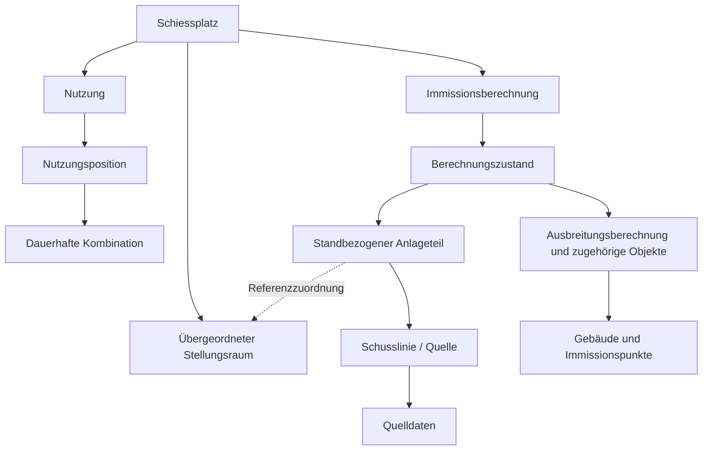

# SLIM: Umsetzungsauftrag für das Datenmodell nach B1 Kapitel 10

Stand: 12.09.2026. Zielgruppe: Coding-Agent im SLIM-Repository.

## 1. Auftrag und Verbindlichkeit

Baue das SLIM-Datenmodell gemäss Beilage B1, Kapitel 10, Abbildung 43 und slm 42–45 auf. Passe danach Import, Berechnungsdienste, DTOs, Oberflächen und Tests an die korrigierten Beziehungen an.

Das fachliche Modell ist verbindlich. Die Tabellen- und Feldnamen in dieser Anleitung sind technische Vorschläge; sie ersetzen weder die Attribute noch die Kardinalitäten des Originalmodells. Verwende für die vollständige Struktur insbesondere B1.2, Kapitel 11, den FGDB-Objektkatalog. Gleiche Berechnungsdetails mit B1 Kapitel 7, Schnittstellen mit Kapitel 6 und Verwaltungsabläufe mit Kapitel 5 ab.

Diese Anleitung basiert auf dem bereitgestellten Originaltext und externen Code-Reviews. Die genannten Fehler sind am aktuellen Commit zu überprüfen: Der Quellcode wurde für diese Anleitung nicht eigenständig untersucht. Bereits korrekt implementierte Teile erhalten.

**SLIM und ELO strikt auseinanderhalten:** Dieser Auftrag betrifft SLIM. ELO ist das angebundene Fremdsystem. Keine gemeinsame Laufzeit, Datenbank oder Secrets einführen; keine ELO-Änderungen aus diesem Auftrag ableiten.

## 2. Verbindliche fachliche Invarianten

| Vorgabe | Zu garantierendes Verhalten |
|---|---|
| slm 42 | Ein Schiessplatz existiert zeitunabhängig und besitzt beliebig viele übergeordnete Stellungsräume und Berechnungsstände. Historische Stellungsräume bleiben referenzierbar. |
| slm 43 | Sämtliche berechnungsspezifischen Strukturen gehören vollständig zu ihrem Berechnungsstand und sind von anderen Ständen unabhängig. |
| slm 44 | Nutzungen gehören zur übergeordneten Referenzstruktur und können mit beliebigen Berechnungsständen kombiniert werden. Sie sind kein Bestandteil eines Berechnungszustands. |
| slm 45 | Jeder importierte Stellungsraum muss eindeutig zur übergeordneten Referenzstruktur des betreffenden Schiessplatzes zugeordnet werden. Unbekannte Stellungsräume führen zu Warnung und Importabbruch. |

Wichtig: Kombinierbarkeit bedeutet nicht, dass jeder Stand alle Nutzungen abbilden kann. Fehlende Quellen dürfen keine Mengen verschwinden lassen; dafür gilt Abschnitt 8.

## 3. Vor dem Umbau

1. Repository-Anweisungen lesen, aktuellen Commit und Arbeitszustand erfassen; fremde Änderungen erhalten.
2. Original-Abbildung und FGDB-Objektkatalog lesen. Eine Zuordnungstabelle erstellen: Originalklasse, Attribute/Kardinalitäten, bestehende Entity, Ziel-Entity, Handlungsbedarf.
3. Entities, Migrationen, Seed, Berechnungs- und Simulationsdienste, Import/Export und API-Verträge verfolgen. Reviews sind Hinweise, keine automatisch bestätigten Codebefunde.
4. Prüfen, ob reale oder nur synthetische Daten existieren. Migration vorhandener Daten und Neubau des Demo-Seeds getrennt planen. Keine produktiven Daten löschen oder durch den Seed ersetzen.
5. Konflikte zwischen Originalquellen ausdrücklich protokollieren. Keine Pflichtbeziehung oder Muss-Klasse zur Vereinfachung entfernen.

## 4. Zielmodell: übergeordnete Referenzen und Nutzungen

Diese Objekte gehören keinem Berechnungszustand:

| Vorgeschlagene Tabelle | Zweck / Beziehungen |
|---|---|
| `schiessplatz` | Dauerhafte Platzidentität, externe Koordinationsnummer und Stammdaten. |
| `stellungsraum` | Dauerhafte Referenz unter einem Schiessplatz, einschliesslich historischer Räume. |
| `waffe`, `kaliber`, Kategorien-Stammdaten | Pflegbare Stammdaten gemäss B1; tatsächliche fachliche Trennung aus dem Original übernehmen. |
| `waffe_kaliber_kombination` | Dauerhafte Identität der Kombination Waffe/Munitionstyp; Zuordnung externer Identifikatoren und Kategorien. |
| `stellungsraum_kombination` | Zulässige Kombination je Stellungsraum. Keine Quelle des Lärmmodells. Weitere Attribute wie Kontingente nur gemäss fachlicher Gültigkeit zuordnen. |
| `nutzung` | Platz- und Raumreferenz, Datum/Zeit, Nutzungskategorie, Einheit/Truppe, Personenzahl, gegebenenfalls zivile Nutzungsart, Herkunft/externe Identität. |
| `nutzung_position` | Nutzung, dauerhafte Kombination, dezimale Menge und Masseinheit. Mehrere Positionen je Nutzung. |

### Regeln

- Nutzungen dürfen keine verpflichtende `zustand_id`, `schusslinie_id` oder Verknüpfung zu einem zustandsspezifischen Immissionspunkt erhalten.
- Falls Platz und Stellungsraum beide gespeichert werden: ihre Zugehörigkeit konsistent erzwingen.
- Die Menge durchgängig dezimal führen. Beim Jahresmittel keine Rundung auf ganze Schüsse/kg einführen.
- `Einheit/Truppe` als Textfeld nicht mit der Masseinheit `Stück/kg` verwechseln.
- Feldlängen, Personenzahl, zivile Nutzungsart und Viertelstundenvalidierung gemäss dem jeweiligen B1-Eingabepfad umsetzen. Insbesondere ELO-Schnittstellenvertrag beachten.
- Historische Referenzen nicht löschen, solange sie verwendet werden. Änderungen heutiger Zulässigkeiten dürfen historische Nutzungen nicht nachträglich unbrauchbar machen.
- Eine Kombination kann mehreren Quellen in einem Zustand entsprechen. `sourceId` deshalb nicht als einziges Quellenfeld an `stellungsraum_kombination` führen.

## 5. Zielmodell: berechnungsspezifische Strukturen

Die Verwaltungshierarchie aus B1 Kapitel 5 zusätzlich berücksichtigen: Immissionsberechnung und ihre Zustände dürfen nicht unbesehen zu einem Objekt zusammenfallen.



Das Diagramm ist eine vereinfachte Orientierung, keine vollständige Wiedergabe von Abbildung 43.

| Bereich | Umsetzungshinweis |
|---|---|
| Zustand | Eigentümer der vollständigen importierten Modellstruktur. |
| Untersuchungsperimeter und Metadaten | Zugehörigkeit und Kardinalitäten aus dem Original übernehmen. |
| Anlageteil / berechnungsspezifischer Stellungsraum | Gehört zum jeweiligen Stand, mit Zuordnung zum übergeordneten Stellungsraum. Geometrie und standbezogene Eigenschaften hier erhalten. |
| Schusslinie und Quelldaten | Quellen gehören zur Zustandsebene. Militärische/zivile Quelldaten, Gewichte und Zeitgruppen entsprechend dem Original modellieren. |
| Ausbreitungsberechnung | Eigene fachliche Klasse mit den Originalbeziehungen; nicht lediglich durch eine unstrukturierte Pegelliste ersetzen. |
| Gebäude und Immissionspunkte | Gehören zur jeweiligen Berechnungsstruktur. Position, Höhe, Empfindlichkeitsstufe und weitere Attribute dürfen nicht zwischen Ständen unbeabsichtigt mitverändert werden. |
| Weitere hellblaue Klassen | Schützenhaus, Hindernis, Hochblende, Massnahmen mit Subtypen, Isophonen, Betroffenen-Analyse und SSF-Massnahmen entsprechend Original modellieren. |

### Quellen, WLR und Kombinationen

Die Identität einer Quelle ist von der Identität der übergeordneten Kombination zu trennen. Quelle/Kombination/Waffenkategorie gemäss FGDB und Betriebsdaten zuordnen; keine unbelegte 1:1-Beziehung erzwingen.

WLR-Werte müssen Quelle, Immissionspunkt und den relevanten Berechnungs-/Zeitgruppenkontext eindeutig identifizieren. Beispielsweise:

```text
wlr_pegel
  ausbreitungsberechnung_id
  schusslinie_id
  immissionspunkt_id
  zeitgruppe
  pegelwerte
```

Konkrete Spalten und Eindeutigkeit anhand der tatsächlichen Dateien festlegen. Keine doppelte Anwendung von Zeitgruppenzuschlägen einführen. LAE/LAFmax entsprechend B1 Kapitel 7 zuordnen.

### Standbezogene Unabhängigkeit

- Dieselbe externe Quellen- oder Punkt-ID kann in mehreren Ständen vorkommen. Interne Identität und Eindeutigkeitsbereich deshalb standbezogen festlegen.
- Neue Immissionspunkte oder geänderte Quellen eines neuen Stands dürfen alte Stände nicht verändern.
- Fremdschlüssel müssen standübergreifende Fehlverknüpfungen verhindern. Je nach Schema zusammengesetzte Fremdschlüssel verwenden; eine alleinige Prüfung im UI genügt nicht.
- Baujahr-/Anlageneigenschaften für eine konkrete Beurteilung müssen zum gewählten Modell passen. Eine heutige Änderung an einer dauerhaften Referenz darf keine historischen Modellgrundlagen überschreiben.
- Zustandsübergreifende Vergleichsreferenzen sind optional zusätzlich möglich; sie ersetzen keine standbezogenen Objekte. Nicht allein anhand gleicher Namen oder EGID automatisch gleichsetzen.
- Die optionale Darstellung bestimmter GIS-Layer bedeutet nicht automatisch, dass deren Speicherung oder Austausch optional ist. Import-/Exportumfang separat anhand B1/B1.2 und beantworteter FAQ bestimmen.

## 6. Datenbank und Historisierung

Ziel ist die im Angebot vorgesehene PostgreSQL-/PostGIS-Architektur. Physische Datenbankobjekte gemäss B1 12.2 deutsch benennen; englische TypeScript-Klassen können über explizites Mapping bestehen bleiben.

Technische Empfehlungen:

- PostGIS-Geometrietypen, SRID und Dimensionen aus dem Objektkatalog übernehmen. LV95 verwendet EPSG:2056; Z-/Höheninformationen nicht verlieren.
- Dezimalmengen mit geeigneter Präzision speichern; Konvertierungen in TypeScript und beim Export testen.
- Fremdschlüssel, externe IDs, Platz- und Zustandszugehörigkeit durch Constraints absichern.
- Die Eindeutigkeit von aktuell gültigem Zustand und MGDM-Stand nach dem Originalumfang absichern, auch bei parallelen Änderungen. Flags allein reichen dafür nicht.
- Nach Freigabe Modellnutzdaten vorzugsweise unveränderbar halten; Korrekturen als neue Revision. Veränderbare Auswahlzeiger und Archivstatus davon trennen. Dies ist ein Umsetzungsvorschlag zur Reproduzierbarkeit, keine zusätzliche wörtliche B1-Vorgabe.
- Eine Migration von WKT-Text nach PostGIS ist nicht automatisch nur ein Typwechsel: Parser, SRID, Geometriegültigkeit, Indizes, Queries und Serializer prüfen.
- Generische JSON-/Geometriespeicherung nur verwenden, wenn Typen, Pflichtattribute, Beziehungen und verlustfreier FGDB-Roundtrip nachweislich erhalten bleiben.

## 7. Importablauf

1. Dateien in Staging einlesen; Originaldatei und Importprotokoll nachvollziehbar zuordnen.
2. Strukturen, Pflichtattribute, interne Referenzen und externe Identifikatoren prüfen.
3. Jeden importierten Anlageteil eindeutig einer übergeordneten Stellungsraumreferenz desselben Platzes zuordnen. Dabei auch historische Räume berücksichtigen.
4. Kombinationen und Quellenbeziehungen gemäss Originaldaten zuordnen; Mehrdeutigkeiten melden.
5. Unbekannter Stellungsraum: Warnung mit Identifikation, Import abbrechen. Kein automatisches Anlegen der dauerhaften Referenz im Import.
6. Erst nach vollständiger Prüfung alle zustandsspezifischen Daten atomar übernehmen. Bei Fehler keine teilweise fachlich nutzbare Modellstruktur hinterlassen.
7. Fachliche FME-Validierung gemäss B1 9.1 von den internen Struktur- und Zuordnungsprüfungen unterscheiden; FME nicht als beliebigen technischen Fallback beschreiben.

Das Anlegen einer fehlenden Stammdatenreferenz geschieht im vorgesehenen berechtigten Prozess. Anschliessend Import wiederholen.

## 8. Berechnung und O8

Eine Berechnung verbindet erst zur Laufzeit:

```text
gewählter Zustand
  + Nutzungen der gewählten Jahre / Periode
  + gültige Parameter und Fachregeln
  = Ergebnis je Immissionspunkt dieses Zustands
```

1. Nutzungen unabhängig vom Zustand anhand Platz und Zeitraum lesen.
2. Dauerhafte Raum-/Kombinationsreferenzen auf Anlageteile und Quellen des gewählten Zustands abbilden.
3. Betriebsdaten und A7-Halbtage gemäss B1 ableiten. Bei gemischten Baujahren die für die jeweilige Teilbeurteilung erforderliche Nutzungsmenge verwenden; nicht nur Quellen filtern und Halbtage des gesamten Platzes übernehmen.
4. Mengen nach den erforderlichen Kategorien/Zeitgruppen mit den Gewichten dieses Zustands verteilen.
5. Passende WLR-Werte und Immissionspunkte verwenden, Pegel berechnen und beurteilen.

**O8 ist ein dokumentierter Entwurfsentscheid für Sonderfälle, keine wörtliche B1-Regel:**

- Positive Menge und Gewichtssumme null: standardmässig `refuse`.
- Bei positiver Gewichtssumme behalten einzelne Nullgewichte ihren Anteil null.
- Fehlende Quelle separat melden; keine positiven Mengen still verwerfen.
- Betroffene Gesamtbeurteilung als unvollständig und nicht abschliessend beurteilbar ausweisen. Teilwerte nicht als gültige Gesamtampel darstellen.
- Status über Service, DTO, Details, Übersicht, Kontextleiste, Simulation und vorhandene Exporte durchreichen.
- Gleichverteilung nur mit dokumentierter KOMZ-Freigabe und gespeicherter Referenz auf Datum/Dokument/Fachentscheid. Der Parameter `equal` allein ist kein Nachweis.
- Keine pauschale Untergrenzen-/«gesichert rot»-Logik ergänzen. Diese ist insbesondere für A7 nicht allgemein gültig.

Ein getesteter Verteilungskern genügt nicht: alle produktiven Aufrufer müssen ihn tatsächlich verwenden.

## 9. Berechnungszustand von Berechnungslauf trennen

Als technische Ergänzung einen reproduzierbaren Berechnungslauf vorsehen. Der Zustand beschreibt das Modell; der Lauf beschreibt dessen Anwendung auf ausgewählte Nutzungen.

Zu sichern sind Zustand, gewählte Jahre/Periode, verwendeter Nutzungsdatenstand, Parameter, Kalenderstand, Freigabereferenzen, Version des Rechenkerns, Ergebnis und Vollständigkeitsstatus.

Nutzungs-IDs allein reichen nicht, wenn die referenzierten Nutzungen später verändert werden können. Mit Versionen, Snapshots oder einem gleichwertigen Verfahren den tatsächlich verwendeten Datenstand rekonstruierbar halten.

## 10. Umbau-Reihenfolge

1. Soll-Ist-Mapping gegen das Original erstellen und Datenmigrationsbedarf bestimmen.
2. Dauerhafte Kombination, zulässige Zuordnung und Modellquelle trennen; Nutzungen mit Positionen abbilden.
3. Anlageteile, Quellen/Quelldaten, Immissionspunkte und weitere Modellklassen korrekt zustandsbezogen aufbauen.
4. Migration und synthetischen Seed anpassen. Fehlende Daten nicht mit erfundenen Fachwerten auffüllen.
5. Import und Zuordnungsprüfungen aufbauen bzw. anpassen.
6. Assessment und Simulation an das neue Modell anbinden; Quellenverteilung und O8 vollständig integrieren.
7. DTOs, generierten API-Client, Masken und Statusaggregation aktualisieren. Übersichtswerte aus Berechnungen statt aus festen Seed-Ampeln ableiten.
8. Vorhandene Exporte anpassen und geforderten Austausch nachweisen; noch fehlende Exporte ausdrücklich als offen führen.
9. ERD, Architekturtexte, C2 und Anforderungsmatrix konsistent aktualisieren. Tatsächlich umgesetzte Teile von Zielzusagen unterscheiden.

## 11. Abnahmetests

| Test | Erwartung |
|---|---|
| Zwei Stände desselben Platzes mit gleichen externen Quellen-/Punkt-IDs, aber anderen Eigenschaften | Beide unabhängig speicherbar; kein gegenseitiges Überschreiben. |
| Neuer Stand mit verschobenen Punkten / zusätzlichen Quellen | Alter Stand und reproduzierbarer alter Lauf unverändert. |
| Historische Nutzungen mit neuem Modell und neue Nutzungen mit altem Modell | Auswahl möglich; Ergebnis korrekt oder nachvollziehbar unvollständig, kein Datenverlust. |
| Eine Kombination auf mehreren Quellen | Gewichte korrekt angewandt; keine erzwungene 1:1-Zuordnung. |
| Quelle aus Zustand A und Immissionspunkt aus Zustand B verknüpfen | Persistenz-/Integritätsprüfung lehnt die unzulässige Beziehung ab. |
| Anlageteil verweist auf Stellungsraum eines anderen Platzes | Unzulässige Zuordnung wird abgelehnt. |
| Import enthält unbekannten Stellungsraum | Warnung und Abbruch; keine Teilübernahme. |
| Historischer, bereits vorhandener Stellungsraum beim Import | Zuordnung möglich, auch wenn heute inaktiv. |
| Nutzung mit mehreren Positionen und Dezimalmengen | API, Speicherung, Mittelung und Export erhalten Werte und Zuordnung. |
| Gemischte Baujahre A7 | Halbtage und Mengen für die zusätzliche Teilbeurteilung aus der richtigen Teilmenge. |
| O8: alle Gewichte null / einige null / keine Quelle | Default-Verweigerung, korrekte Teil-Null-Verhältnisse und separate Fehlermeldung; kein gültiges Grün aus Restdaten. |
| O8-Freigabe und Statusweitergabe | Freigabereferenz nachvollziehbar; Gesamtstatus konsistent bis Oberfläche und vorhandenem Export. |
| Gleichzeitige Auswahländerungen gültig/MGDM | Original-Eindeutigkeitsregel bleibt gewahrt. |
| FGDB-Roundtrip mit tatsächlichen Objektklassen | Identitäten, Attribute, Beziehungen, Geometrien und Dimensionen erhalten. |
| Nutzungsänderung nach abgeschlossenem Lauf | Alter Lauf bleibt mit seinen damaligen Eingaben reproduzierbar. |

Golden-Master-Rechentests gegen B1.4 weiterführen. Zusätzlich Service-/DB-Integration testen: Reine Kern- oder Mock-Tests belegen die Zustandstrennung nicht. Übersprungene Tests und Testgerüste getrennt von erfolgreichen Läufen berichten.

## 12. Erwartetes Ergebnis des Coding-Agenten

- Vollständiges Mapping der Originalklassen auf das implementierte Schema, mit Quellenbezug.
- Korrigierte Entities, Constraints und nachvollziehbare Migrationen; aktualisierter synthetischer Seed.
- Angepasste Berechnungs-, Import- und sonstige betroffene Anwendungspfade.
- ERD mit tatsächlichen Beziehungen, inklusive dauerhafter Referenzen und Zustandsebene.
- Relevante bestandene Tests mit Commit/Datum; offene oder blockierte Nachweise separat.
- Konkrete Liste verbleibender Lücken. slm 42–45 nicht pauschal als erfüllt markieren, solange ihre vollständige Umsetzung nicht nachgewiesen ist.

Einzelne vorgeschlagene Tabellen dürfen technisch anders organisiert werden, wenn die Originalstrukturen, Beziehungen und Invarianten vollständig erhalten bleiben. Die fachliche Trennung selbst steht nicht zur Disposition.
