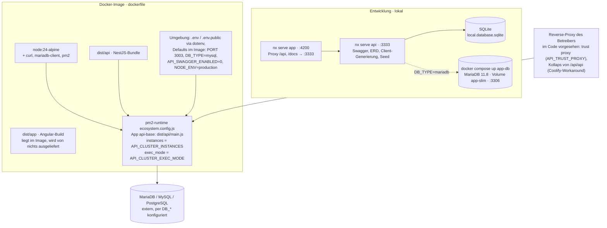

# Deployment und Sicherheit (Ist-Zustand)

Stand: 2026-09-11. Beschrieben ist, **was das Repository heute liefert** (`dockerfile`,
`docker-compose.yml`, `ecosystem.config.js`, `.env.example`, `apps/api/src/main.ts`,
`app.module.ts`). Was für einen Produktionsbetrieb noch fehlt, steht unten unter
[Offen für die Produktion](#offen-für-die-produktion) und ist nicht als vorhanden
eingezeichnet.

## Was das Repository bereitstellt

```mermaid
flowchart TB
  subgraph Dev["Entwicklung · lokal"]
    direction LR
    NXAPP["nx serve app · :4200<br/>Proxy /api, /docs → :3333"]
    NXAPI["nx serve api · :3333<br/>Swagger, ERD, Client-Generierung, Seed"]
    SQLITE[("SQLite<br/>local.database.sqlite")]
    COMPOSE[("docker compose up app-db<br/>MariaDB 11.8 · Volume app-slim · :3306")]
    NXAPP --> NXAPI --> SQLITE
    NXAPI -. "DB_TYPE=mariadb" .-> COMPOSE
  end

  subgraph Image["Docker-Image · dockerfile"]
    direction TB
    BASE["node:24-alpine<br/>+ curl, mariadb-client, pm2"]
    DISTAPI["dist/api · NestJS-Bundle"]
    DISTAPP["dist/app · Angular-Build<br/>liegt im Image, wird von nichts ausgeliefert"]
    PM2["pm2-runtime ecosystem.config.js<br/>App api-base: dist/api/main.js<br/>instances = API_CLUSTER_INSTANCES<br/>exec_mode = API_CLUSTER_EXEC_MODE"]
    ENV["Umgebung: .env / .env.public via dotenv,<br/>Defaults im Image: PORT 3003, DB_TYPE=mysql,<br/>API_SWAGGER_ENABLED=0, NODE_ENV=production"]
    BASE --> PM2
    DISTAPI --> PM2
    ENV --> PM2
  end

  PROXY["Reverse-Proxy des Betreibers<br/>im Code vorgesehen: trust proxy (API_TRUST_PROXY),<br/>Kollaps von /api/api (Coolify-Workaround)"]
  DB[("MariaDB / MySQL / PostgreSQL<br/>extern, per DB_* konfiguriert")]

  PROXY -- "HTTP → :3003 /api/*" --> PM2
  PM2 --> DB
```

| Baustein | Datei | Was tatsächlich passiert |
| --- | --- | --- |
| Docker-Image | `dockerfile` | `node:24-alpine`, installiert `pm2`, kopiert `dist/apps/api` → `dist/api`, `dist/apps/app` → `dist/app`, `config/` (OpenAPI-Spec) und `ecosystem.config.js`; läuft als User `node`; `EXPOSE 3003 80 443`; `CMD pm2-runtime start ecosystem.config.js`. `mariadb-client` liegt bei (für `mysqldump`), ein Backup-Skript gibt es nicht. |
| Prozessmanager | `ecosystem.config.js` | Eine pm2-App `api-base` (`dist/api/main.js`), Instanzen und Modus aus `API_CLUSTER_INSTANCES` / `API_CLUSTER_EXEC_MODE` (Default im File: `cluster`, in `.env.example`: `fork`, 1 Instanz). Der `deploy`-Block ist eine Vorlage mit Platzhaltern und nicht einsatzfähig. |
| Frontend-Auslieferung | `apps/api/src/core/static-file` (`CoreStaticFileModule`, `staticFileMiddleware`) | Die API liefert den Angular-Build aus (`dist/app/browser`, überschreibbar mit `APP_DIST_PATH`): Dateien des Builds über `ServeStaticModule`, jede andere Adresse ausserhalb von `/api`, `/docs`, `/assets` erhält `index.html` (`isStaticIndexPath`). Seit dem 02.10.2026 entscheidet die Dateiendung des Pfads, nicht mehr ein Punkt irgendwo in der Adresse – Links mit E-Mail-Adresse (Passwort zurücksetzen, E-Mail bestätigen, 2FA) antworteten vorher mit 404; gefunden durch den e2e-Lauf gegen den Produktions-Build. In der Entwicklung liefert der Angular-Dev-Server. Kein nginx im Image; `APP_UI_PATH` wird von keinem Code gelesen. |
| Datenbank Entwicklung | `.env.example` | SQLite-Datei, `DB_SYNC=1` (TypeORM legt das Schema an). |
| Datenbank Container | `docker-compose.yml` | Service `app-db` (MariaDB 11.8, Container `app-slim-db`, Port 3306, Volume `app-slim`); Zugangsdaten aus `DB_*`. Kein API-Container in der Compose-Datei. |
| Konfiguration | `.env` (geladen von `apps/api/src/core/env-loader.ts` vor allen Imports) | `APP_ENV`, `APP_SECRET`, `API_PORT`, `DB_*`, `MAIL_*` (Passwort-Reset, E-Mail-Bestätigung, 2FA-Codes), `API_RATE_LIMIT_AUTH/PUBLIC`, `API_TRUST_PROXY`, `API_SWAGGER_ENABLED`, `API_SWAGGER_GENERATE_CLIENT`, `API_AUTH_PASSWORD_*`, `API_AUTH_LOGIN_LOCKOUT_ENABLED`, `DEMO_SEED`/`DEMO_RESEED`, `API_CLUSTER_*`, `REDIS_URL` (im Code ungenutzt). |
| Health | `apps/api/src/core/health-check` | `GET /api/health` (Heap), `/api/health/alive`, `/api/health/ready` (Terminus, DB-Ping) — für Container-Healthchecks und den Setup-Wizard. |
| Reverse-Proxy-Betrieb | `libs/api/common/src/lib/utils.ts` | `resolveTrustProxy()` setzt Express `trust proxy` aus `API_TRUST_PROXY`; `applyMiddlewareAppStripeDouble()` kollabiert `/api/api` (Kommentar im Code: Coolify). Mehr sagt der Code über das Hosting nicht. |

## Umgebungen

Es gibt **eine** Konfigurationsdatei (`.env`) und den Schalter `APP_ENV`. Verhalten
nach Wert, wie im Code ausgewertet:

| `APP_ENV` | Swagger `/api/docs` | Client-Generierung, ERD | Demo-Seed | ValidationPipe / Guards |
| --- | --- | --- | --- | --- |
| `development` (Default) | wenn `API_SWAGGER_ENABLED=1` | ja (bei aktivem Swagger) | ja (`DEMO_SEED` ≠ 0) | identisch |
| `production` | wenn `API_SWAGGER_ENABLED=1` (Image-Default 0) | nein | nein | identisch |

Getrennte dev/test/prod-Umgebungen mit eigenen Datenbanken, Secrets und Deployments
sind damit **nicht** abgebildet; die e2e-Suite startet über `tools/serve-api-e2e.js`
eine API mit In-Memory-SQLite.

## Sicherheit – im Code umgesetzt

| Massnahme | Wo | Details |
| --- | --- | --- |
| Authentifizierung | `@app-galaxy/auth-api`, Seiten `apps/app/src/app/views/auth` | Login mit verschlüsselten Credentials (`encryptCredentials`), JWT-Bearer + Session-Tabelle (`AuthGuard('jwt')` prüft die Session), 2FA-Login, Mandantenwahl, Passwort zurücksetzen, E-Mail bestätigen. |
| Passwortregeln | `.env` `API_AUTH_PASSWORD_MIN_LENGTH`, `API_AUTH_PASSWORD_HISTORY_ENABLED`, `API_AUTH_LOGIN_LOCKOUT_ENABLED` | Produktionswerte laut Kommentar in `.env.example` (≥ 10 Zeichen, 18 für erhöhte Rollen); im Prototyp 4 / aus. |
| Autorisierung | `AppsRolesGuard(API_APPS_MAPPING.X)` auf jedem Admin-Controller | Rollen tragen App-Ids (40–45, `apps/api/src/mocks/main.mock-data.ts`); die Sidebar und der `adminGuard` im Frontend spiegeln das. |
| Mandantentrennung | `TenantGuard` + `@GetTenantId()`; `SlimBaseEntity extends TenantBaseEntity` | Jede Tabelle hat `tenantId`; jede Abfrage der Services filtert darauf (Tests: «leaves other tenants alone», «is scoped by tenant and area»). |
| Replay-Schutz | `ReplayGuard` (Backend), `AuthHttpReplayAttackInterceptor` (Frontend) | Header `X-TOKEN-ASGARD` mit AES-verschlüsseltem Zeitstempel + Nonce; Nonce wird einmalig akzeptiert (In-Memory-Store; Redis-Store wäre für Cluster nötig). |
| Rate Limiting | `AuthThrottlerGuard` (`APP_GUARD`), `ThrottlerModule` | `/api/auth/*` 20/min, `/api/public/*` 60/min (aus `.env`); Admin-Routen unbegrenzt, da hinter JWT + Rollen + Replay. |
| HTTP-Header | `securityHeaders()` (`libs/api/common/src/lib/security-headers.ts`), in `main.ts` als `customHeaders` an `MiddlewareCors` übergeben | Auf jeder Antwort (App, API, CORS-Preflight), unabhängig von `APP_ENV`: `Strict-Transport-Security` (1 Jahr, inkl. Subdomains), `Content-Security-Policy` (`script-src 'self'` ohne Inline-Skripte und ohne `eval`; `style-src 'self' 'unsafe-inline'` wegen der Komponenten-Styles von Angular; Bilder und Anfragen zusätzlich an die Kartendienste `https://*.geo.admin.ch`; `object-src 'none'`, `frame-ancestors 'self'`), `X-Frame-Options: SAMEORIGIN`, `X-Content-Type-Options: nosniff`, `Permissions-Policy` (Kamera, Mikrofon, Standort u. a. aus), `Referrer-Policy: same-origin`. Kein `X-Powered-By`. Weitere Kartendienste: `API_SECURITY_CSP_MAP_SOURCES`; ganze Policy ersetzen: `API_SECURITY_CSP`. Voraussetzungen im Frontend: `index.html` lädt `theme-init.js` statt eines Inline-Skripts, der Produktions-Build inlinet kein Critical CSS (`inlineCritical: false`). `MiddlewareSecurityHeaders` (core-api) setzt seine Header nur mit `API_CONFIG_HEADERS_SECURITY` und `APP_ENV` ≠ `development` – im Demo-Betrieb also nie (Befund Header-Scan 02.10.2026); die SLIM-Liste wird danach gesetzt und gilt in jedem Fall. Tests: `security-headers.spec.ts`. Die Seite `/erd` (nur Nicht-Produktion) hat eine eigene Policy (Mermaid von jsDelivr). |
| CORS | `MiddlewareCors` (core-api) | erlaubte Origins aus `API_ACCESS_CONTROL_ORIGIN` (Default `*` — für Produktion einzuschränken). |
| Eingabevalidierung | `ValidationPipe` in `main.ts`, DTOs mit `class-validator` | `forbidUnknownValues`, `skipUndefinedProperties`, `skipNullProperties`; Pfad-Ids mit `ParseUUIDPipe`; fachliche Prüfungen im Service (erlaubte Kombination Stellungsraum × Waffe, Zeitfenster, Quellen der Simulation). Keine `whitelist`-Option, überzählige Felder werden nicht entfernt. |
| Datenlöschung | `DeleteDateColumn` auf `SlimBaseEntity` | Soft-Delete; Nutzungen lassen sich wiederherstellen (`POST …/usage/restore`). |
| Proxy-Vertrauen | `app.set('trust proxy', resolveTrustProxy())` | Client-IP für Throttling aus `X-Forwarded-For` mit `API_TRUST_PROXY` Hops. |
| Geheimnisse | `.env` (git-ignoriert), `.npmrc` mit Nexus-Token | Der Setup-Wizard schreibt beide; `APP_SECRET` wird generiert, wenn leer. |
| Nachvollziehbarkeit | galaxy Session-/Login-Logging; `recordedBy`, `createdAt/updatedAt` auf Nutzungen | Ein fachliches Änderungsprotokoll (wer hat welche Nutzung geändert) gibt es noch nicht. |

## Offen für die Produktion

Nicht umgesetzt; im Lösungskonzept als Vorhaben zu beschreiben, nicht als Ist.

- [x] **Frontend-Auslieferung**: Static-Serving in der API mit Fallback auf `index.html` (`apps/api/src/core/static-file`).
- [ ] **Hosting in der Schweiz / on-premise**: keine Festlegung im Repository (Anforderungskatalog: on-premise, `slm 57`).
- [ ] **Getrennte Umgebungen** dev / test / prod mit eigenen Secrets und Datenbanken; heute ein `.env`.
- [ ] **TLS-Terminierung** und Zertifikate: nicht im Image (Port 80/443 nur exponiert); Aufgabe des Proxys.
- [ ] **Backup / Restore**: `mariadb-client` liegt im Image, Skripte, Zeitplan und Restore-Test fehlen (`slm 57`: RPO 1 Tag, RTO 2 Tage, 12 Monate Generationen).
- [ ] **Monitoring / Alerting**: nur die Health-Endpunkte; keine Metriken, kein Log-Versand.
- [ ] **Secrets-Management**: `.env` im Container; kein Vault/Secret-Store.
- [ ] **CORS und Passwortpolitik** auf Produktionswerte setzen (`API_ACCESS_CONTROL_ORIGIN`, `API_AUTH_PASSWORD_MIN_LENGTH`, Lockout).
- [ ] **MFA / AGOV** als Pflicht (`slm 35`, `slm 56`): 2FA ist vorhanden, Erzwingung und AGOV-Anbindung nicht.
- [ ] **Replay-Store und Sessions im Cluster** (Redis) sobald `API_CLUSTER_INSTANCES > 1`.
- [ ] **Änderungsprotokoll** fachlicher Daten (Nutzungen, Stammdaten).
- [ ] **CI/CD**: kein Git-Repository, keine Pipeline; Build und Tests laufen lokal (`npm run build`, `npm test`, `npx nx e2e app-e2e`).
