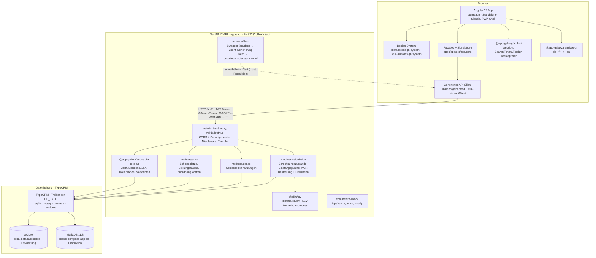
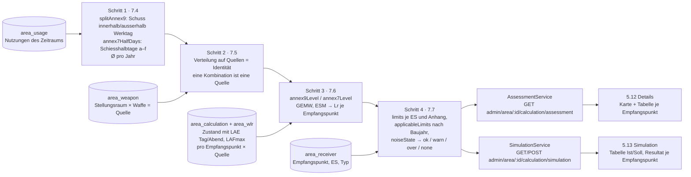
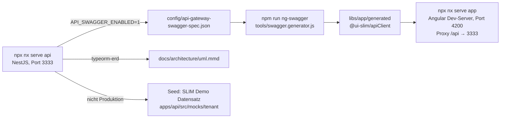
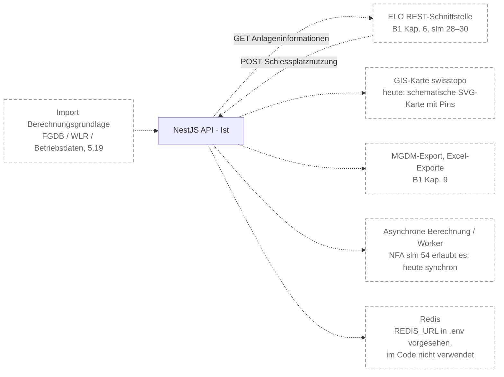

# Gesamtarchitektur (Ist-Zustand)

Stand: 2026-09-11. Diese Zeichnung zeigt **nur, was im Repository umgesetzt ist**.
Alles, was die Ausschreibung zusätzlich verlangt oder was früher vorgeschlagen wurde
(ELO-Schnittstelle, GIS-Karte, Berechnungs-Worker, Importe/Exporte), steht am Ende
unter [Geplant, nicht Teil des Prototyps](#geplant-nicht-teil-des-prototyps) und ist
in keiner Ist-Zeichnung enthalten.

Grundlage: Beilage A2 verlangt einen Architekturüberblick mit Schichten und Schema
(`docs/anforderungskatalog/index.md`, Abschnitt 8).

## Überblick

Die Verbindung Browser → API läuft in der Entwicklung über den Angular-Dev-Server
(`apps/app/proxy.conf.json` leitet `/api` und `/docs` auf `localhost:3333`), der
Client ist mit `rootUrl: ''` konfiguriert. Wie das Frontend in Produktion ausgeliefert
wird, ist in [deployment-sicherheit.md](deployment-sicherheit.md) beschrieben — kurz:
das Docker-Image enthält den Angular-Build, aber es gibt heute weder einen nginx noch
Code in der API, der `dist/app` ausliefert. Das ist ein offener Punkt, keine
Schichtentscheidung.

## Schichten

| Schicht | Technologie | Ort im Repository | Verantwortung |
| --- | --- | --- | --- |
| Präsentation | Angular 22 (Standalone, Signals, `@angular/service-worker`), SCSS-Design-System (BEM, Tokens als `--slim-*`, Light/Dark) | `apps/app`, `libs/app/design-system` | Seiten unter `views/auth` (Anmeldung) und `views/admin` (alles hinter dem Login, `app-admin-layout`: Topbar, Sidebar, Tabbar), Styleguide `/styleguide` |
| Client-State | Facade pro Feature auf `SignalStore` (kein NgRx im App-Code) | `apps/app/src/app/core/<feature>` | Daten laden, Signale für die Seiten; Seiten erben `ComponentBase` und laden in `getData()` |
| API-Vertrag | OpenAPI-Spezifikation → ng-openapi-gen | `config/api-gateway-swagger-spec.json`, `libs/app/generated` (`@ui-slim/apiClient`, git-ignoriert) | Modelle und Services werden beim API-Start erzeugt; im Frontend gibt es keine handgeschriebenen API-Typen |
| Authentifizierung / Mandanten | `@app-galaxy/auth-ui` (Frontend), `@app-galaxy/auth-api` + `core-api` (Backend) | `app.config.ts` (`provideAuth`), `app.module.ts` | JWT-Sessions, 2FA, Passwort-Reset, E-Mail-Bestätigung, Mandantenwahl, Rollen/Apps-Katalog, Replay-Schutz |
| Anwendung | NestJS 12 (ESM), `class-validator`, `@nestjs/swagger` | `apps/api/src/modules/{area,usage,calculation}` | Fachlogik: Schiessplätze/Stellungsräume/Waffen, Nutzungen (CRUD, Soft-Delete/Restore), Beurteilung pro Empfangspunkt, Simulation |
| Fachkern Lärmberechnung | reines TypeScript, abhängigkeitsfrei | `libs/shared/lsv` (`@slim/lsv`) | GEMW/ESM, Anhang 9/7, Betriebsdaten (Werktag-Split, Schiesshalbtage), Grenzwerte, Ampeln; Kontrollwerte B1.4 als Tests, siehe [laermberechnung.md](laermberechnung.md) |
| Persistenz | TypeORM, Entities auf `SlimBaseEntity` → `TenantBaseEntity` (`tenantId` auf jeder Tabelle) | `libs/api/common/src/lib/entities/base.entity.ts`, `modules/*/entities` | Schema per `DB_SYNC=1` (Entwicklung); ERD generiert: [uml.mmd](uml.mmd) |
| Datenbank | SQLite (Entwicklung), MariaDB 11.8 (docker-compose); Treiber `sqlite3`, `mysql2`, `pg` installiert | `docker-compose.yml`, `.env` (`DB_TYPE`, `DB_*`) | Auswahl zur Laufzeit über `DB_TYPE`; in Produktion setzt das Docker-Image `DB_TYPE=mysql` |
| Demo-Daten | Datensatz «SLIM Demo» (JSON, Platzhalter `{{year}}`), Seed beim Start ausserhalb Produktion | `apps/api/src/mocks/tenant` | Mandant, Demo-User, 9 Schiessplätze; Geissalp mit Stellungsräumen, Quellen, Empfangspunkten, zwei Berechnungszuständen und Nutzungen des laufenden Jahres |
| Betrieb / Werkzeuge | Setup-Wizard, Playwright, Vitest/Jest, pm2, Docker | `setup/`, `apps/app-e2e`, `ecosystem.config.js`, `dockerfile` | siehe [deployment-sicherheit.md](deployment-sicherheit.md) |

Genereller Ablauf einer Anfrage: Seite → Facade → generierter Service → HTTP mit
Bearer-Token, Mandanten-Token und Replay-Header (Interceptoren von auth-ui) → NestJS
Guards (`AuthGuard('jwt')`, `TenantGuard`, `AppsRolesGuard(App-Id)`, `ReplayGuard`) →
Service → TypeORM, immer mit `tenantId` aus `@GetTenantId()`.

## Datenfluss Lärmberechnung

Die Beurteilung (5.12 «Details») und die Simulation (5.13) rechnen **synchron im
API-Prozess**. Es gibt keinen Worker, keine Queue und keinen Cache pro Zustand; ein
Aufruf dauert mit den Demo-Daten Millisekunden. Nichts wird persistiert – die
Ergebnisse entstehen bei jeder Anfrage neu aus den Nutzungen und der
Berechnungsgrundlage.

Regeln, wie sie im Code stehen (`apps/api/src/modules/calculation/assessment.service.ts`):

- Anhang 9 wird aus den **militärischen** Nutzungen gerechnet, Anhang 7 aus den
  **zivilen** (oder allen, wenn der Schiessplatz das Flag «Gesamtbeurteilung nach
  Anhang 7» trägt, B1 5.16).
- Baujahr der Anlagenteile (Zustand): `before1985` → nur IGW, `after1985` → nur PW,
  `mixed` → IGW über alle Quellen, PW nur über Quellen von Stellungsräumen mit
  `builtAfter1985`.
- Ampel je Zeile: rot wenn Lr > Grenzwert, orange wenn Lr > Grenzwert − 5 dB, sonst
  grün; die Ampel des Empfangspunkts ist die schlechteste anwendbare Zeile. Der
  Vergleich läuft auf 0.1 dB gerundeten Werten.
- Zeitraum: Standard 1. Januar bis heute; über mehrere Jahre werden die Schusszahlen
  gemittelt (`period.years`).
- Kontrollwerte aus Beilage B1.4 sind als Tests in `libs/shared/lsv` hinterlegt, die
  Demo-Werte des Mocks als Tests der Services (`assessment.service.spec.ts`,
  `simulation.service.spec.ts`).

## Entwicklungs- und Buildkette

Das Repository ist kein Git-Repository und hat keine CI-Konfiguration; Builds laufen
lokal (`npm run build`, `npx nx test api`, `npx nx test app`, `npx nx e2e app-e2e`).
Der Setup-Wizard (`npm run setup`, `setup/`) prüft Toolchain, `.env`, Registry-Token,
Abhängigkeiten, Datenbank, Workspace, API-Health, Frontend, Login, Berechtigungen,
Demo-Daten und die e2e-Suite.

## Geplant, nicht Teil des Prototyps

Diese Bausteine verlangt der Anforderungskatalog; sie sind **nicht** umgesetzt und in
den Ist-Zeichnungen oben bewusst weggelassen.

| Baustein | Stand heute | Anforderung |
| --- | --- | --- |
| ELO-Schnittstelle | Nutzungen tragen `source: 'elo'` als Kennzeichen; der Demo-Datensatz enthält importierte Zeilen. Kein Endpunkt, keine Anbindung. | B1 Kapitel 6, `slm 28`–`slm 30` |
| GIS-Karte | Schematische SVG-Karte mit Empfangspunkt-Pins, Positionen als Prozentwerte (`mapX`/`mapY`); LV95-Koordinaten (`east`/`north`) sind gespeichert, aber nicht dargestellt. | 5.10, 5.12 (swisstopo-Hintergrund, Vollansicht) |
| Import Berechnungsgrundlage | Zustände und WLR-Werte kommen nur aus dem Demo-Datensatz. | 5.19, `slm 36`ff. |
| Exporte | Schaltflächen «Exportieren» / «Bericht PDF» sind in den Mocks, nicht angebunden. | B1 Kapitel 9, MGDM |
| Worker / Queue / Cache | Berechnung synchron im Request; ausreichend für das Mengengerüst des Prototyps. | `slm 54` (Ø 5 s, max. 10 s; asynchron zulässig) |
| Redis | Nur `.env.example`; galaxy Replay-Store und pm2-Cluster könnten es nutzen, konfiguriert ist nichts. | Cluster-Betrieb |
| Datenverwaltung (5.14–5.28) | Routen als Platzhalter vorhanden (`docs/architecture/sitemap.md`). | B1 5.14–5.28 |
