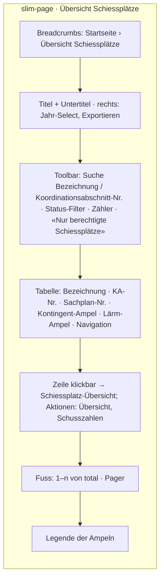
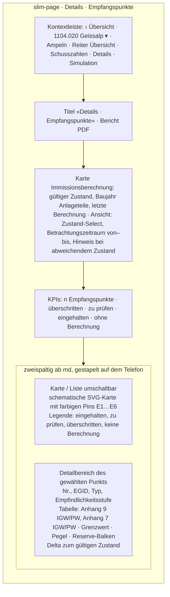
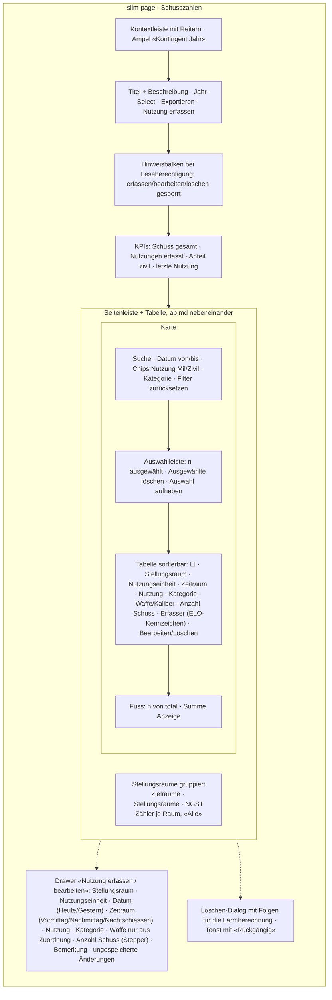
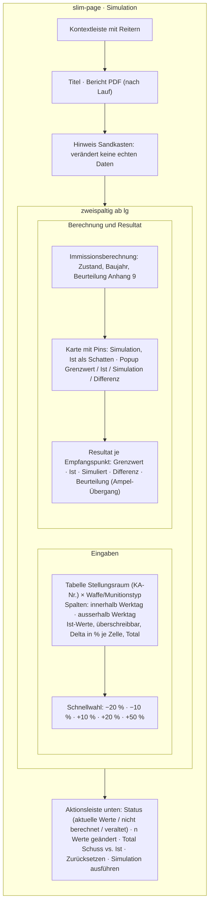

# UI-Ansichten für das Usability-Konzept

Stand: 2026-09-11. Beilage A2 verlangt kein fertiges UI-Design, aber ein
Usability-Konzept; diese Ansichten belegen es. Skizzen zeigen den Aufbau, Screenshots
der laufenden Anwendung werden unter `docs/architecture/images/` ergänzt, sobald die
Seiten fertig sind (Bildpfade unten sind Platzhalter).

## Grundlagen

- **Design System** `libs/app/design-system` (`@ui-slim/design-system`): SCSS-Tokens
  als `--slim-*`, BEM-Blöcke (`slim-page`, `slim-card`, `slim-table`, `slim-badge`,
  `slim-chip` …), Light und Dark, Farbschema wie ELO. Lebender Styleguide unter
  `/styleguide`. Regeln in `.claude/styleguide.md`.
- **Mobile first**: unter 1024 px Topbar + Tabbar, ab 1024 px Sidebar (`app-admin-layout`);
  Tabellen stapeln auf dem Telefon (`slim-table--stack`), Touch-Ziele ≥ 44 px.
- **Navigation**: Sitemap Abbildung 18 (`docs/architecture/sitemap.md`), Breadcrumbs auf
  jeder Seite, Kontextleiste je Schiessplatz mit den Reitern Übersicht · Schusszahlen ·
  Details · Simulation, Schiessplatz-Wechsel in der Leiste.
- **Ampel-Logik** (B1 5.10, umgesetzt in `@slim/lsv`):

  | Ampel | Kontingent (Ist vs. Soll Plangenehmigung) | Lärm (Lr vs. Grenzwert je ES) |
  | --- | --- | --- |
  | grün «Eingehalten» | Ist ≤ Soll | Lr ≤ Grenzwert − 5 dB |
  | orange «Zu prüfen» | Ist ≤ 125 % Soll | Lr > Grenzwert − 5 dB |
  | rot «Überschritten» | Ist > 125 % Soll | Lr > Grenzwert |
  | grau «Keine Daten» | kein Soll | keine Berechnung / Reservepunkt |

  Aggregation: rot, sobald ein Element rot ist, sonst orange, sonst grün. Die Pille
  (`app-status-pill`) trägt Symbol und Text, nicht nur Farbe.
- **Mehrsprachigkeit** de / fr / it / en über `translate`-Pipe, Sprachwahl in der Kopfzeile.

## Übersicht Schiessplätze mit Ampeln

Route `/admin/area` (umgesetzt, `views/admin/area/area-overview.component.ts`).
Daten: `GET admin/area` über `AreaFacade`.

Elemente: Suche (auch Sachplan-Nr.), Filter «Nur Handlungsbedarf» (orange/rot) — von
der Einstiegsseite per `?status=attention` vorbelegt —, zwei Ampeln pro Zeile, auf dem
Telefon gestapelte Karten mit `data-label`.

## Schiessplatz – Details: Karte mit Empfangspunkten

Route `/admin/area/:id/details` (im Bau nach `_mocks/area/detail.index.html`).
Daten: `GET admin/area/:id/calculation/assessment?calculationId&from&to`.

Elemente: Pin-Farbe = schlechteste anwendbare Beurteilung des Punkts; Planungswert
nur für Anlageteile nach 1985 (gemischt: nur diese Stellungsräume); Reservepunkte ohne
Gebäude erscheinen grau. Die Liste ist die barrierefreie Alternative zur Karte
(Sortierung rot → orange → grün → grau). Die Karte ist heute schematisch (SVG,
Positionen in Prozent); die swisstopo-Karte mit Vollansicht ist geplant, nicht
umgesetzt.

## Schiessplatz – Schusszahlen: Nutzungstabelle

Route `/admin/area/:id/shots` (im Bau nach `_mocks/area/index.html`).
Daten: `GET admin/area/:id/usage/overview?year`, Mutationen `POST`/`PATCH`/`DELETE`
`admin/area/:id/usage`, Undo über `POST …/usage/restore`.

Elemente: Standardfilter laufendes Jahr; Waffenliste nur aus den erlaubten
Kombinationen Stellungsraum × Waffe (5.17); Zeilen aus der ELO-Schnittstelle sind
gekennzeichnet; Löschen ist ein Soft-Delete mit Undo. Jede Mutation löst
`DATA_RELOAD` aus, sodass KPIs und Zähler mitziehen.

## Schiessplatz – Simulation

Route `/admin/area/:id/simulation` (im Bau nach `_mocks/area/simulation.index.html`).
Daten: `GET admin/area/:id/calculation/simulation?year` (Ist), `POST …/simulation`
(Rechnen); nichts wird gespeichert.

Elemente: Initialwerte = militärische Schusszahlen des Jahres pro Quelle nach 7.4.5;
ein Resultat wird als «veraltet» markiert, sobald Werte danach geändert werden; die
Beurteilung zeigt den Ampel-Übergang Ist → Simulation. Die Rechnung läuft synchron in
der API mit den WLR-Werten des gültigen Zustands (siehe
[gesamtarchitektur.md](gesamtarchitektur.md#datenfluss-lärmberechnung)).

## Ergonomie-Regeln, die alle Ansichten teilen

- Ein Block pro Komponente, Zustände als Modifikatoren (`--active`, `--stale`), keine
  reinen Farbcodierungen ohne Text oder Symbol.
- Formulare als Drawer (Telefon: Vollbild), Pflichtfelder markiert, Validierung am Feld
  und im Backend (`class-validator`).
- Tastatur: alle Pins und Zeilenaktionen sind Buttons/Links mit `aria-label`; Fokus
  sichtbar (`focus-visible`).
- Leere Zustände mit Handlungsaufforderung («Erste Nutzung erfassen»), Ladezustände mit
  Spinner/Skeleton, Fehler als `slim-alert` mit übersetzter Meldung (auch «offline»).
